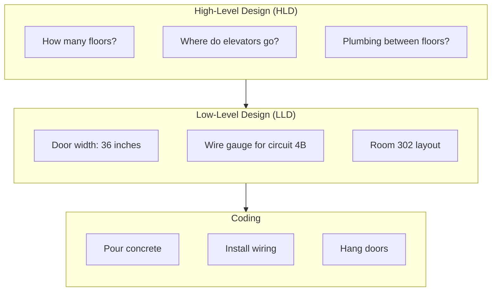
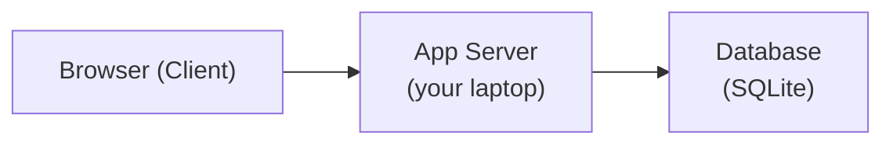
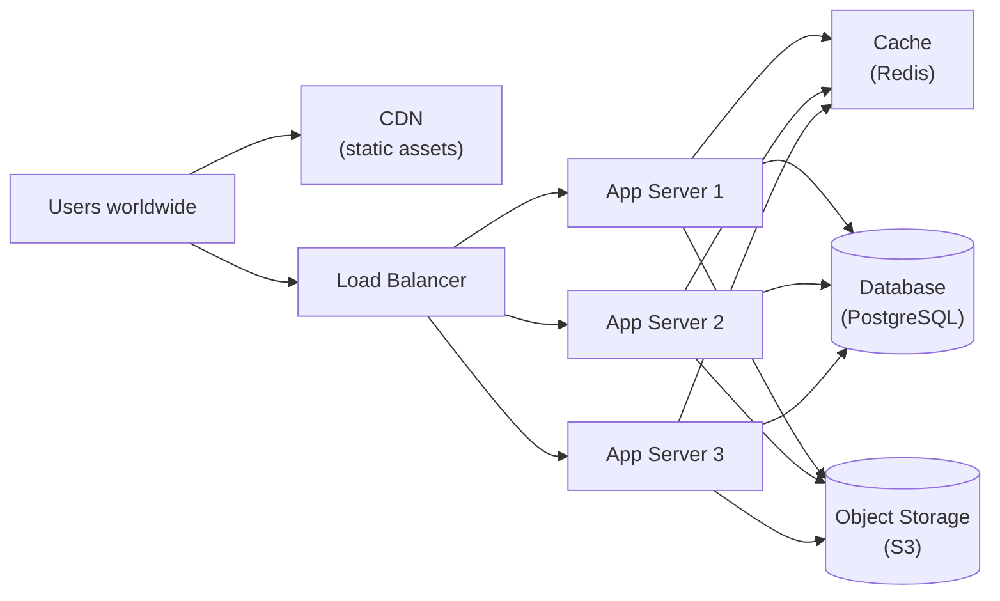
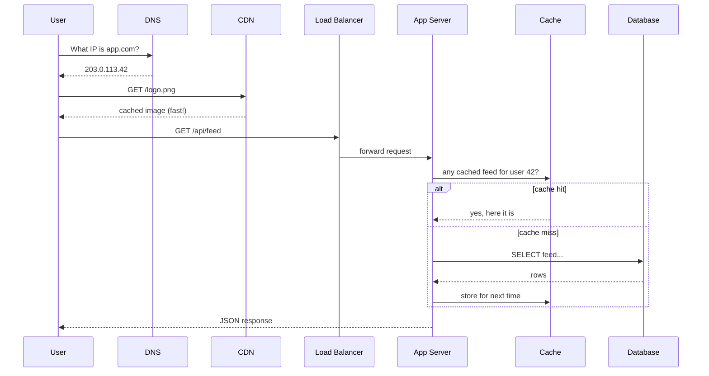
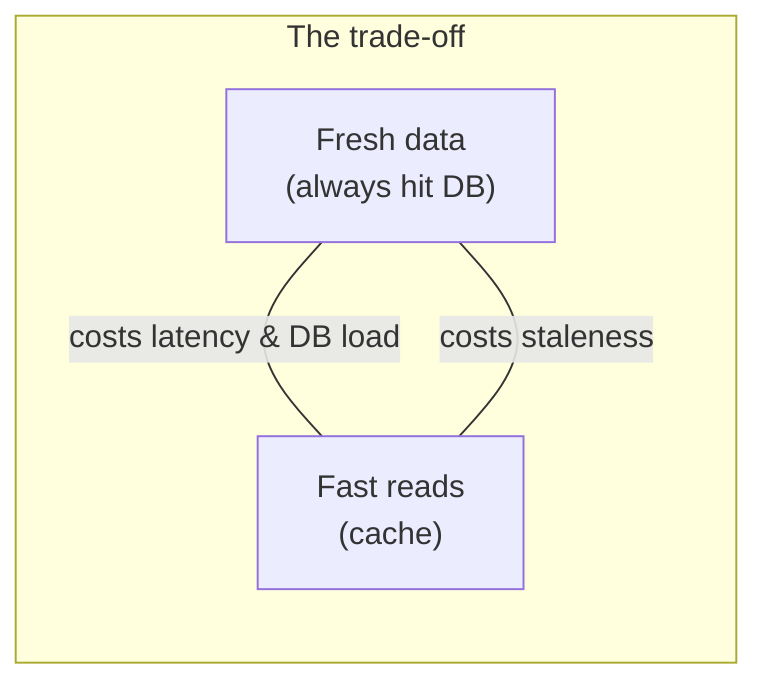
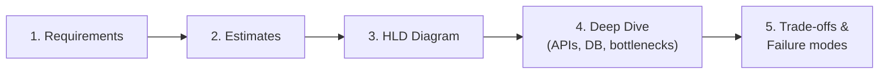

# 01. What is System Design?

## Learning goals

By the end of this lesson you will be able to:

- Explain system design in plain English to someone who has never built a large app
- Distinguish **coding**, **High-Level Design (HLD)**, and **Low-Level Design (LLD)** — and know when each matters
- Recognize the universal building blocks that appear in almost every production backend
- Explain why "it worked on my laptop" is not enough at real-world scale
- Name common trade-offs and describe what "good" system design looks like for a beginner

---

## Simple definition (start here)

**System design** is the skill of planning how software components work together so a product:

- Serves **many users** at once
- Stores data **safely and durably**
- Stays **fast enough** under load
- **Survives failures** (crashes, network blips, traffic spikes)

### The everyday analogy: opening a restaurant

Imagine you want to sell sandwiches:

| Stage | What you're doing | Software equivalent |
|-------|-------------------|---------------------|
| **Coding** | Learning how to slice bread and grill chicken | Writing functions, classes, SQL queries |
| **LLD** | Designing the kitchen layout — where the grill goes, how orders flow from counter to prep station | Designing APIs, database tables, service modules |
| **HLD** | Deciding: one food truck or ten locations? Do we need a central warehouse? How do customers order — walk-in, app, delivery? | Deciding: load balancers, caches, databases, CDN, queues |

Writing a single function is like perfecting one recipe.  
System design is like planning the **whole restaurant chain** so it doesn't collapse when 500 people show up at lunch.

---

## Why system design matters

### Small scale vs real-world scale

**Small scale** (school project, side app, 10 users):

- One server
- One database
- Deploy on a Friday and hope for the best

That is fine. Many great products start exactly there.

**Real-world scale** (millions of users, global traffic, money on the line):

You must answer questions that never appear in a coding tutorial:

| Question | Why it matters |
|----------|----------------|
| Where do incoming requests go? | One machine cannot handle everyone |
| Where is data stored — and is there a backup? | Hard drives fail; humans make mistakes |
| What if a server dies at 2 AM? | Users expect the app to still work |
| What if users in India have slow internet? | Latency is a product feature |
| How do we add a new feature without rewriting everything? | Teams ship weekly, not yearly |

System design is how you answer those questions **before** you paint yourself into a corner — using diagrams, rough numbers, and explicit trade-offs.

### Interview relevance (without being dry)

In a system design interview, the interviewer is not asking you to recite AWS service names. They want to see if you can:

1. **Clarify** what you're building
2. **Estimate** scale (roughly — not to three decimal places)
3. **Draw** a sensible architecture
4. **Discuss** bottlenecks and failure modes
5. **Evolve** the design when requirements change

That is the same skill you use when joining a team and someone says: "We need to handle 10× traffic next quarter."

---

## Coding vs HLD vs LLD

Think of building a **library**:

| Level | Focus | Library analogy | Software example |
|-------|--------|-----------------|------------------|
| **Coding** | Algorithms, syntax, data structures in one language | Actually shelving a book, stamping a due date | Implement `shortenUrl()` in Python; write the SQL `INSERT` |
| **LLD (Low-Level Design)** | Modules, classes, APIs, database schema, error handling | Detailed floor plan: shelf dimensions, checkout desk layout, barcode system | Design `UrlService` class, `urls` table columns, `POST /api/v1/urls` request/response |
| **HLD (High-Level Design)** | Major components, data flow, technology choices | "We need a main branch, 3 reading rooms, a digital catalog, and an inter-library loan system" | Client → Load Balancer → App Servers → Cache → Database → CDN |

### How to tell them apart in practice

| Scenario | HLD or LLD? | Why |
|----------|-------------|-----|
| "We use PostgreSQL for durable storage" | **HLD** | Technology choice, not schema detail |
| "`urls` table has columns: `id`, `short_code`, `long_url`, `created_at`" | **LLD** | Concrete schema |
| "Traffic hits a load balancer, then app servers" | **HLD** | Component layout |
| "`GET /users/:id` returns `{ id, name, email }` or 404" | **LLD** | API contract |
| "Implement binary search on a sorted array" | **Coding** | Algorithm in code |

### The building analogy (visual mental model)

You would never pour concrete before deciding how many floors the building has.  
Similarly, don't obsess over column types before you know whether you need one database or ten.

---

## A worked example: "Share a note" app

Let's design a tiny app where users paste text and get a shareable link.

### Naive design (works for you and 3 friends)

**What happens here:**

1. User opens the app in a browser
2. Browser sends the note text to your server
3. Server saves it in SQLite
4. Server returns a link like `myapp.com/note/abc123`

This works! Ship it. Learn from real users.

### When scale changes the design

Suppose the app goes viral. Now you have:

- 50,000 users hitting the site at once
- Large notes with images attached
- Users worldwide (some far from your single US server)

**Symptoms of pain:**

| Symptom | Root cause | Typical fix |
|---------|------------|-------------|
| Pages load slowly in Asia | Single server in Virginia | CDN + servers in multiple regions |
| App server CPU at 100% | One machine handling all requests | Load balancer + multiple app servers |
| Database overloaded on reads | Every page view hits the DB | Cache (Redis) for popular notes |
| Image uploads slow down API | Large files block request threads | Object storage (S3) + async upload |
| Server crash = site down | Single point of failure | Multiple servers + health checks |

### Better design (works for many users)

Nothing magical happened. We introduced **building blocks** that appear in nearly every large system. You don't add them all on day one — you add them when a bottleneck proves you need them.

---

## The universal building blocks

Almost every large web application is a remix of these components:

| # | Building block | What it does | Everyday analogy |
|---|----------------|--------------|------------------|
| 1 | **Clients** | Browser, mobile app, IoT device — initiates requests | The customer placing an order |
| 2 | **DNS** | Translates `app.com` → IP address | Phone book / address lookup |
| 3 | **Load balancer** | Spreads traffic across many servers | Host at a restaurant directing you to the next free table |
| 4 | **App / API servers** | Business logic, validation, orchestration | Kitchen — where the actual work happens |
| 5 | **Cache** | Fast temporary storage (Redis, Memcached) | The waiter who remembers "the usual" instead of asking the kitchen every time |
| 6 | **Database** | Durable source of truth | The filing cabinet / ledger of record |
| 7 | **Queue + workers** | Background jobs (email, thumbnails, reports) | "We'll prep that catering order overnight" |
| 8 | **Object storage / CDN** | Files, images, video; served from edge locations | Warehouse + local delivery hubs |

### How they fit together (typical read path)

### You don't need everything on day one

| Stage | Reasonable stack |
|-------|------------------|
| **MVP / prototype** | Client + 1 app server + 1 database |
| **Early growth** | Add cache for hot reads; CDN for static assets |
| **Serious traffic** | Load balancer + multiple app servers; queue for async work |
| **Global scale** | Multi-region, sharding, dedicated object storage |

The art is knowing **when** to add complexity — not adding it "just in case" on day one.

---

## Why scale changes design (the highway analogy)

Imagine a **two-lane road** (your laptop):

- Fine for 100 cars per hour
- At 10,000 cars per hour → gridlock, accidents, angry drivers

You don't fix gridlock by buying a faster car. You:

- Add **more lanes** (horizontal scaling — more servers)
- Add **on-ramps and off-ramps** (load balancers)
- Add **local exits** so people don't drive cross-country for milk (CDN / edge caching)
- Add **a dispatch system** for trucks that don't need the fast lane (queues for background work)

**Key insight:** Problems that don't exist at small scale **dominate** at large scale:

| Small scale | Large scale |
|-------------|-------------|
| "Is my query fast enough?" | "Can the database handle 50k reads/sec?" |
| "Did my deploy work?" | "Can we deploy without downtime?" |
| "One server is fine" | "What happens when any single machine dies?" |
| "Store the file on disk" | "Store 10 PB of user photos cost-effectively" |

---

## Functional vs non-functional requirements (preview)

You'll go deep on this in [Lesson 02](02-requirements.md). For now:

| Type | Question it answers | Example |
|------|---------------------|---------|
| **Functional** | What does the product *do*? | "Users can shorten a URL and get redirected" |
| **Non-functional** | *How well* does it do it? | "Redirect latency p99 < 100ms"; "99.9% uptime" |

**Beginner trap:** Designing only for features ("users can upload photos") while ignoring non-functionals ("upload must complete in < 5s on 3G", "photos must never be lost").

Interviewers and production systems care **equally** about both.

---

## Trade-offs are the job

There is rarely one perfect design. A good system designer **names trade-offs out loud** instead of pretending one solution wins everything.

### Common trade-offs

| Trade-off | Option A | Option B | When A wins | When B wins |
|-----------|----------|----------|-------------|-------------|
| **Speed vs cost** | Aggressive caching, bigger machines | Minimal infra | User experience is revenue-critical | Early startup, tight budget |
| **Consistency vs availability** | Every read sees latest write | System stays up even if slightly stale | Banking, inventory | Social media feed, view counts |
| **Simplicity vs flexibility** | Monolith, one database | Microservices, many stores | Small team, MVP | Large org, independent teams |
| **Fresh data vs cached data** | Always hit database | Cache heavily | Stock prices, auth tokens | News feed, product catalog |
| **Build vs buy** | Custom solution | Managed service (RDS, S3) | Unique competitive need | Standard problem, speed to market |

### Worked example: caching a news feed

**Without cache:** Every user request hits the database → accurate, but slow and expensive at scale.

**With cache:** Most requests served from Redis in ~1ms → fast and cheap, but a just-posted article might not appear for a few seconds.

Neither is "wrong." The right answer depends on whether users need **instant** updates or **fast** loading.

---

## What "good" looks like for a beginner

You do **not** need to:

- Memorize Google's exact internal architecture
- Name every AWS/GCP service on the first try
- Design for billions of users on your first attempt

You **do** need to:

| Step | What good looks like |
|------|------------------------|
| 1. Clarify requirements | "MVP is X; out of scope is Y; we expect Z users" |
| 2. Rough estimates | "~10M DAU → ~100 writes/sec peak → 1TB storage/year" |
| 3. Clear HLD | Boxes and arrows; major components labeled; data flow obvious |
| 4. Key LLD detail | Important APIs, core tables, one or two sequence diagrams |
| 5. Bottlenecks | "Database writes will be the first bottleneck; here's why" |
| 6. Failure modes | "If cache dies, we degrade to DB — slower but still up" |
| 7. Evolution | "At 10× traffic we'd add read replicas; at 100× we'd shard" |

### Red flags vs green flags in an interview

| Red flag 🚩 | Green flag ✅ |
|-------------|---------------|
| Jumping straight to Kafka and microservices | Starting simple, evolving when needed |
| Never asking clarifying questions | Spending 5 minutes on requirements |
| "We'll just scale infinitely" | Naming specific bottlenecks |
| Ignoring failure scenarios | "If X dies, here's what happens" |
| Memorized buzzwords without reasoning | Explaining *why* you chose each component |

---

## The system design process (bird's-eye view)

You'll learn each step in upcoming lessons. Here is the full arc:

| Lesson | Topic |
|--------|-------|
| 01 (this one) | What is system design? |
| 02 | Requirements gathering |
| 03 | Back-of-the-envelope estimates |
| 04 | Clients, servers, APIs |
| 05 | Load balancing |
| 06+ | Databases, caching, and beyond |

---

## Common beginner mistakes

| Mistake | Why it's a problem | Better approach |
|---------|-------------------|-----------------|
| **Designing before clarifying** | You solve the wrong problem (full Instagram vs photo upload MVP) | Spend 5–10 minutes on requirements first |
| **Only functional requirements** | "It has all the features" but it's slow, fragile, or expensive | Always state latency, scale, availability |
| **Over-engineering day one** | 15 microservices for 100 users | Monolith + Postgres until pain proves otherwise |
| **Under-engineering obvious bottlenecks** | Single DB for 1M writes/sec | Estimate first; design for known hot paths |
| **Treating diagrams as decoration** | Boxes with no data flow | Every arrow should mean something |
| **Ignoring failure** | "It works when everything is healthy" | Always ask: what if this component dies? |
| **Buzzword salad** | "We'll use Kafka, Cassandra, and ML" without reasoning | Name the problem each tool solves |

---

## Check your understanding

Work through these before moving on. Try answering out loud — that's closer to an interview.

### Question 1
In one sentence, what is system design?

### Question 2
Is designing a database table schema HLD or LLD? What about choosing "we'll use PostgreSQL"?

### Question 3
Name four building blocks of a typical web backend and explain what each does in one line.

### Question 4
Your side project works fine with one server. A blog post about it goes viral and traffic jumps 100×. Name two symptoms you might see and two building blocks you'd consider adding.

### Question 5
A teammate says: "Let's use a cache so reads are fast." What's one trade-off you should mention?

### Question 6
What's the difference between coding and system design? Use the restaurant or library analogy.

Detailed answers

**1. What is system design?**

System design is planning how software components work together under real-world constraints — scale, latency, cost, and failures — so the product remains useful, fast, and reliable as it grows.

**2. HLD vs LLD for database decisions**

- **Choosing PostgreSQL** → **HLD**. It's a technology/component decision ("we need a relational database for durable storage").
- **Designing the `urls` table with columns `id`, `short_code`, `long_url`, `created_at`** → **LLD**. It's concrete schema and field-level detail.

Rule of thumb: if you're naming **components and flows**, it's HLD; if you're naming **APIs, tables, and classes**, it's LLD.

**3. Four building blocks (examples)**

| Block | One-line explanation |
|-------|------------------------|
| **Load balancer** | Distributes incoming requests across multiple app servers so no single machine is overwhelmed |
| **Cache (Redis)** | Stores frequently accessed data in fast memory to reduce database load and latency |
| **Database** | Persistent source of truth for data that must survive restarts |
| **CDN** | Serves static content (images, JS, CSS) from servers geographically close to users |

Other valid answers: clients, DNS, queue/workers, object storage.

**4. Viral traffic — symptoms and fixes**

**Symptoms:**
- Slow page loads or timeouts (server CPU/memory maxed out)
- Database connection errors or slow queries (too many concurrent reads/writes)
- Server crash takes the whole site down (single point of failure)

**Building blocks to add:**
- **Load balancer + multiple app servers** — spread request load
- **Cache** — reduce database read pressure for hot data
- **CDN** — serve static assets without hitting your origin server

**5. Cache trade-off**

Caching trades **freshness/consistency** for **speed and cost savings**. After a write, cached data may be stale until the cache is updated or expires. You must decide whether slightly old data is acceptable (social feed: often yes) or not (bank balance: no).

**6. Coding vs system design**

Using the restaurant analogy: **coding** is learning to cook one dish perfectly. **System design** is planning the entire restaurant operation — how many locations, how orders flow from customer to kitchen to delivery, what happens when the lunch rush hits, and how you expand without everything breaking.

---

**Next:** [Requirements Gathering](02-requirements.md) — where you learn to ask the right questions *before* drawing a single box.
