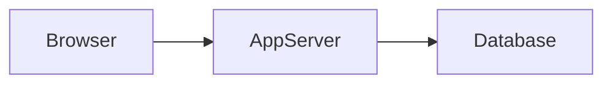
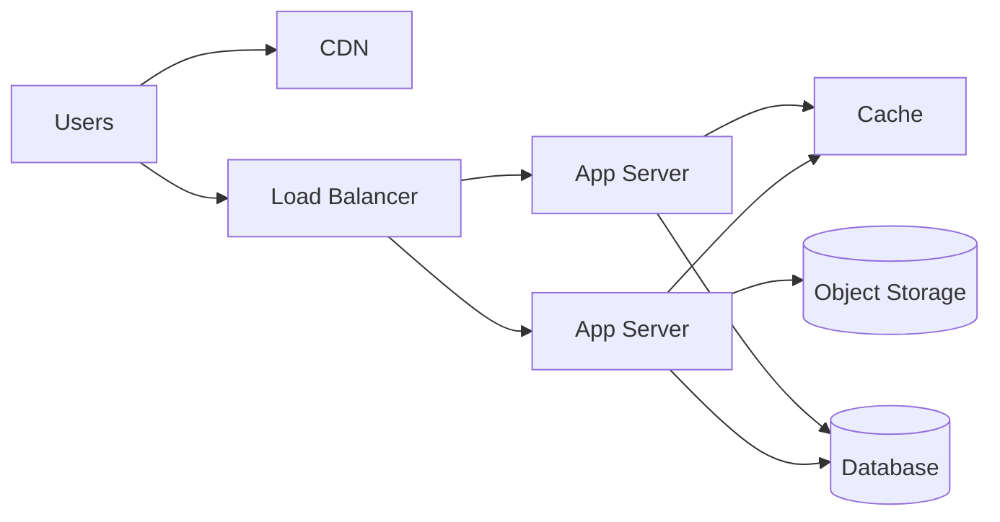

# 01. What is System Design?

## Learning goals

By the end of this lesson you will be able to:

- Explain system design in plain English  
- Tell the difference between coding, HLD, and LLD  
- Recognize the main parts of almost any large app  

## Simple definition

**System design** is planning how a software product is built so it works for many users, stores data safely, stays fast enough, and survives failures.

Writing a function is coding.  
Designing how millions of users share photos across the world is system design.

## Why it matters

At small scale (a school project), one server + one database is enough.

At real-world scale you must answer:

- Where do requests go?  
- Where is data stored?  
- What if a server dies?  
- What if one city has slow internet?  
- How do we add features without rewriting everything?  

System design is the skill of answering those questions with diagrams, numbers, and trade-offs.

## Coding vs HLD vs LLD

| Level | Focus | Example |
|-------|--------|---------|
| Coding | Algorithms & language details | Write `shortenUrl()` in Python |
| **LLD** | Modules, classes, APIs, DB schema | Design `UrlService`, tables, endpoints |
| **HLD** | Major components & data flow | Client → API → Cache → DB → CDN |

Think of a building:

- **HLD** = floors, elevators, plumbing layout  
- **LLD** = door specs, wiring diagrams, room sizes  
- **Code** = actually pouring concrete and installing wires  

## A tiny example: “Share a note”

**Naive design (works for you and 3 friends):**

**Better design (works for many users):**

Nothing magical happened — we introduced common building blocks you will see everywhere.

## The universal building blocks

Almost every large system is a remix of these:

1. **Clients** — browser, mobile app  
2. **DNS** — turns `app.com` into an IP address  
3. **Load balancer** — spreads traffic across servers  
4. **App / API servers** — business logic  
5. **Cache** — fast temporary memory (Redis)  
6. **Database** — durable source of truth  
7. **Queue + workers** — background jobs  
8. **Object storage / CDN** — files, images, video  

You do not need all of them on day one. You add them when a bottleneck appears.

## Functional vs non-functional requirements

- **Functional:** what the product *does* (“users can shorten URLs”)  
- **Non-functional:** *how well* it does it (“p99 latency < 200ms”, “99.9% uptime”)  

Beginners often design only for features. Interviewers and production systems care equally about non-functionals.

## Trade-offs are the job

There is rarely one perfect design. Common trade-offs:

- Speed vs cost  
- Consistency vs availability  
- Simplicity vs flexibility  
- Fresh data vs cached data  

A good designer **names the trade-off out loud**.

## What “good” looks like for a beginner

You do **not** need to memorize Google’s exact architecture.

You **do** need to:

1. Clarify requirements  
2. Make rough estimates  
3. Draw a clear HLD  
4. Detail key APIs and tables (LLD)  
5. Call out bottlenecks and failure modes  

## Check your understanding

1. In one sentence, what is system design?  
2. Is designing a database table HLD or LLD?  
3. Name four building blocks of a typical web backend.  

Answers

1. Planning how software components work together under real constraints (scale, latency, failures).  
2. LLD (schema detail). HLD would say “we use a SQL database” without every column.  
3. Any four of: clients, load balancer, app servers, cache, DB, queue, CDN/object storage.

---

**Next:** [Requirements Gathering](02-requirements.md)
