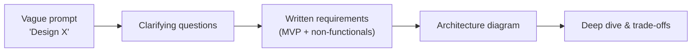
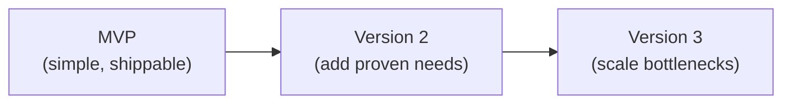
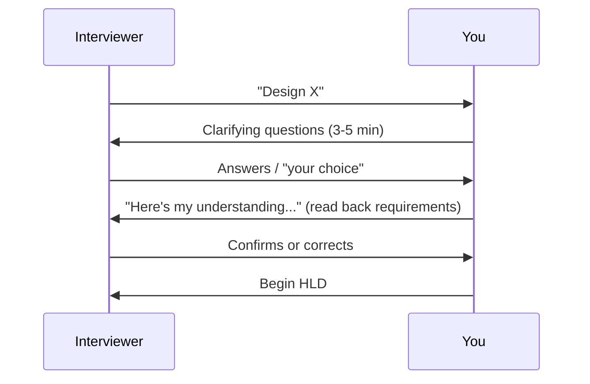

# 02. Requirements Gathering

## Learning goals

By the end of this lesson you will be able to:

- Explain why requirements come **before** architecture diagrams
- Separate **functional** and **non-functional** requirements with confidence
- Use a structured **clarifying-questions checklist** in interviews and real projects
- Define **MVP** vs **out-of-scope** vs **future evolution**
- Write requirements using a reusable template
- Walk through full requirement sets for common case-study prompts (URL shortener, chat, Instagram-style app)
- Avoid the most common beginner mistakes that lead to over-scoped or wrong architectures

---

## Why this comes first

If you jump straight to boxes and arrows, you will often solve the **wrong problem**.

### The post office analogy

Imagine someone walks in and says: *"Design a mail system."*

Before you build anything, you need to know:

| Unclear question | Why it changes the design |
|------------------|---------------------------|
| Letters only, or packages up to 50 kg? | Sorting machines vs forklift warehouses |
| Same city, or international? | One hub vs customs + multi-region hubs |
| Delivery in 1 day or 1 week? | Air freight vs ground trucks |
| 100 letters/day or 10 million? | One clerk vs automated sorting facility |

**Same words. Completely different systems.**

In system design, "Design Instagram" could mean:

- Photo upload + feed only (MVP social app)
- Stories, Reels, DMs, ads, search, shopping, moderation (a company, not a case study)

Those require wildly different architectures, timelines, and teams. **Clarify first. Design second.**



Skipping step B is the #1 beginner mistake in interviews.

---

## Functional requirements

**Functional requirements** describe **what the system does** — the features and behaviors users (or other systems) can perform.

Write them as clear, testable bullets. Each bullet should answer: *"Can a user/system do X?"*

### How to write good functional requirements

| Bad (vague) | Good (specific) |
|-------------|-----------------|
| "Users can share content" | "Users can upload a photo (JPEG/PNG, max 10 MB) and share it with followers" |
| "Fast search" | "Users can search for other users by exact username" |
| "Messaging works" | "Users can send 1:1 text messages up to 2,000 characters" |

### Worked example: URL shortener (MVP)

**Functional requirements:**

- User submits a long URL and receives a unique short URL (e.g., `short.ly/aZ9kQ2`)
- Visiting the short URL redirects (HTTP 302) to the original long URL
- Short codes are unique across the system
- Optional: user can set a custom alias (e.g., `short.ly/my-link`) if not taken
- Optional: user can set an expiry date; expired links return 404
- Optional: track click count per short URL

### More functional examples (by domain)

| Product | Functional requirement examples |
|---------|--------------------------------|
| **Chat app** | Send/receive 1:1 text; see online/offline status; load message history |
| **Twitter-like** | Post tweet (280 chars); follow users; view home timeline |
| **Ride-sharing** | Request ride; driver accepts; track location; complete payment |
| **File storage** | Upload file; download via link; delete own files |
| **Rate limiter** | Allow N requests per user per minute; return 429 when exceeded |

---

## Non-functional requirements

**Non-functional requirements (NFRs)** describe **how well** the system performs — quality attributes, constraints, and operational expectations.

Features tell you *what* to build. NFRs tell you *how hard* the engineering problem actually is.

### The restaurant analogy for NFRs

Two restaurants both "serve food" (same functional requirement):

| Restaurant | Non-functionals | Design impact |
|------------|-----------------|---------------|
| **Food truck** | 50 customers/lunch, 5-min wait OK, one location | One grill, one cook, cash only |
| **Fine dining chain** | 500 covers/night, <15 min wait, 99.9% reservation uptime, GDPR for EU guests | Reservation system, kitchen display, multi-location sync, compliance audit logs |

Same function ("serve food"). Different non-functionals → different architecture.

### Common NFR categories

| Category | Questions to ask | Example targets |
|----------|------------------|-----------------|
| **Latency** | How fast must operations feel? p50 vs p99? | "Redirect < 100ms p99"; "Feed load < 500ms p50" |
| **Availability** | Can it be down? How often? | "99.9% uptime" (~8.7 hrs downtime/year) |
| **Throughput / scale** | How many users, requests, data volume? | "10M DAU"; "1k writes/sec peak"; "100 TB storage in 3 years" |
| **Consistency** | Must every read see the latest write immediately? | "Strong consistency for payments"; "eventual OK for view counts" |
| **Durability** | Can we ever lose data? | "Zero data loss for paid orders"; "best-effort for analytics logs" |
| **Security & privacy** | Auth? Encryption? Compliance? | "HTTPS everywhere"; "PII encrypted at rest"; "GDPR delete within 30 days" |
| **Reliability / fault tolerance** | What happens when components fail? | "Survive single server failure with no user-visible outage" |
| **Cost** | Budget constraints? | "Must run on <$500/month for MVP" |
| **Maintainability** | Team size, deploy frequency? | "Weekly deploys"; "team of 5 engineers" |

### Functional vs non-functional — side-by-side

| Statement | Type | Why |
|-----------|------|-----|
| "User can upload a photo" | **Functional** | Describes a feature |
| "Upload completes in < 5s on 4G" | **Non-functional** | Describes performance |
| "User can log in with email/password" | **Functional** | Feature |
| "Sessions expire after 24 hours" | **Non-functional** | Security/operational constraint |
| "System supports 1M concurrent users" | **Non-functional** | Scale |
| "User can search by username" | **Functional** | Feature |
| "Search returns in < 200ms p99" | **Non-functional** | Latency |

### Availability numbers (useful reference)

| Target | Downtime per year | Typical use case |
|--------|-------------------|------------------|
| 99% ("two nines") | ~3.65 days | Internal tools, dev environments |
| 99.9% ("three nines") | ~8.7 hours | Most consumer web apps |
| 99.99% ("four nines") | ~52 minutes | Payment systems, critical infra |
| 99.999% ("five nines") | ~5 minutes | Telco, some banking |

You don't need five nines for a photo-sharing MVP. **Match availability to business impact.**

---

## The clarifying-questions checklist

Use this checklist in **every** system design session — interview or real project. Spend 5–10 minutes here. It pays for itself.

### Master checklist

| # | Question | What you're really asking |
|---|----------|---------------------------|
| 1 | **Who are the users?** | Public consumers? Enterprise admins? Mobile-only? IoT devices? |
| 2 | **What is the MVP?** | Smallest useful version — what ships first? |
| 3 | **What is explicitly out of scope?** | Prevents scope creep |
| 4 | **Read-heavy or write-heavy?** | Drives cache vs write-optimization decisions |
| 5 | **Expected scale — now and in 1–2 years?** | DAU, QPS, storage growth |
| 6 | **Latency expectations?** | p50 and p99 for key operations |
| 7 | **Consistency requirements?** | Strong vs eventual — per feature if needed |
| 8 | **Durability / data loss tolerance?** | Can we lose anything? What? |
| 9 | **Geographic scope?** | Single region or global users? |
| 10 | **Online vs async?** | Must action complete before response, or is "we'll process it" OK? |
| 11 | **Auth & security?** | Public? Login required? Roles? |
| 12 | **Abuse & edge cases?** | Spam, bots, oversized uploads, malicious URLs? |
| 13 | **Compliance?** | GDPR, HIPAA, PCI-DSS, data residency? |
| 14 | **Existing systems?** | Greenfield or integrate with legacy? |

### How to ask in an interview (example script)

> **Interviewer:** "Design a URL shortener."
>
> **You:** "Before I draw anything, I'd like to clarify a few things:
> 1. Is the MVP create + redirect, or do we also need analytics and custom aliases?
> 2. What's the expected scale — hundreds of users or hundreds of millions of links?
> 3. Do short URLs expire, or are they permanent?
> 4. Any auth — can anyone create links, or registered users only?
> 5. What's the latency target for redirects?"

This signals maturity. Interviewers **want** you to ask.

---

## MVP vs out-of-scope vs future evolution

### Definitions

| Term | Meaning | Example (chat app) |
|------|---------|-------------------|
| **MVP** | Minimum Viable Product — smallest useful version | 1:1 text, delivery, history |
| **Out of scope (for now)** | Explicitly *not* building in this design | Voice/video, 10k-person groups, disappearing messages |
| **Future evolution** | How the design extends when requirements grow | "At 10× users we'd add read replicas"; "Phase 2: group chats" |

### MVP mindset (the library analogy)

A new library doesn't open with:

- 3 floors of rare manuscripts
- A coffee shop
- A 24/7 drive-through book drop
- An inter-library loan network across 50 countries

It opens with: **shelves, a checkout desk, and a catalog.**

Same for system design:

| Bad (minute one) | Good (MVP first) |
|------------------|------------------|
| "We'll build Kafka, multi-region Cassandra, ML ranking, and a custom CDN" | "MVP: single-region Postgres + Redis cache. At 10× traffic we add read replicas. At 100× we consider sharding." |

Design the **smallest useful product**, then explain how it **evolves**. Interviewers reward this heavily.



---

## Requirements template

Copy and fill this in at the start of every design session:

```text
Product: <name>

Users:
- <who uses it, on what devices>

Functional (MVP):
- ...
- ...

Out of scope (for now):
- ...

Future evolution (optional):
- ...

Non-functional:
- Scale: <DAU, QPS, storage>
- Latency: <key operations + targets>
- Availability: <target + acceptable downtime>
- Consistency: <strong vs eventual, per feature if needed>
- Durability: <data loss tolerance>
- Security: <auth, encryption, compliance>

Assumptions:
- <anything you assumed because the prompt was silent>
```

---

## Worked example 1: URL shortener (full)

```text
Product: URL Shortener (like bit.ly)

Users:
- Anonymous and registered users on web/mobile

Functional (MVP):
- Create short URL from long URL; receive unique short code
- Redirect short URL → long URL (HTTP 302)
- Short codes unique globally

Out of scope (for now):
- User accounts and link management dashboard
- Custom domains (short.co instead of short.ly)
- Link preview / malware scanning

Future evolution:
- Custom aliases, click analytics, expiry dates
- API for programmatic link creation

Non-functional:
- Scale: 100M links stored; 10k redirects/sec peak
- Latency: redirect p99 < 100ms
- Availability: 99.9%
- Consistency: eventual OK for click counts; strong for redirect mapping
- Durability: never lose a short→long mapping once created
- Security: rate-limit creation; block known malicious domains

Assumptions:
- Short codes are 6–8 alphanumeric characters
- Links are permanent unless expiry feature added later
```

**Why this matters for architecture:** 10k redirects/sec peak tells you reads dominate → cache the mapping aggressively. "Never lose mapping" tells you replicate the database. Rate-limiting tells you need abuse protection at the API layer.

---

## Worked example 2: Chat app (full)

```text
Product: 1:1 Messaging App (WhatsApp-lite)

Users:
- Mobile users (iOS/Android), global

Functional (MVP):
- 1:1 text messaging (up to 2,000 chars)
- Online/offline presence indicator
- Message delivery to offline users (store-and-forward)
- Message history (load last 50 messages on open)

Out of scope (for now):
- Group chats
- Voice/video calls
- End-to-end encryption
- Disappearing messages
- Media attachments (images/video)

Future evolution:
- Group chats up to 256 members
- Image sharing via object storage
- Read receipts

Non-functional:
- Scale: 50M DAU; 1M concurrent connections
- Latency: message delivery < 500ms p99 on good network
- Availability: 99.9%
- Consistency: messages must not be lost once server ACKs send
- Durability: messages stored until user deletes
- Security: auth required; TLS in transit

Assumptions:
- Users have stable user IDs
- "Delivered" means persisted on server and pushed to recipient if online
```

**Architecture hints this unlocks:** 1M concurrent connections → WebSockets or long polling, not plain REST. Store-and-forward → message queue + persistent storage. Presence → heartbeat system or last-seen cache.

---

## Worked example 3: Instagram-style app (trimmed for interview)

**Interviewer says:** "Design Instagram."

**Your clarifying questions and resulting requirements:**

```text
Product: Photo Sharing App (Instagram MVP)

Users:
- Mobile-first consumers, global

Functional (MVP):
- Upload photo (JPEG, max 10 MB)
- Follow other users
- View home feed (photos from followed users, reverse chronological)
- Like a photo
- Basic user profile (photo grid, follower count)

Out of scope (for now):
- Stories, Reels, DMs
- Search, explore, ads
- Video upload
- Image filters / ML tagging

Future evolution:
- Ranked feed (ML)
- Stories (24h expiry content)
- CDN multi-region

Non-functional:
- Scale: 10M DAU; 500 uploads/sec peak; 50k feed reads/sec peak
- Latency: feed load < 1s p99; upload ACK < 3s
- Availability: 99.9%
- Consistency: eventual OK for like counts; strong for "photo exists after upload ACK"
- Durability: photos never lost after successful upload
- Security: auth required; signed URLs for photo access

Assumptions:
- Feed is reverse chronological (not ranked) for MVP
- Average 5 MB per photo
```

Compare this to designing "all of Instagram." The MVP fits in a 45-minute interview. The full company does not.

---

## How requirements drive architecture decisions

| Requirement | Architectural consequence |
|-------------|----------------------------|
| 10k redirects/sec, read-heavy | Cache short→long mapping in Redis |
| Messages must not be lost | Persistent queue + DB before ACK to sender |
| 1M concurrent WebSocket connections | Dedicated connection servers; not plain REST |
| Global users, fast image load | CDN + object storage |
| Strong consistency for payments | Synchronous replication or consensus protocol |
| Eventual OK for view counts | Async counter updates, batched writes |
| 99.99% availability | No single points of failure; multi-AZ deployment |
| GDPR delete within 30 days | Soft delete + purge pipeline; audit logs |

Always trace: **requirement → design choice → trade-off.**

---

## Common beginner mistakes

| # | Mistake | Why it hurts | Fix |
|---|---------|--------------|-----|
| 1 | **Designing every feature of a real company** | Scope explodes; you run out of time; architecture is unfocused | Define MVP; list out-of-scope explicitly |
| 2 | **Ignoring non-functionals entirely** | "It has all the features" but no idea if it handles scale or survives failures | Always state scale, latency, availability |
| 3 | **Assuming strong consistency everywhere** | Over-engineering; slower and costlier than needed | Ask per feature: "Must this be instantly consistent?" |
| 4 | **Not listing out-of-scope items** | Interviewer assumes you're building DMs, ads, and ML ranking | Say what you're NOT building |
| 5 | **Forgetting abuse cases** | "Users upload photos" but no max size → storage bomb | Ask: spam, bots, oversized payloads, malicious links |
| 6 | **Silent assumptions** | You assume "mobile only" but interviewer meant web too | State assumptions out loud |
| 7 | **No scale numbers at all** | Can't size databases, caches, or server counts | Ask or assume: "Let's assume 10M DAU unless you have a number" |
| 8 | **Treating latency as optional** | Design works functionally but feels unusable | Set p99 targets for 2–3 key operations |

---

## Interview tip: the first 5 minutes



**Read back your requirements** before drawing. One sentence:

> "So we're building MVP chat with 1:1 text, presence, and history for 50M DAU, delivery under 500ms, and no group chats — I'll design for that unless you'd like to adjust."

This prevents 20 minutes of designing the wrong system.

---

## Check your understanding

### Question 1
Is "redirect must complete in under 100ms" functional or non-functional? Explain why.

### Question 2
Why should you list out-of-scope items explicitly?

### Question 3
Give three clarifying questions you would ask for "Design YouTube."

### Question 4
For a ride-sharing app, give one functional and one non-functional requirement.

### Question 5
What's the difference between MVP and "future evolution"? Give an example.

### Question 6
An interviewer says: "Design Twitter." You spend 0 minutes on requirements and immediately draw 15 microservices. What's wrong?

### Question 7
"Like counts can be slightly stale" — what NFR category is this, and what design freedom does it give you?

<details>
<summary>Detailed answers</summary>

**1. Redirect latency**

**Non-functional** — specifically a **latency** NFR. It doesn't describe *what* the system does (redirect); it describes *how fast* it must do it. Functional would be: "User visiting a short URL is redirected to the original URL."

**2. Why list out-of-scope items**

- **Prevents scope explosion** — you and the interviewer agree on boundaries
- **Avoids wrong architecture** — DMs require different infra than a photo feed
- **Shows maturity** — you prioritize instead of trying to boil the ocean
- **Saves interview time** — focus deep dives on what matters for MVP

**3. Clarifying questions for "Design YouTube"**

Any three of:

- Are we designing upload + playback only, or also live streaming?
- What's the expected scale (users, uploads/day, concurrent viewers)?
- Max video length and resolution?
- Global audience or single region?
- Is search in scope?
- Monetization / ads / comments / recommendations?
- Latency target for video start (e.g., < 2s to first frame)?
- Can we use existing CDN/transcoding services?

**4. Ride-sharing — functional vs non-functional**

- **Functional:** "Rider can request a ride by setting pickup and dropoff location."
- **Non-functional:** "Driver location updates every 3 seconds with < 1s latency" (latency + throughput) OR "99.9% availability during peak hours" (availability).

**5. MVP vs future evolution**

- **MVP** = what you build **now** (smallest useful product)
- **Future evolution** = what you **plan to add later** and how the architecture accommodates it

Example: Chat MVP = 1:1 text only. Future evolution = group chats up to 256 people, requiring a different message routing model — but MVP schema doesn't block it.

**6. What's wrong with jumping to 15 microservices**

- No clarifying questions → you might design the wrong product (Twitter the company vs tweet post + timeline MVP)
- No scale assumptions → can't justify microservices vs monolith
- Over-engineered for unknown requirements
- Interviewers want to see **requirements → estimates → simple design → evolve**, not buzzword soup

**7. Stale like counts**

This is a **consistency** NFR — specifically **eventual consistency** is acceptable. Design freedom:

- Update like counts **asynchronously** (queue + batch writes) instead of synchronously on every click
- Cache like counts aggressively
- Avoid distributed transactions across services
- Accept that a user might see "99 likes" for a second before it becomes "100"

</details>

---

**Next:** [Back-of-the-Envelope Estimates](03-estimates.md) — learn to put numbers on your requirements so your architecture is grounded in reality, not guesswork.
