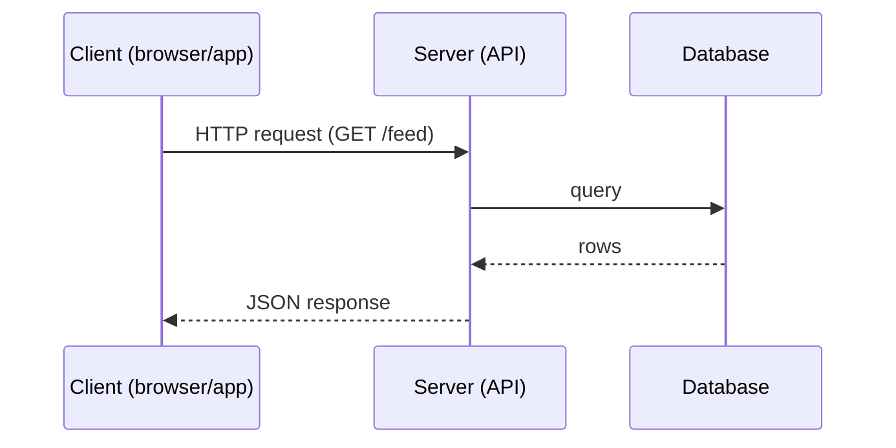

# 04. Clients, Servers & APIs

## Learning goals

- Explain request/response between client and server  
- Choose between REST-style and other API styles at a high level  
- Design simple, clear endpoints for HLD/LLD  

## Client and server



- **Client:** UI + local state; initiates requests  
- **Server:** validates, authorizes, applies business rules, talks to storage  

For scale, we usually run **many stateless app servers** behind a load balancer. Stateless means any server can handle any request (session data lives in Redis/DB, not in server RAM only).

## What is an API?

An **API** is the contract: which URLs exist, what you send, what you get back.

Good APIs are:

- Predictable naming  
- Versioned when breaking changes happen  
- Explicit about errors  

## REST-style APIs (most common in tutorials)

Resources + HTTP verbs:

| Verb | Meaning | Example |
|------|---------|---------|
| GET | Read | `GET /users/42` |
| POST | Create | `POST /urls` |
| PUT/PATCH | Update | `PATCH /users/42` |
| DELETE | Remove | `DELETE /posts/9` |

Example body:

```json
POST /api/v1/urls
{
  "longUrl": "https://example.com/very/long/path"
}

→ 201 Created
{
  "shortCode": "aZ9kQ2",
  "shortUrl": "https://short.ly/aZ9kQ2"
}
```

## Other API styles (awareness)

| Style | When you see it |
|-------|-----------------|
| **GraphQL** | Clients need flexible queries (many mobile screens) |
| **gRPC** | Fast service-to-service (binary, typed) |
| **WebSockets** | Real-time chat, live updates |
| **Webhooks** | Server pushes events to your URL |

For beginners and most case studies here, **HTTP JSON APIs** are enough.

## Designing APIs for system design

In LLD, write:

1. Endpoint list  
2. Request / response JSON  
3. Status codes for main errors  
4. Auth method (API key, JWT, cookie session)  

### Auth quick map

- **Public read:** URL redirect — maybe no auth  
- **User actions:** JWT / session cookie  
- **Service-to-service:** mTLS or signed tokens  

## Idempotency (important)

If a client retries `POST /payments`, you must not charge twice.

Pattern: client sends `Idempotency-Key`; server stores result of first successful processing.

## Pagination

Never return unbounded lists.

```text
GET /feed?cursor=abc&limit=20
```

Cursor-based pagination scales better than `OFFSET` for big feeds.

## Versioning

```text
/api/v1/...
/api/v2/...
```

Or header-based versioning. Pick one and stay consistent.

## Example LLD snippet: notes API

```text
POST   /api/v1/notes          create note
GET    /api/v1/notes/:id      get note
GET    /api/v1/notes?limit=20 list my notes
DELETE /api/v1/notes/:id      delete note
```

## Check your understanding

1. Why prefer stateless app servers?  
2. What HTTP verb should fetch a resource use?  
3. Why is idempotency critical for payments?  

<details>
<summary>Answers</summary>

1. Any server can handle any request → easy horizontal scaling and failover.  
2. GET.  
3. Network retries can duplicate requests; without idempotency you double-charge.

</details>

---

**Next:** [Load Balancing](05-load-balancing.md)
