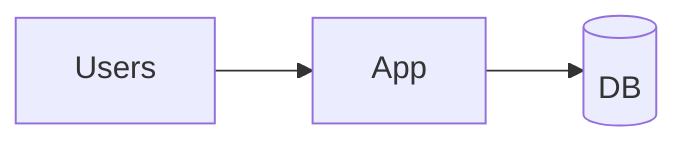
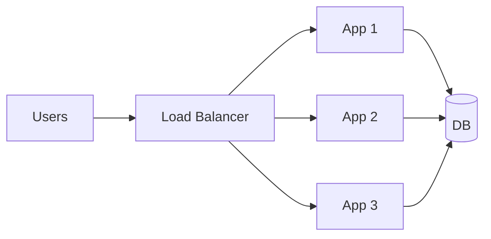
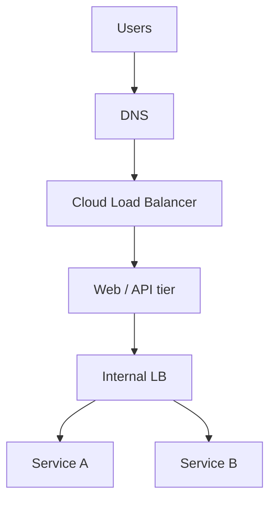

# 05. Load Balancing

## Learning goals

- Explain why load balancers exist  
- Compare common balancing algorithms  
- Place LBs correctly in an HLD diagram  

## The problem

One app server:

When traffic grows, that server CPU/memory saturates. Requests queue up → timeouts.

## The fix: many servers + a load balancer

The **load balancer (LB)** accepts all traffic and forwards each request to a healthy backend.

## What load balancers give you

1. **Horizontal scale** — add app servers  
2. **High availability** — remove dead servers from rotation  
3. **SSL termination** — decrypt HTTPS at LB (common pattern)  
4. **Health checks** — only send traffic to live instances  

## Layer 4 vs Layer 7

| Type | Operates on | Pros |
|------|-------------|------|
| **L4** | IP/port (TCP) | Very fast, simple |
| **L7** | HTTP path/headers | Route `/api` vs `/static`, A/B, auth-aware |

Most web designs use **L7 HTTP load balancers** (AWS ALB, Nginx, Envoy).

## Common algorithms

| Algorithm | Behavior | Good for |
|-----------|----------|----------|
| **Round robin** | Take turns | Similar servers, similar requests |
| **Least connections** | Prefer quieter server | Long-lived connections |
| **Consistent hashing** | Same key → same server | Sticky cache locality |
| **Weighted** | Stronger servers get more | Mixed instance sizes |

## Sticky sessions (use carefully)

“Stick” a user to one server based on cookie.

- Useful if local in-memory session exists  
- Hurts failover and scale — prefer external session store (Redis)  

## Health checks

LB periodically calls `/health`.

- **200 OK** → keep in pool  
- Fail N times → eject  

Design health endpoints to check critical dependencies thoughtfully (don’t false-fail the whole node because one optional cache is down — product decision).

## Where LBs appear in bigger systems

Public LB at the edge; internal LBs between microservices.

## Beginner HLD tip

In diagrams, one box labeled **Load Balancer** in front of **N App Servers** is enough. Mention algorithm only if relevant (e.g., consistent hashing for chat gateways).

## Check your understanding

1. What happens if the LB itself dies? (Think: usually multiple LBs / managed service)  
2. Why are sticky sessions often discouraged?  
3. Round robin vs least connections — when prefer least connections?  

Answers

1. You use managed highly-available LBs or anycast/DNS failover — single LB is a SPOF.  
2. They couple users to one machine; failures and scaling are harder.  
3. When request durations vary a lot (some connections hold longer).

---

**Next:** [Databases](06-databases.md)
