# 05. Load Balancing

## Learning goals

By the end of this lesson you will be able to:

- Explain **why** load balancers exist and what problems they solve
- Compare **Layer 4 (L4)** vs **Layer 7 (L7)** load balancers with practical examples
- Describe common **balancing algorithms** and when to use each (with everyday analogies)
- Configure **health checks** so traffic only goes to healthy servers
- Understand **sticky sessions**, their risks, and better alternatives
- Explain **SSL/TLS termination** at the load balancer
- Place load balancers correctly in **HLD diagrams** (edge, internal, multi-tier)
- Recognize the load balancer as a potential **single point of failure (SPOF)** and how to mitigate it

---

## The problem: one server isn't enough

### Restaurant analogy

Imagine a restaurant with **one chef** and **one stove**:

| Customers | What happens |
|-----------|--------------|
| 5 tables | Chef handles it fine |
| 50 tables | Orders pile up; wait times explode |
| 200 tables | Kitchen meltdown; customers leave angry reviews |

You don't fix this by buying a faster stove alone. You hire **more chefs** and need a **host** to direct customers to the next available station.

In software: one app server has finite CPU, memory, and network bandwidth. When traffic grows, that server saturates → requests queue → timeouts → outages.

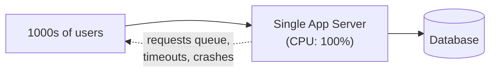

---

## The fix: many servers + a load balancer

A **load balancer (LB)** sits in front of multiple app servers. It accepts **all incoming traffic** and **forwards each request** to a healthy backend server.

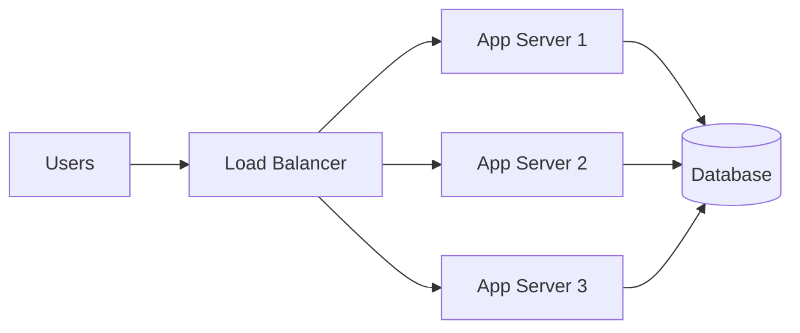

### Post office analogy

Think of a busy post office with **multiple counter clerks**:

- Customers enter the lobby (incoming traffic)
- A **greeter** (load balancer) directs each customer to the clerk with the **shortest line**
- If a clerk goes on break (server crash), the greeter **stops sending people** to that counter
- Customers don't need to know *which* clerk helped them — they just get served

The load balancer is that greeter.

---

## What load balancers give you

| Benefit | Explanation | Without LB |
|---------|-------------|------------|
| **Horizontal scaling** | Add more app servers to handle more traffic | Vertical scaling only (bigger machine — has limits) |
| **High availability** | Detect dead servers; stop sending traffic to them | One server dies → entire site down |
| **SSL/TLS termination** | Decrypt HTTPS at the LB; backends speak plain HTTP internally | Every app server manages certificates |
| **Health checks** | Only route to servers passing health probes | Traffic sent to crashed servers → errors |
| **Traffic routing (L7)** | Route `/api` to API servers, `/static` to CDN origin | Manual DNS or separate domains |
| **Graceful deploys** | Drain connections from old servers while new ones warm up | Deploy = downtime or errors |

---

## Layer 4 vs Layer 7 load balancers

Load balancers operate at different levels of the **network stack**. The layer determines **what information** the LB can see when making routing decisions.

### Highway analogy

Imagine traffic entering a city:

| Layer | What it sees | Analogy | Routing decision |
|-------|--------------|---------|------------------|
| **L4 (Transport)** | IP address + port number | Highway exit number — "all cars on Exit 7 go to District A" | "Send TCP connection to server 10.0.1.5:8080" |
| **L7 (Application)** | HTTP URL path, headers, cookies | Reading each car's **delivery address** — "packages for Main Street go to Warehouse B" | "Send `/api/*` to API pool; `/static/*` to static pool" |

### Comparison table

| Feature | L4 (Transport) | L7 (Application) |
|---------|----------------|------------------|
| **Operates on** | IP + port (TCP/UDP) | HTTP headers, URL path, cookies |
| **Speed** | Very fast (less inspection) | Slightly more overhead |
| **Routing flexibility** | Basic (by port) | Rich (by path, header, cookie) |
| **SSL termination** | Yes | Yes |
| **Content-based routing** | No | Yes (`/api` vs `/images`) |
| **Examples** | AWS NLB, HAProxy (TCP mode) | AWS ALB, Nginx, Envoy, HAProxy (HTTP mode) |

### When to use which

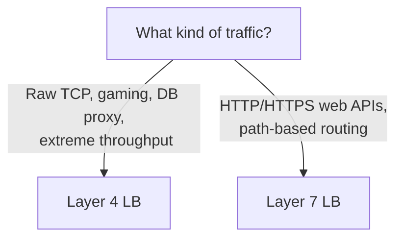

| Use case | Typical choice |
|----------|----------------|
| Web API (REST/JSON) | **L7** (AWS ALB, Nginx) |
| WebSocket connections | **L7** (needs HTTP upgrade handling) |
| Microservice routing by path | **L7** |
| Database connection pooling (TCP) | **L4** |
| Gaming servers (UDP) | **L4** |
| Extreme throughput, simple fan-out | **L4** |

**For most system design interviews:** assume **L7 HTTP load balancer** unless the prompt involves raw TCP/UDP or gaming.

### L7 routing example

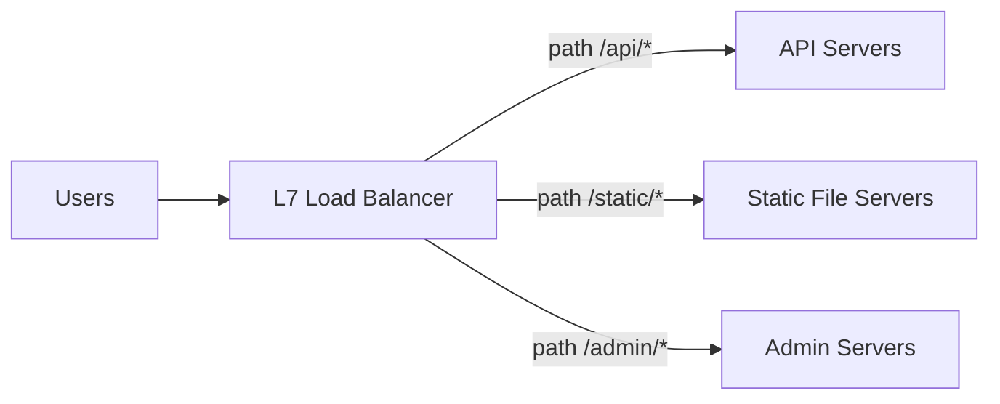

One domain (`myapp.com`), multiple backend pools — the LB inspects the URL path and routes accordingly.

---

## Common load balancing algorithms

The algorithm decides **which backend server** gets the next request.

### Algorithm reference table

| Algorithm | How it works | Analogy | Good for | Watch out for |
|-----------|--------------|---------|----------|---------------|
| **Round Robin** | Takes turns: 1 → 2 → 3 → 1 → 2 → 3 | Rotating door — each person goes to the next clerk in sequence | Similar servers, similar request costs | Uneven if requests vary in weight |
| **Weighted Round Robin** | Servers with higher weight get more requests | Senior clerk handles 2× the customers of a trainee | Mixed instance sizes (4 CPU vs 8 CPU) | Weights need tuning |
| **Least Connections** | Send to server with fewest active connections | Greeter sends you to the clerk with the **shortest line** | Long-lived connections, varied request duration | Slightly more LB overhead |
| **Weighted Least Connections** | Least connections adjusted by server weight | Shortest line, but senior clerks can handle longer lines | Mixed sizes + long connections | Same as above |
| **IP Hash / Source IP** | Same client IP → same server | Regular customer always directed to the same clerk who knows them | Simple session affinity | Uneven if few client IPs (NAT) |
| **Consistent Hashing** | Hash a key (user ID, URL) → ring → server | Library book assigned to a shelf by title letter — adding shelves moves few books | Cache locality, sharding gateways | Adding/removing servers causes minimal redistribution |
| **Random** | Pick a random healthy server | Lottery ticket for which counter | Simple, surprisingly effective at scale | No guarantee of even distribution (law of large numbers helps) |
| **Least Response Time** | Pick server with lowest latency | Send to the clerk who finishes fastest | Latency-sensitive workloads | Requires active measurement |

### Round robin — worked example

Three servers: A, B, C. Ten requests arrive:

```text
Request 1 → A
Request 2 → B
Request 3 → C
Request 4 → A
Request 5 → B
Request 6 → C
Request 7 → A
Request 8 → B
Request 9 → C
Request 10 → A
```

Simple and fair **if every request costs roughly the same**. Breaks down when some requests take 10ms and others take 30 seconds.

### Least connections — when round robin fails

| Server | Active connections | Next request goes to... |
|--------|-------------------|------------------------|
| A | 50 (handling slow uploads) | |
| B | 3 | **B** ← fewest |
| C | 5 | |

Round robin would send the next request to A (its "turn") even though A is overloaded with long uploads. Least connections sends it to B.

**Use least connections when:** request durations vary widely (file uploads, report generation, WebSocket connections).

### Consistent hashing — cache locality

Imagine a distributed cache where you want the same user's data to land on the same cache node:

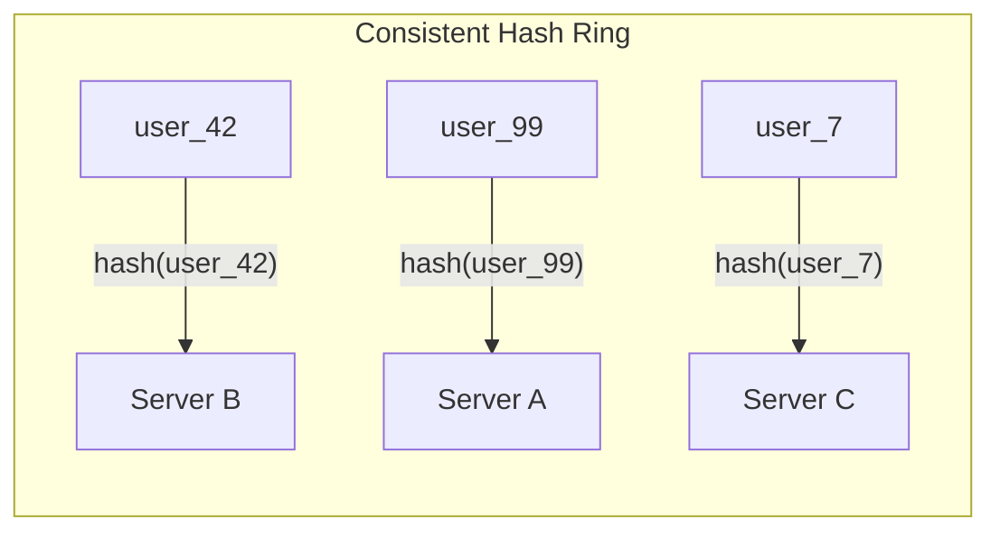

When you **add** Server D, only a fraction of keys move (not all of them, unlike plain modulo hashing). This is important for caches — fewer cache misses after scaling.

**Use consistent hashing when:** cache servers, chat gateway sharding, session stores partitioned by user ID.

---

## Health checks

A load balancer must know which backends are **alive and ready**. Without health checks, traffic goes to crashed servers → users see errors.

### Doctor check-up analogy

The load balancer is a nurse doing **periodic check-ups** on each server:

- "Can you respond to a ping?" (basic)
- "Can you actually query the database?" (deep)

If a server fails check-ups N times in a row → **removed from rotation** until it recovers.

### Types of health checks

| Type | What it checks | Pros | Cons |
|------|----------------|------|------|
| **TCP check** | Can I open a connection to port 8080? | Fast, simple | Server may accept TCP but be broken internally |
| **HTTP check** | Does `GET /health` return 200? | Verifies app is responding | May not catch DB dependency failures |
| **Deep / dependency check** | Does `/health` verify DB + cache connectivity? | Catches real failures | Too aggressive → false positives (server ejected because optional cache is down) |

### Designing a health endpoint

```http
GET /health

200 OK
{
  "status": "healthy",
  "uptime": 86400,
  "checks": {
    "database": "ok",
    "cache": "ok"
  }
}
```

### Health check configuration (typical)

| Setting | Example value | Meaning |
|---------|---------------|---------|
| **Interval** | Every 10 seconds | How often to check |
| **Timeout** | 2 seconds | Max wait for response |
| **Healthy threshold** | 2 consecutive successes | Before adding to pool |
| **Unhealthy threshold** | 3 consecutive failures | Before removing from pool |

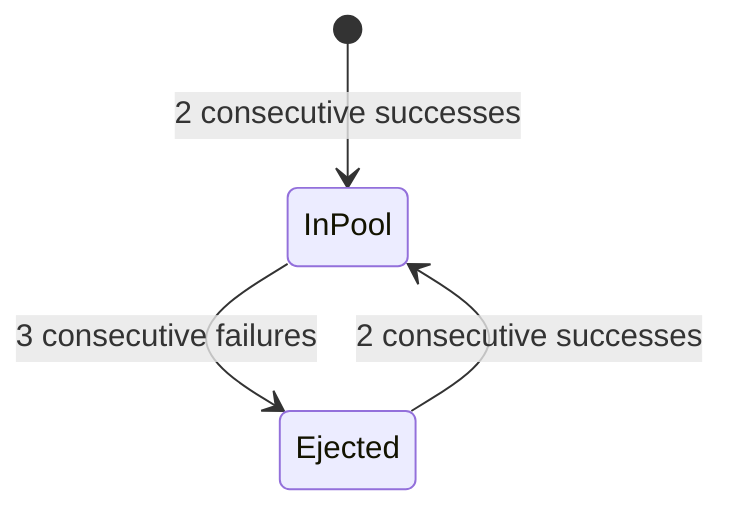

### False positives — design carefully

| Scenario | Risk | Decision |
|----------|------|----------|
| Optional cache is down | Ejecting server removes capacity unnecessarily | `/health` returns 200 if DB is OK; cache failure = degraded but serving |
| Slow DB during spike | All servers fail health check → **total outage** | Set generous timeouts; use circuit breakers |
| Health check hammers DB | Health checks themselves cause overload | Lightweight check or cached DB ping |

**Product decision:** What does "healthy" mean for your app? Document it.

---

## Sticky sessions (session affinity)

**Sticky sessions** (session affinity) bind a user's requests to **one specific server**, usually via a cookie set by the load balancer.

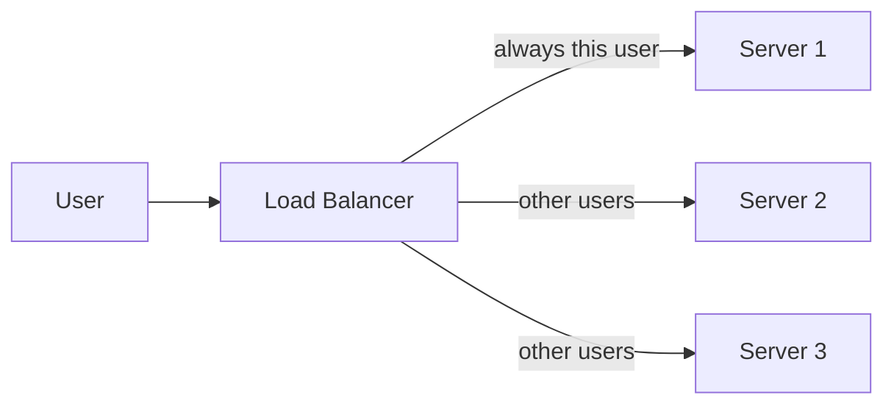

### When sticky sessions seem useful

- Legacy app stores session data **in server memory** (not Redis/DB)
- WebSocket connection must stay on the same server
- Local in-process cache per server

### Why sticky sessions are often discouraged

| Problem | Explanation |
|---------|-------------|
| **Uneven load** | Power users stuck to one server; others idle |
| **Harder failover** | Server dies → all its sticky users lose sessions |
| **Scaling friction** | Adding servers doesn't help sticky users already assigned |
| **Deploy complexity** | Can't freely drain a server if users are stuck to it |

### Better alternative: external session store

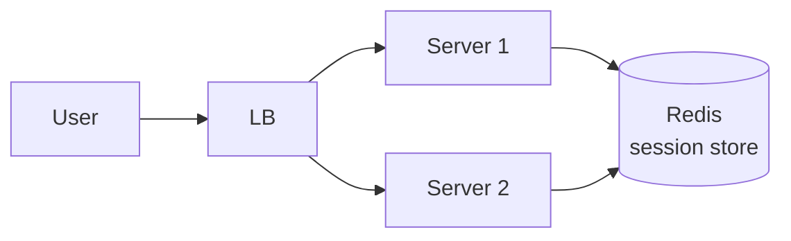

Any server can handle any user — session data lives in **Redis** or the **database**, not in one server's RAM. This is the **stateless server** pattern from [Lesson 04](04-clients-servers-apis.md).

**Interview guidance:** Mention sticky sessions if the prompt involves WebSockets or legacy apps, but prefer external session stores for HTTP APIs.

---

## SSL/TLS termination

**HTTPS** encrypts traffic between client and server. **SSL/TLS termination** means the load balancer handles decryption — backends receive unencrypted HTTP internally.

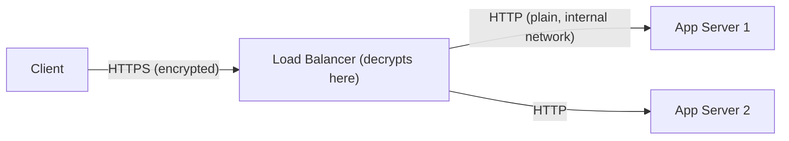

### Why terminate at the LB

| Benefit | Explanation |
|---------|-------------|
| **Centralized cert management** | One place to renew certificates — not N app servers |
| **Reduced CPU on app servers** | Crypto is expensive; LB hardware/software handles it |
| **Simpler app code** | App servers don't need TLS libraries configured |
| **Easier inspection (L7)** | LB can read HTTP headers for routing (requires decryption) |

### Security note

Traffic between LB and app servers is **unencrypted** but travels over a **private network** (VPC). For highly sensitive data, use **SSL end-to-end** (LB decrypts and re-encrypts to backends) — more secure, more complex.

| Pattern | Client → LB | LB → App | Use case |
|---------|-------------|----------|----------|
| **Terminate at LB** | HTTPS | HTTP (private network) | Most web apps |
| **End-to-end SSL** | HTTPS | HTTPS | Banking, healthcare, compliance |
| **Passthrough (L4)** | HTTPS | HTTPS (LB doesn't decrypt) | When LB can't inspect content |

---

## Where load balancers sit in bigger systems

Load balancers appear at **multiple tiers** in production architectures.

### Edge (public) load balancer

The first stop after DNS. Handles internet traffic, SSL termination, DDoS protection.

### Internal load balancer

Between microservices or between web tier and app tier. Not exposed to the public internet.

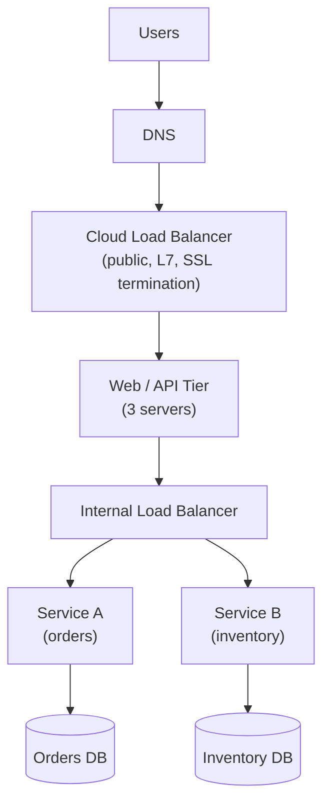

### Multi-tier example (classic web app)

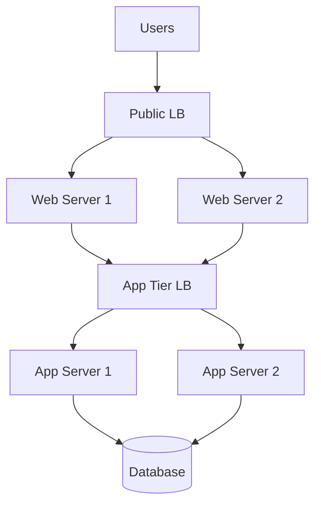

In practice, web and app tiers are often merged into one "API server" tier behind a single LB for simpler architectures.

### Global load balancing (awareness)

For multi-region deployments, **DNS-based** or **anycast** global load balancing directs users to the nearest healthy region:

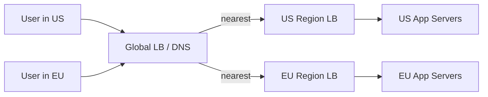

---

## The load balancer as a single point of failure (SPOF)

If you have **one load balancer** and it dies, **all traffic stops** — even if every app server is healthy.

### Library analogy

One greeter at the door directing all visitors. If the greeter leaves, **nobody enters the library** — even though all the librarians are ready to help.

### Mitigation strategies

| Strategy | How it works |
|----------|--------------|
| **Managed cloud LB** | AWS ALB/NLB, GCP LB — cloud provider runs redundant LBs for you |
| **LB pair (active/passive)** | Two LBs; heartbeat between them; standby takes over on failure |
| **DNS failover** | Multiple LB IPs; DNS routes to healthy one |
| **Anycast IP** | Same IP announced from multiple locations; BGP routes to nearest live node |

**In interviews:** Draw one LB box (keep diagrams simple), but **mention** that production uses highly available managed load balancers or redundant pairs — never a single bare-metal LB with no failover.

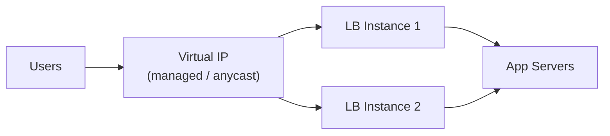

---

## Worked example: designing LB for a URL shortener

**Requirements (from Lesson 02):**

- 10k redirects/sec peak (read-heavy)
- Redirect p99 < 100ms
- 99.9% availability

**LB design:**

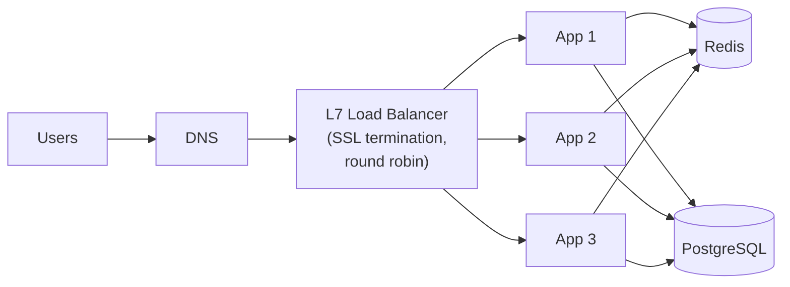

| Decision | Choice | Why |
|----------|--------|-----|
| LB type | L7 (HTTP) | Need path-based routing: `/api/*` vs `/:shortCode` redirect |
| Algorithm | Round robin | Redirects are fast, uniform requests |
| Sticky sessions | No | Stateless redirect — any server can handle any short code (mapping in Redis/DB) |
| SSL termination | At LB | Centralized certs; app servers focus on logic |
| Health check | `GET /health` every 10s | Eject after 3 failures |
| SPOF mitigation | Managed cloud LB (AWS ALB) | Inherently multi-AZ redundant |

**What to say in interview:**

> "Redirects are stateless and uniform, so round robin behind an L7 load balancer works well. SSL terminates at the LB. No sticky sessions needed because the short→long mapping lives in Redis. The LB itself is a managed service for HA."

---

## Beginner HLD diagram tips

| Do ✅ | Don't ❌ |
|-------|---------|
| One box labeled **Load Balancer** in front of **N App Servers** | Draw every LB algorithm detail on the diagram |
| Mention algorithm **only if relevant** (consistent hashing for chat gateways) | Add a LB in front of every single box |
| Note SSL termination if HTTPS is discussed | Forget to mention LB SPOF mitigation |
| Show health checks if discussing failover | Over-complicate with 4 tiers of LBs for an MVP |

**Minimum viable diagram:**

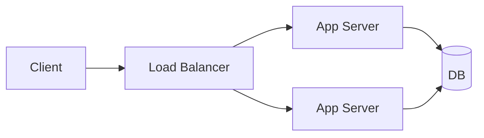

That's enough for most interviews. Add detail verbally.

---

## Common beginner mistakes

| Mistake | Why it's wrong | Better approach |
|---------|----------------|-----------------|
| **Single app server, no LB** | Can't scale horizontally; SPOF | LB + N servers (N ≥ 2) |
| **Sticky sessions by default** | Couples users to machines | External session store (Redis) |
| **Ignoring LB as SPOF** | LB dies → total outage | Managed/redundant LB |
| **Health check hits DB on every probe** | Health checks become a DDoS on your own DB | Lightweight `/health`; deep checks sparingly |
| **L4 when you need path routing** | Can't route `/api` vs `/static` | Use L7 for HTTP |
| **Round robin for long-lived connections** | Uneven load | Least connections |
| **SSL on every app server** | Cert renewal nightmare | Terminate at LB |
| **LB between app and DB** | Databases have their own connection pooling/replication | LB sits in front of **stateless** tiers |

---

## Check your understanding

### Question 1
What happens if the load balancer itself dies and you have no redundancy?

### Question 2
Why are sticky sessions often discouraged for HTTP APIs?

### Question 3
Round robin vs least connections — when do you prefer least connections?

### Question 4
What's the difference between L4 and L7 load balancing? Give an example where L7 is necessary.

### Question 5
What is SSL termination and why do it at the load balancer?

### Question 6
You're designing a chat app with 1M WebSocket connections. Which LB algorithm might you choose and why?

### Question 7
A server's optional analytics cache goes down. Should your health check eject the server from the pool? Why or why not?

### Question 8
Draw (or describe) where the load balancer sits in a 3-tier web application.

<details>
<summary>Detailed answers</summary>

**1. LB dies with no redundancy**

All traffic stops — even if every app server is healthy. Users can't reach the application at all. This is why the LB is itself a potential **single point of failure (SPOF)**. Mitigation: managed cloud LBs (AWS ALB, GCP LB), active/passive LB pairs, DNS failover, or anycast IPs.

**2. Sticky sessions discouraged for HTTP APIs**

- **Uneven load:** Some servers overloaded, others idle
- **Failover pain:** Server dies → all sticky users lose in-memory sessions
- **Scaling doesn't help existing users:** New servers only help new (unassigned) users
- **Better alternative:** Store sessions in Redis/DB (stateless servers) — any server handles any request

Sticky sessions are sometimes necessary for WebSockets or legacy apps, but external session stores are preferred for REST APIs.

**3. Round robin vs least connections**

Prefer **least connections** when request **durations vary significantly**:
- File uploads (some take 30 seconds, some take 1 second)
- WebSocket connections (long-lived)
- Report generation endpoints mixed with fast CRUD endpoints

Round robin is fine when requests are uniform and short (URL redirects, simple API reads).

**4. L4 vs L7**

- **L4** routes based on **IP + port** (TCP/UDP level). Fast, simple. Cannot inspect HTTP content.
- **L7** routes based on **HTTP properties** (URL path, headers, cookies). Enables content-based routing.

**L7 necessary when:** routing `/api/*` to API servers and `/static/*` to static servers on the same domain; reading cookies for auth routing; A/B testing by header; WebSocket upgrade handling.

**5. SSL termination**

SSL/TLS termination = the load balancer **decrypts HTTPS** from the client and forwards **plain HTTP** to app servers (over a private network).

**Why at LB:**
- Centralized certificate management (one renewal, not N servers)
- Offloads expensive crypto from app servers
- Enables L7 inspection of HTTP headers for routing

**6. Chat app with 1M WebSockets — algorithm**

**Least connections** or **consistent hashing by user ID:**
- WebSocket connections are **long-lived** → round robin creates uneven attachment counts
- **Consistent hashing** keeps a user's connection on the same gateway server (needed for routing messages to the right connection)
- On gateway failure, clients reconnect and get reassigned

Also mention: WebSocket-aware L7 LB, connection draining on deploy.

**7. Optional cache down — eject from pool?**

**Probably not.** If the analytics cache is optional and the app can still serve core functionality (redirects, API responses) without it — just slower or without analytics — ejecting the server **reduces capacity unnecessarily**.

Better approach:
- `/health` returns 200 if core dependencies (DB) are OK
- Report cache as "degraded" in health response
- Alert ops team, but keep serving traffic

Only eject if the failed dependency is **critical** to serving requests.

**8. LB in a 3-tier web app**

```text
Users
  → DNS
  → Public Load Balancer (SSL termination)
  → Web/API Servers (stateless, N instances)
  → Database (with its own replication — no LB needed between app and DB for most designs)
```

For microservices, an **internal LB** also sits between the API tier and backend services. The LB always goes in front of **stateless** tiers that need horizontal scaling.

</details>

---

**Next:** [Databases](06-databases.md) — learn how to choose, structure, and scale the durable heart of almost every system.
