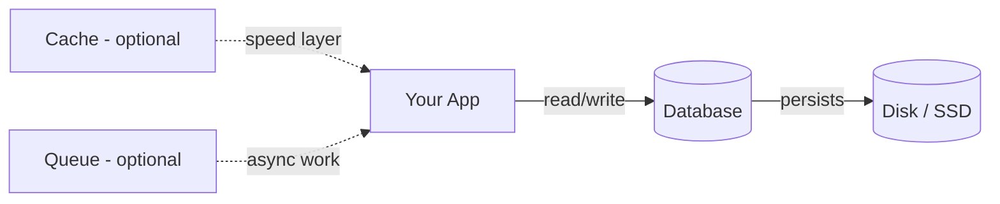
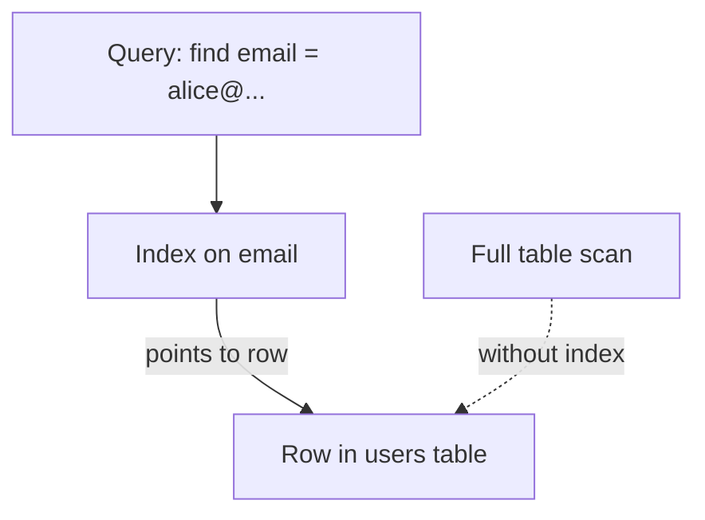
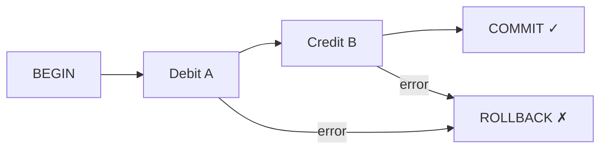
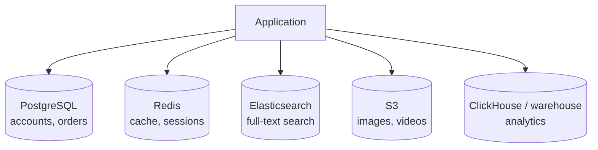

# 06. Databases

> **Where this fits:** You know how apps talk to servers and how load balancers spread traffic. Now we ask: *where does the data actually live, and how do we pick the right storage?*

---

## Learning goals

By the end of this lesson, you should be able to:

- Explain what a database is and why it is the **durable source of truth** in most systems
- Compare **SQL (relational)** vs **NoSQL families** and pick one for a simple scenario
- Describe **indexes** using the book-index analogy and explain their trade-offs
- Summarize **ACID transactions** in plain English with a money-transfer example
- Contrast **normalization** vs **denormalization** and know when each makes sense
- Sketch **example schemas** for common apps (URL shortener, chat, e-commerce)
- Introduce **polyglot persistence** — using multiple databases in one product
- Avoid beginner mistakes like "NoSQL because it sounds modern"

---

## The big picture: why databases matter

Imagine you run a small online bookstore. Users sign up, browse books, place orders, and pay. Where does all that information go?

- **RAM** disappears when the server restarts.
- **Log files** are awkward to query ("show me all orders from user 42 in March").
- **Spreadsheets** break at scale and lack concurrent access controls.

A **database** is software built to **store, organize, query, and protect data** reliably — often for years.



**Everyday analogy — the filing cabinet vs sticky notes:**

- **Cache** = sticky notes on your desk (fast, but can fall off or get outdated).
- **Queue** = an inbox tray for tasks ("mail this package later").
- **Database** = the locked filing cabinet in the back office. If it's not in the cabinet, it didn't officially happen.

In system design interviews and real products, the database is usually the **source of truth**. Everything else (cache, search index, analytics warehouse) is derived from or synchronized with it.

---

## SQL (relational databases)

**Examples:** PostgreSQL, MySQL, SQLite, Amazon RDS (Postgres/MySQL).

SQL databases store data in **tables** — rows and columns, like a spreadsheet with strict rules.

```text
users
┌────┬──────────────────┬─────────────────────┐
│ id │ email            │ created_at          │
├────┼──────────────────┼─────────────────────┤
│  1 │ alice@example.com│ 2026-01-15 10:00:00 │
│  2 │ bob@example.com  │ 2026-01-16 14:30:00 │
└────┴──────────────────┴─────────────────────┘

orders
┌────┬─────────┬────────┬───────────┐
│ id │ user_id │ total  │ status    │
├────┼─────────┼────────┼───────────┤
│ 10 │       1 │  29.99 │ shipped   │
│ 11 │       2 │  14.50 │ pending   │
└────┴─────────┴────────┴───────────┘
```

### What SQL is good at

| Strength | Plain English | Example |
|----------|---------------|---------|
| **Structured relationships** | "This order belongs to this user" | `JOIN users ON orders.user_id = users.id` |
| **Complex queries** | Filter, sort, aggregate across tables | "Top 10 customers by spend this month" |
| **Transactions (ACID)** | Multi-step updates that must succeed or fail together | Transfer money between accounts |
| **Constraints** | Enforce rules at storage level | `email` must be unique; `total` cannot be negative |

**Everyday analogy — a library catalog system:**

Books, authors, and borrowers are separate tables linked by IDs. The librarian can ask precise questions: "Which books is Alice currently holding?" SQL excels when your data has **clear structure and relationships**.

### When to reach for SQL (beginner heuristic)

- User accounts, profiles, permissions
- Orders, payments, inventory
- Anything where **correctness** matters more than extreme write throughput
- You need **joins** across entities regularly

---

## NoSQL — an umbrella, not one thing

"NoSQL" does **not** mean "no SQL ever" or "always better." It means **not only relational tables** — optimized for different shapes and access patterns.

Think of NoSQL like **different types of storage furniture**:

| Furniture | NoSQL family | What it holds | Real products |
|-----------|--------------|---------------|---------------|
| Filing folders with flexible papers | **Document** | JSON-like documents | MongoDB, Firestore |
| Labeled cubbyholes | **Key-value** | `key → value` | Redis, DynamoDB, Memcached |
| Wide spreadsheets with sparse columns | **Wide-column** | Rows + flexible column families | Cassandra, HBase |
| Sticky-note relationship maps | **Graph** | Nodes + edges | Neo4j, Neptune |

### Document stores

```json
{
  "_id": "user_42",
  "name": "Alice",
  "email": "alice@example.com",
  "preferences": {
    "theme": "dark",
    "notifications": true
  },
  "addresses": [
    { "type": "home", "city": "Boston" }
  ]
}
```

**Good for:** product catalogs, user profiles, content with varying fields, mobile apps with flexible schemas.

**Watch out:** Complex multi-document transactions are harder than in SQL (though improving).

### Key-value stores

```text
session:abc123  →  { "user_id": 42, "expires": "..." }
url:aZ9kQ2       →  "https://example.com/long-page"
cart:user_42     →  { "items": [...] }
```

**Good for:** sessions, caching, simple lookups, high-throughput counters, feature flags.

**Watch out:** No rich queries — you must know the key.

### Wide-column stores

Designed for **massive scale** and **high write throughput**. Data is partitioned by key; columns can vary per row.

**Good for:** time-series events, IoT, analytics ingestion, messaging at huge volume.

**Watch out:** Query patterns must be designed upfront — "query-driven design."

### Graph databases

```text
(Alice) --FRIENDS_WITH--> (Bob)
(Alice) --PURCHASED--> (Book: "Design Patterns")
```

**Good for:** social graphs, fraud detection, recommendation "friends of friends," org hierarchies.

**Watch out:** Overkill for simple CRUD apps.

### SQL vs NoSQL — decision table (simplified)

| Question | Lean SQL | Lean NoSQL |
|----------|----------|------------|
| Do I need multi-row transactions (payments)? | ✅ | ⚠️ Often harder |
| Is my schema stable and relational? | ✅ | Maybe document |
| Do I only ever fetch by one key? | Maybe still SQL | ✅ Key-value / document |
| Do I need billions of writes/day on simple events? | ⚠️ Expensive | ✅ Wide-column / Kafka + store |
| Is my access pattern "friends of friends"? | ⚠️ Painful joins | ✅ Graph |

### The real rule (not dogma)

> Choose the database that fits your **access patterns** and **consistency needs** — not the logo on a blog post.

If you always fetch `user_id → profile`, a document or key-value store is natural.  
If you need to debit one account and credit another atomically, SQL transactions shine.

---

## Indexes — the book index analogy

Without an index, finding a row can mean **scanning every row** in the table — like reading an entire textbook cover to cover to find one definition.

An **index** is a separate sorted structure pointing to rows — like the **index at the back of a book**.

```text
Table: users (1 million rows)
Query: SELECT * FROM users WHERE email = 'alice@example.com'

Without index on email:
  → Scan all 1,000,000 rows  (slow)

With index on email:
  → Jump to 'alice@example.com' in index  (fast)
  → Fetch that one row
```



### Index trade-offs

| Benefit | Cost |
|---------|------|
| Faster reads / lookups | Slower writes (index must update too) |
| Faster sorting/filtering on indexed columns | Extra disk space |
| Enables unique constraints (`UNIQUE INDEX on email`) | Too many indexes confuse query planner |

**Everyday analogy:** A book index helps you find topics quickly, but someone had to **create and maintain** that index when the book was printed. Every new edition (write) takes more work if the index is huge.

### Common indexes beginners should know

```sql
-- Primary key: unique identity for each row (automatic index)
PRIMARY KEY (id)

-- Unique index: no duplicates allowed
CREATE UNIQUE INDEX idx_users_email ON users(email);

-- Composite index: multiple columns together
CREATE INDEX idx_messages_conv_time ON messages(conversation_id, created_at);
```

**Composite index tip:** Order matters. An index on `(conversation_id, created_at)` helps:

```sql
WHERE conversation_id = 5 ORDER BY created_at
```

It may **not** help much for:

```sql
WHERE created_at > '2026-01-01'   -- conversation_id not in filter
```

---

## Primary keys and unique IDs

Every row needs a **unique identity**.

| Strategy | Example | Pros | Cons |
|----------|---------|------|------|
| **Auto-increment integer** | 1, 2, 3, … | Simple, compact, sortable | Hard in distributed systems; reveals volume |
| **UUID** | `550e8400-e29b-41d4-a716-446655440000` | Generate anywhere, no coordination | Longer, random → index fragmentation |
| **Snowflake / ULID** | Time-ordered 64-bit IDs | Sortable by time, distributed-friendly | Requires ID service or library |

For a single Postgres database MVP, auto-increment or UUID both work. At scale (many services writing IDs), prefer **time-ordered distributed IDs** — see case study 05 in this series.

---

## Transactions and ACID — explained like a bank teller

A **transaction** groups multiple changes into one unit: **all succeed, or all fail**.

**Scenario:** Transfer $10 from Account A to Account B.

```sql
BEGIN;
  UPDATE accounts SET balance = balance - 10 WHERE id = 'A';
  UPDATE accounts SET balance = balance + 10 WHERE id = 'B';
COMMIT;
```

If the server crashes after debiting A but before crediting B, you have a disaster. Transactions prevent that.

### ACID in plain English

| Letter | Name | Everyday analogy |
|--------|------|------------------|
| **A** | Atomic | Paying for groceries: either the whole checkout completes, or nothing is charged — no "paid but didn't get items" |
| **C** | Consistent | Rules always hold: balance never goes negative if you forbid it |
| **I** | Isolated | Two tellers serving two customers don't accidentally mix up whose money they're moving |
| **D** | Durable | Once the receipt prints (commit), the record survives even if the power goes out |



**When you need transactions:** payments, inventory reservation, seat booking, any multi-step update where partial completion is unacceptable.

**When you might relax:** like counts, view counters, analytics — eventual accuracy is OK (more in lesson 09).

---

## Normalization vs denormalization

### Normalization — avoid duplication

Split data into related tables so each fact lives in **one place**.

```text
Normalized:
  users(id, name)
  orders(id, user_id, total)
  order_items(id, order_id, product_id, qty)

To show an order page → JOIN tables
```

**Pros:** Less storage waste, updates in one place, fewer inconsistencies.  
**Cons:** Reads can require multiple joins (slower at huge scale).

**Everyday analogy:** Normalized = everyone's phone number stored in **one address book**, referenced by name ID — not copied on 50 sticky notes.

### Denormalization — duplicate for speed

Store redundant copies so reads are **simple and fast**.

```text
Denormalized feed table:
  feed_items(user_id, post_id, author_name, post_text, created_at)
  -- author_name duplicated from users table
```

**Pros:** One query returns the feed — no joins at read time.  
**Cons:** When Alice renames herself, you must update many feed rows (or accept stale names briefly).

**Everyday analogy:** Denormalized = printing **pre-made handouts** for every student instead of making them look up the textbook each time. Faster to hand out, harder to update when the textbook changes.

| Pattern | Normalize when… | Denormalize when… |
|---------|-----------------|-------------------|
| User profile | Single source of truth matters | Rarely — profiles change |
| News feed / timeline | Never for read path at scale | Precompute fanout rows |
| Product catalog | Inventory counts in one table | Display snapshots in search index |
| Leaderboard | Raw events normalized | Materialized top-N table |

Most production systems do **both**: normalized core in SQL + denormalized read models for hot paths.

---

## Example schemas (starter patterns)

### URL shortener

```text
urls(
  short_code    VARCHAR(8)  PRIMARY KEY,
  long_url      TEXT        NOT NULL,
  user_id       BIGINT      NULL,
  created_at    TIMESTAMP   NOT NULL,
  expires_at    TIMESTAMP   NULL,
  click_count   BIGINT      DEFAULT 0
)

-- Index for user's list of links
CREATE INDEX idx_urls_user ON urls(user_id, created_at DESC);
```

**Access patterns:**

- Redirect: `SELECT long_url FROM urls WHERE short_code = ?` → single-row lookup
- Analytics: increment `click_count` (consider async aggregation at scale)

### Chat / messaging

```text
conversations(
  id            BIGINT PRIMARY KEY,
  created_at    TIMESTAMP
)

conversation_members(
  conversation_id BIGINT,
  user_id         BIGINT,
  PRIMARY KEY (conversation_id, user_id)
)

messages(
  message_id      BIGINT PRIMARY KEY,
  conversation_id BIGINT NOT NULL,
  sender_id       BIGINT NOT NULL,
  body            TEXT,
  created_at      TIMESTAMP NOT NULL
)

CREATE INDEX idx_messages_conv_time
  ON messages(conversation_id, created_at DESC);
```

**Why the composite index?** Loading a chat thread = "all messages in this conversation, newest last" — one indexed range scan.

### E-commerce (simplified)

```text
products(id, name, price_cents, inventory_count)
carts(id, user_id)
cart_items(cart_id, product_id, quantity)
orders(id, user_id, status, total_cents, created_at)
order_items(order_id, product_id, quantity, price_cents)
```

**Checkout transaction (conceptual):**

1. Verify inventory
2. Decrement inventory
3. Create order + order_items
4. Charge payment (often external API)
5. Commit or rollback

---

## Polyglot persistence — one size does not fit all

Large products rarely use **one** database for everything. **Polyglot persistence** = right tool for each job.



| Data type | Typical store | Why |
|-----------|---------------|-----|
| User accounts & billing | PostgreSQL | ACID, relationships |
| Session tokens | Redis | Fast TTL key-value |
| Product search | Elasticsearch | Full-text, facets |
| Media files | S3 / object storage | Cheap blobs, CDN-friendly |
| Clickstream events | Kafka → column store | Write-heavy analytics |

**Beginner advice:** Start with **one primary SQL database** for your MVP. Add specialized stores when you hit a **concrete pain point** (search is slow → add Elasticsearch; sessions hammer DB → add Redis). Don't pre-optimize with five databases on day one.

---

## How databases fit in a typical HLD

```text
Client → Load Balancer → App Servers → Redis (cache) → PostgreSQL (source of truth)
                                      ↘ Queue → Workers → DB / email / etc.
```

When you draw this in an interview, label:

- **What** is stored where
- **Read path** vs **write path**
- Whether you need **strong consistency** or can tolerate lag

---

## Common mistakes (and how to avoid them)

| Mistake | Why it's wrong | Better approach |
|---------|----------------|-----------------|
| "We'll use MongoDB because SQL doesn't scale" | Oversimplified; Postgres scales far | Pick based on access pattern + ops skills |
| No indexes on hot query columns | Full table scans kill latency | Index columns in `WHERE`, `JOIN`, `ORDER BY` |
| Storing images inside the database | Blobs bloat backups and slow queries | Object storage (S3) + URL in DB |
| Denormalizing everything on day one | Update nightmares | Normalize first; denormalize measured hot paths |
| Using the cache as source of truth | Data loss on eviction/crash | DB commits first; cache is derived |
| UUIDs everywhere without reason | Larger indexes, random I/O | Auto-increment fine for single-DB MVP |
| Ignoring connection limits | App opens 10k DB connections | Pool connections (PgBouncer, ORM pool) |

---

## Interview phrases that sound solid

- "Postgres is our **source of truth** for users and orders; Redis caches hot profile reads with a 5-minute TTL."
- "Checkout uses a **transaction** to decrement inventory and create the order atomically."
- "The feed is **denormalized** into a per-user timeline table for O(1) reads; we fan out on write."
- "We index `(conversation_id, created_at)` because every thread load hits that pattern."

---

## Check your understanding

### Questions

1. What is the difference between a cache and a database in terms of durability?
2. When would you prefer SQL over a document database?
3. Explain indexes using the book index analogy. What do they cost?
4. What does "atomic" mean in a money transfer transaction?
5. Why might a social media feed be denormalized?
6. Name two NoSQL families and one use case for each.
7. What is polyglot persistence, and when should a beginner avoid it?
8. Why is a composite index on `(conversation_id, created_at)` useful for chat apps?

### Answers

<details>
<summary>Click to reveal answers</summary>

1. **Cache** is a fast, optional layer — data can disappear (eviction, restart). **Database** is durable: committed data survives crashes and is the authoritative record.

2. Prefer **SQL** when you need complex relationships, joins, and **multi-row ACID transactions** — e.g., payments, inventory, order processing.

3. An index is like a **book index**: jump directly to rows matching a column instead of reading the whole table. **Cost:** slower writes, extra disk, and maintenance overhead.

4. **Atomic** means all steps (debit + credit) complete together, or **none** do — no partial transfer leaving accounts inconsistent.

5. Feeds are read **far more often** than profile names change. Denormalizing stores pre-built timeline rows so reads are one simple query, not expensive joins at scale.

6. Examples: **Key-value** — sessions in Redis; **Document** — flexible product JSON in MongoDB; **Wide-column** — event ingestion; **Graph** — social friend networks.

7. **Polyglot persistence** = using multiple specialized databases in one system. Beginners should **avoid** it until one database clearly fails for a specific job — otherwise operational complexity explodes.

8. Chat UIs load messages **by conversation, sorted by time**. That composite index matches the exact filter + sort pattern, avoiding full scans.

</details>

---

## Quick reference card

```text
SQL         → tables, joins, ACID, structured relationships
NoSQL       → document / key-value / wide-column / graph — match access pattern
Index       → faster reads, slower writes (book index analogy)
ACID        → all-or-nothing, rules hold, isolated, survives crash
Normalize   → less duplication, more joins
Denormalize → duplicate for fast reads (feeds, leaderboards)
Polyglot    → many stores at scale; one SQL DB for MVP
```

---

**Next:** [07. Replication & Sharding](07-replication-sharding.md) — what happens when one database machine is no longer enough.
