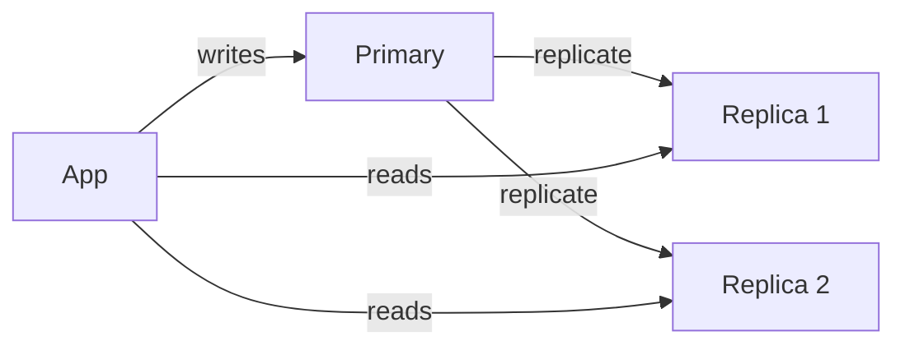
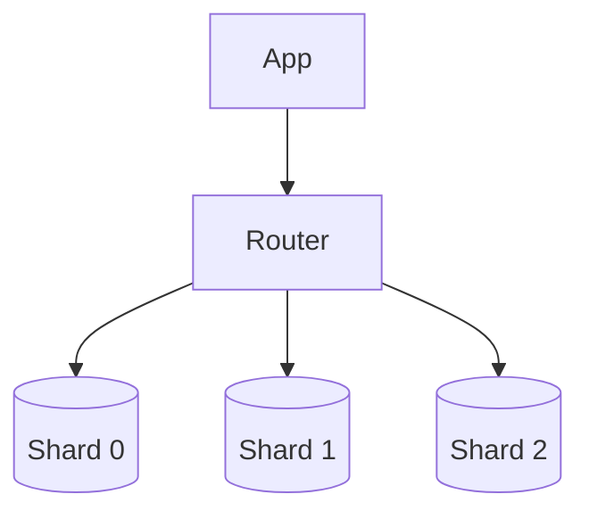

# 07. Replication & Sharding

## Learning goals

- Explain replication for reads and failover  
- Explain sharding for capacity growth  
- Spot hot-shard problems  

## Scaling reads: replication

**Replication** copies data from a primary database to replicas.



### Benefits

- More read throughput  
- Failover if primary dies (promote a replica)  
- Geographic replicas closer to users (advanced)  

### Cost

- **Replication lag:** replica may be slightly stale  
- More hardware and operational complexity  

Pattern name: **read replicas**.

## Scaling writes & storage: sharding

When one primary cannot handle write volume or data size, **shard** (partition) data across many databases.



Each shard holds a subset of rows.

## Choosing a shard key

The shard key decides where a row lives.

| Shard key | Example | Risk |
|-----------|---------|------|
| `user_id` | social apps | celebrity hot shard |
| `tenant_id` | B2B SaaS | huge tenant imbalance |
| hash(id) | uniform spread | harder range queries |

**Goal:** even distribution + queries that usually hit one shard.

## Cross-shard queries are hard

`JOIN` across shards or global sorts are expensive.

Design so common queries are **single-shard**.

## Consistent hashing (idea)

Used by caches and some databases so when nodes are added/removed, only a fraction of keys move.

You will see this again in distributed cache and ID systems.

## Leader election & failover (intuition)

If primary dies:

1. Detect failure  
2. Promote a replica  
3. Point apps/LB at new primary  

Managed databases often automate this.

## Beginner decision tree

```text
Need more read capacity?     → replicas / cache
Need more write capacity
  or data > one machine?     → shard (or switch store)
Need multi-region?           → advanced replication topologies
```

## Example

URL shortener mapping `short_code → long_url`:

- Shard by `hash(short_code) % N`  
- Redirects are single-key lookups → sharding works cleanly  

Social graph “friends of friends” can be painful to shard — different problem.

## Check your understanding

1. Does replication by itself increase write capacity of the primary?  
2. What is a hot shard?  
3. Why is shard key choice critical?  

<details>
<summary>Answers</summary>

1. No — writes still go to primary (unless multi-primary, which is harder).  
2. One shard gets disproportionate traffic/data.  
3. It determines load balance and whether queries stay single-shard.

</details>

---

**Next:** [Caching](08-caching.md)
