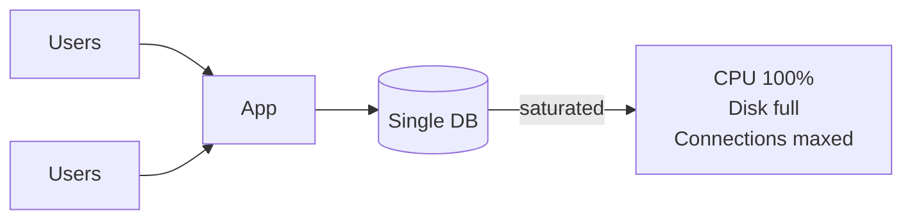
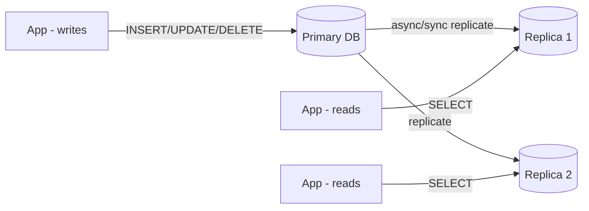
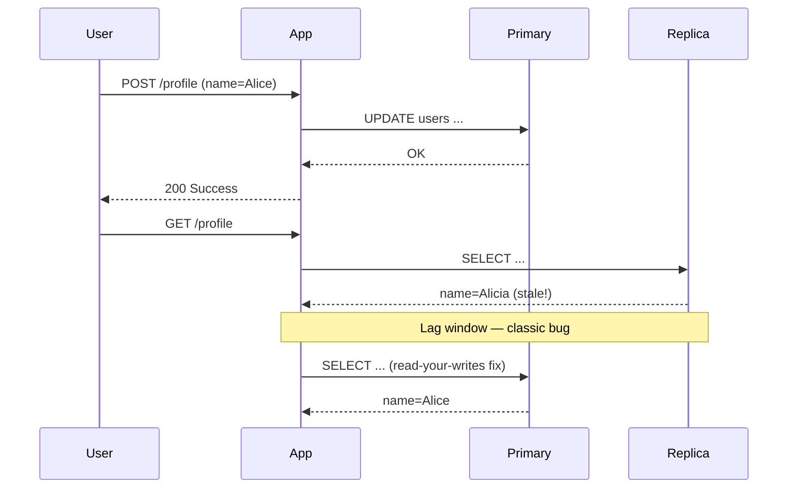
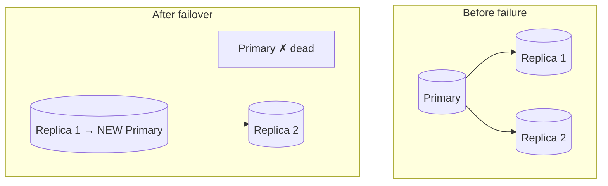
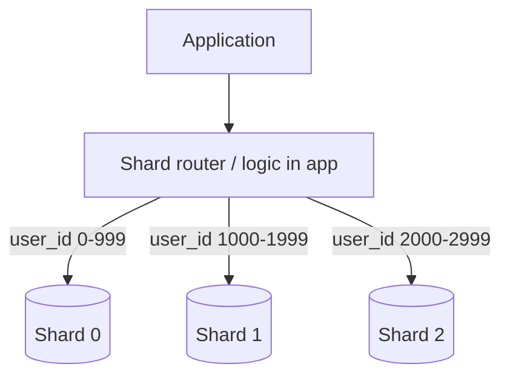
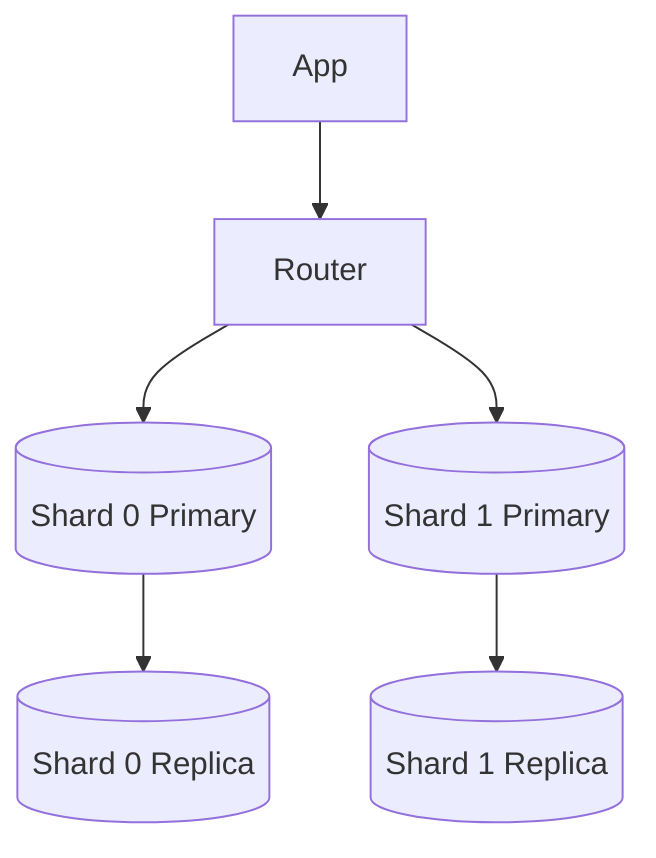
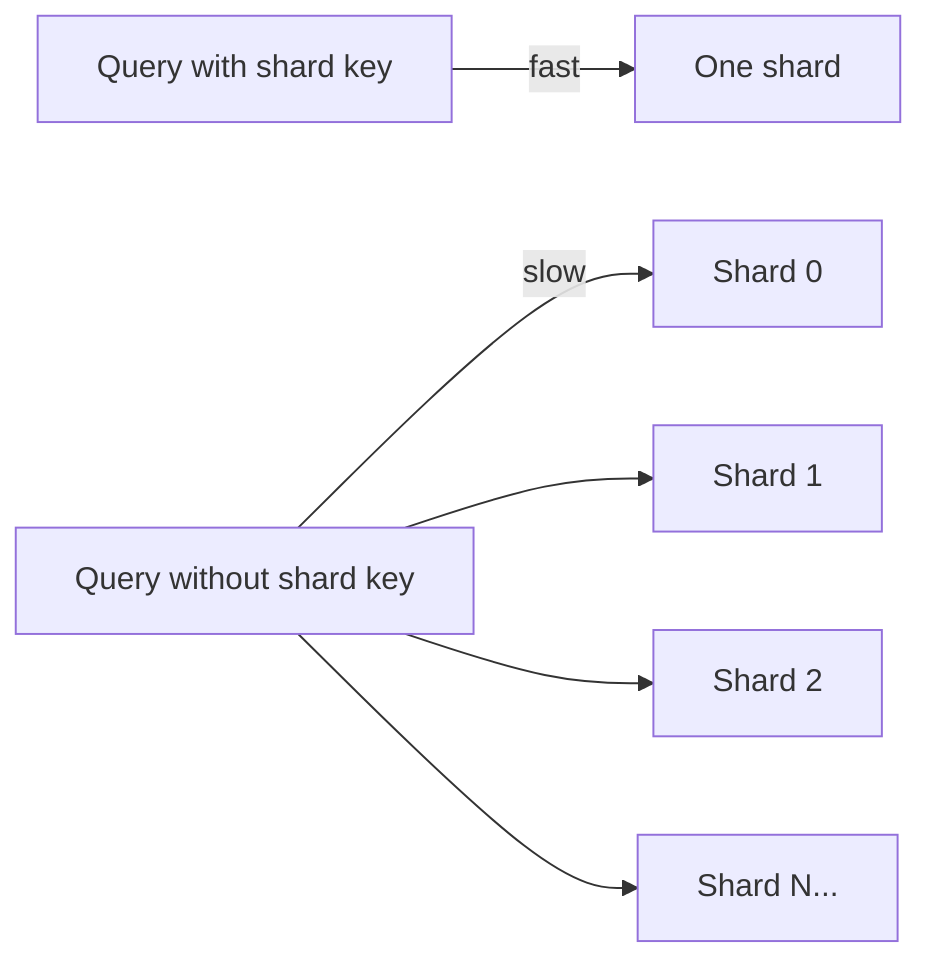
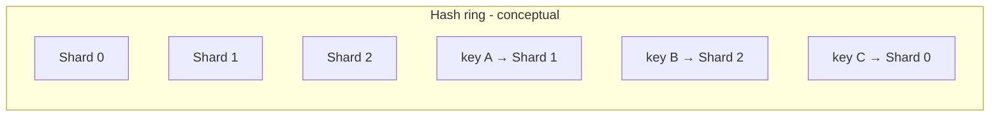
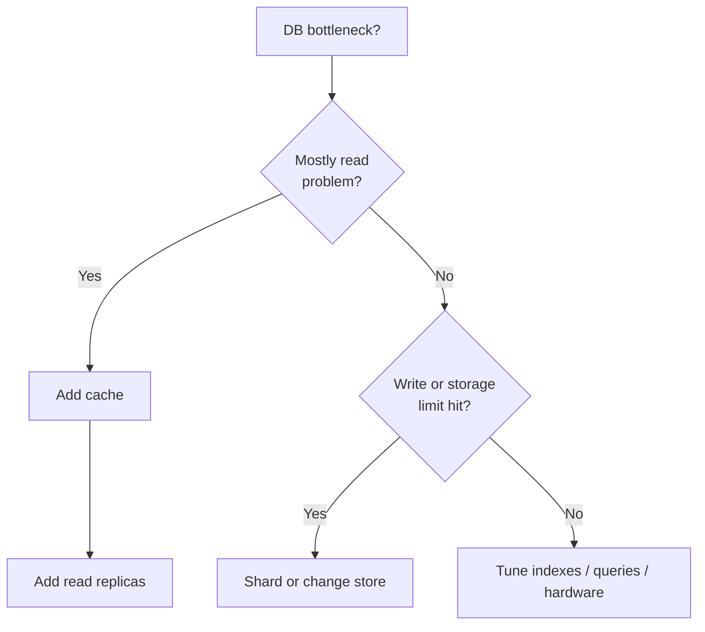

# 07. Replication & Sharding

> **Where this fits:** You picked a database and modeled your data. Now traffic grows — reads slow down, disks fill up, writes pile up. This lesson covers the two classic answers: **copy the data** (replication) and **split the data** (sharding).

---

## Learning goals

By the end of this lesson, you should be able to:

- Explain **replication** using a primary-replica (master-copy) analogy
- Describe **replication lag**, why it happens, and how apps cope with stale reads
- Outline **failover** steps when a primary database dies
- Explain **sharding** (horizontal partitioning) and when you need it
- Choose a **shard key** and predict **hot shard** problems
- Build intuition for **consistent hashing** without heavy math
- Use a **decision tree** to choose replicas vs cache vs sharding
- Sketch how replication + sharding combine in real systems

---

## The scaling problem — one database, many hungry apps



A single database server has limits:

- **CPU** — query processing, index maintenance
- **Memory** — buffer cache, connections
- **Disk I/O** — reads and writes to SSD
- **Disk size** — you cannot store infinite rows on one machine
- **Network** — bandwidth to app servers

Two different problems need two different tools:

| Problem | Symptom | Tool |
|---------|---------|------|
| Too many **reads** | SELECT queries slow; CPU high on reads | **Replication** (+ caching) |
| Too many **writes** or **too much data** | INSERT/UPDATE bottleneck; disk full | **Sharding** (or different store) |

**Everyday analogy — a popular restaurant:**

- **Replication** = printing **extra copies of the menu** and hiring more waiters to *read* orders to customers — the kitchen (primary) still cooks every dish.
- **Sharding** = opening **multiple kitchens**, each handling a subset of dishes — now you can cook more meals in parallel.

---

## Part 1: Replication (read scaling + availability)

**Replication** copies data from a **primary** (leader, master) to one or more **replicas** (followers, read replicas).



### Primary-replica analogy — the teacher and photocopies

Imagine a teacher ( **primary** ) who writes the official grade book. Every hour, the school makes **photocopies** ( **replicas** ) for tutors who help students look up grades.

- **Writes** (new grades) go only to the teacher's master book.
- **Reads** (students asking "what's my score?") can use photocopies — faster, spread across many tutors.
- If a tutor's copy is from **this morning** but a grade was entered **five minutes ago**, the student might see stale info — that's **replication lag**.

### Benefits of replication

| Benefit | Explanation |
|---------|-------------|
| **Read throughput** | Spread SELECT queries across N replicas |
| **High availability** | If primary dies, promote a replica (failover) |
| **Geographic proximity** | Replicas in EU and US — reads closer to users |
| **Backup / reporting** | Run heavy analytics on replica without hurting primary |

### Costs and caveats

| Cost | Explanation |
|------|-------------|
| **Replication lag** | Replicas are often milliseconds to seconds behind |
| **Write bottleneck unchanged** | All writes still hit primary (in classic setup) |
| **Complexity** | Monitoring lag, failover drills, split-brain risk |
| **Storage multiplied** | Each replica stores a full copy |

### Sync vs async replication (intuition)

| Mode | Behavior | Trade-off |
|------|----------|-----------|
| **Synchronous** | Primary waits for replica to confirm before ACKing write | Stronger durability; higher write latency |
| **Asynchronous** | Primary ACKs immediately; replica catches up later | Faster writes; replica may be stale |

Most web apps use **async replication** for read replicas and accept small lag.

### Replication lag — what it looks like in products

```text
Timeline:
  T0: User updates profile name to "Alice" on PRIMARY → success
  T1: User refreshes page → read from REPLICA (still says "Alicia")
  T2: Replication catches up → replica now says "Alice"
```

**Mitigations:**

| Strategy | How it works |
|----------|--------------|
| **Read-your-writes** | After a write, route that user's reads to primary for a few seconds |
| **Session stickiness** | Same user → same replica (imperfect) |
| **Client versioning** | Return `version: 7` with write; client sends `If-None-Match` |
| **Accept staleness** | OK for public profiles, not OK for bank balance |



---

## Failover — when the primary dies

**Failover** = automatically or manually promoting a replica to become the new primary.



### Failover steps (simplified)

1. **Detect failure** — health checks, heartbeat timeout, operator alert
2. **Choose new primary** — usually the most caught-up replica
3. **Promote replica** — elevate to read-write role
4. **Reconfigure apps / DNS / load balancer** — point writes to new primary
5. **Rebuild old primary** — when it returns, make it a replica

**Everyday analogy:** The head chef calls in sick. The sous chef (replica) takes over the kitchen (promotion). Waiters (apps) are told to give orders to the sous chef now. When the head chef returns, they might work as line cook (replica) until next rotation.

### Failover risks beginners should know

| Risk | What happens |
|------|--------------|
| **Split-brain** | Two nodes both think they're primary → conflicting writes |
| **Data loss** | Async replication: writes not yet replicated are lost |
| **Flapping** | Unstable network triggers repeated failovers |
| **App misconfiguration** | Apps still sending writes to dead primary |

**Managed databases** (AWS RDS, Google Cloud SQL, PlanetScale) automate much of this. Self-hosted Postgres/MySQL requires tools like Patroni, Orchestrator, or operator runbooks.

---

## Part 2: Sharding (write + storage scaling)

When one primary cannot handle **write volume** or **data size**, **shard** (partition) data across multiple independent databases.



Each shard holds a **subset of rows** — typically the same schema on each shard.

**Everyday analogy — apartment mailboxes:**

Instead of one giant inbox for an entire city (one DB), each building has its own bank of mailboxes (shards). Mail sorted by address (shard key) goes to the right building. You never search every building to find one letter — if you know the address.

### Replication vs sharding — side by side

| | Replication | Sharding |
|---|-------------|----------|
| **Copies** | Same full dataset on each node | Different subset on each shard |
| **Fixes** | Read capacity, failover | Write capacity, storage size |
| **Writes** | Still one primary (classic) | Spread across shards |
| **Complexity** | Lower | Much higher |
| **Cross-row queries** | Easy (same DB) | Hard (cross-shard) |

**Production systems often combine both:** each shard has its own primary + replicas.



---

## Choosing a shard key

The **shard key** determines which shard owns a row.

```python
# Simple hash sharding (conceptual)
def shard_for(user_id: int, num_shards: int) -> int:
    return hash(user_id) % num_shards
```

### Shard key options

| Shard key | Example use | Pros | Cons |
|-----------|-------------|------|------|
| **`user_id`** | Social apps, SaaS | Most queries scoped to one user | Celebrity / power user → **hot shard** |
| **`tenant_id`** | B2B multi-tenant | Keeps one customer's data together | Huge enterprise tenant dominates a shard |
| **`hash(id)`** | URL shortener, sessions | Even spread | Range queries across all shards |
| **`geo_region`** | Compliance (EU data in EU) | Legal residency | Uneven population density |
| **`time` (month)** | Logs, events | Easy archival | Recent month = hot shard |

**Goal:** **Even distribution** + **queries usually hit one shard**.

### Hot shards — when one mailbox is overflowing

A **hot shard** receives disproportionate traffic or data compared to siblings.

```text
Shard 0: 10 million users (normal)
Shard 1: 10 million users (normal)
Shard 2: 1 user (celebrity) + 50 million followers' fanout  ← HOT
```

**Symptoms:** One shard's CPU/disk maxes while others are idle; p99 latency spikes for unlucky users.

**Mitigations:**

- Split hot shard further (sub-shard by secondary key)
- Separate hot tenants to dedicated shard
- Cache aggressively on hot keys
- Rate-limit abusive keys

### Cross-shard queries — the hard part

Operations that need **all shards** are expensive:

| Operation | Difficulty |
|-----------|------------|
| `GET user 42's profile` (shard by user_id) | ✅ Single shard |
| `GET all users named 'Alice'` (no shard key in query) | ❌ Scatter-gather all shards |
| `JOIN orders × users` on different shard keys | ❌ Very painful |
| Global `ORDER BY created_at LIMIT 10` | ❌ Merge from all shards |

**Design rule:** Structure data so **99% of queries are single-shard**.



---

## Consistent hashing — intuition without the math exam

When you add or remove shards, **naive** `hash(key) % N` remaps **most keys** to new shards — cache stampedes, mass data migration.

**Consistent hashing** maps keys and shards onto a **ring**. When a shard is added/removed, only **neighboring keys** move.



**Everyday analogy — clock faces:**

Imagine keys placed around a clock. Each shard "owns" the arc from the previous shard to itself. Add a new shard at 3 o'clock — only keys between 12 and 3 move to the new shard. Keys at 6 and 9 stay put.

**Where you'll see it:**

- Distributed caches (Memcached clients, Redis Cluster)
- Dynamo-style databases (DynamoDB, Cassandra)
- Load balancers (sticky routing)

You don't need to implement it — know **why** it exists: **minimal remapping when cluster size changes**.

---

## Resharding — growing from 4 to 8 shards

```text
Phase 1: 4 shards, data grows
Phase 2: Add 4 more shards (8 total)
Phase 3: Background job copies/migrates key ranges
Phase 4: Dual-write or read-from-new during migration
Phase 5: Decommission old mapping
```

Resharding is a **planned project**, not a button click. This is why some teams use **managed sharding** (Vitess, Citus, DynamoDB) or design for growth early.

---

## Beginner decision tree

```text
START: Database feels slow or full

├─ Is it mostly READ slowness?
│   ├─ Yes → Add caching (lesson 08)
│   │        + read replicas (replication)
│   └─ No  → continue ↓
│
├─ Is WRITE rate or total DATA too big for one machine?
│   ├─ Yes → Consider sharding OR different store (Cassandra, etc.)
│   └─ No  → Optimize queries, indexes, hardware, connection pooling
│
├─ Need multi-region disaster recovery?
│   └─ Cross-region replicas + failover plan
│
└─ Need legal data residency (EU only)?
    └─ Geo-sharding by region
```



---

## Worked example: URL shortener

**Data:** `short_code → long_url`

**Access pattern:** Redirect by `short_code` only — perfect single-key lookup.

```text
Shard = hash(short_code) % N

Redirect flow:
  1. hash("aZ9kQ2") % 8 → shard 3
  2. SELECT long_url FROM urls WHERE short_code = 'aZ9kQ2'  (on shard 3)
  3. 302 redirect
```

**Why sharding works cleanly:** No cross-shard joins. Each redirect is independent.

**Add replication:** Each shard has primary + replica; redirects read from replica; new URL creation writes to primary.

---

## Worked example: Social app (harder)

**Access patterns:**

- User timeline: `user_id` scoped → shard by `user_id` ✅
- Global trending topics: needs data from **all shards** ❌
- Friends of friends: graph traversal across users on different shards ❌❌

**Lesson:** Sharding fits **key-scoped** workloads. Graph-like queries often need a **graph DB**, denormalization, or separate search/social graph service.

---

## Comparison table — scaling tactics

| Tactic | Scales reads | Scales writes | Scales storage | Complexity |
|--------|-------------|---------------|----------------|------------|
| Better indexes | ✅ | — | — | Low |
| Read replicas | ✅✅ | — | — | Medium |
| Cache (Redis) | ✅✅ | — | — | Medium |
| Sharding | ✅ (via parallelism) | ✅✅ | ✅✅ | High |
| Read/write split DB | ✅ | Partial | — | Medium |

---

## Common mistakes

| Mistake | Reality |
|---------|---------|
| "We'll add replicas to fix write slowness" | Replicas don't split write load on primary |
| Ignoring replication lag in UX | Users see stale data after their own edits |
| Sharding too early | Operational nightmare for 10k users — vertical scale + cache first |
| Bad shard key (e.g., `created_at` only) | All new data hits one shard |
| Cross-shard JOINs in hot path | Latency explosion |
| No failover drill | Promotion works in theory, fails in production |
| Forgetting connection limits per shard | 8 shards × 500 connections = 4000 connections to manage |

---

## Interview phrases that sound solid

- "Reads go to **read replicas**; writes go to the **primary**. We route post-write reads to primary for **read-your-writes**."
- "We shard by **`hash(user_id)`** to spread load; celebrity users get a **dedicated sub-shard** to avoid hot spots."
- "Global leaderboards are **not** sharded queries — we maintain a separate **Redis sorted set** updated async."
- "Failover is automated via **RDS Multi-AZ** / Patroni with a 30-second RTO target."

---

## Check your understanding

### Questions

1. Does adding read replicas increase the primary's write capacity?
2. What is replication lag, and name one way to mitigate it for a user who just updated their profile?
3. Explain sharding in one sentence using the mailbox analogy.
4. What is a hot shard? Give one cause and one mitigation.
5. Why are cross-shard JOINs problematic?
6. Why is `hash(short_code) % N` a good shard strategy for a URL shortener?
7. What is consistent hashing useful for?
8. Walk through the first three steps of failover when a primary dies.

### Answers

<details>
<summary>Click to reveal answers</summary>

1. **No.** In classic primary-replica setup, **all writes** still go to the primary. Replicas only help **read** throughput and availability.

2. **Replication lag** is the delay before changes on the primary appear on replicas. Mitigation: **read-your-writes** — after updating profile, route that user's reads to the primary (or wait until lag < threshold).

3. Sharding **splits data across multiple databases** like **separate banks of mailboxes** — each piece of mail (row) goes to one building (shard) based on address (shard key), so no single inbox holds everything.

4. A **hot shard** gets far more traffic/data than others. **Cause:** sharding by `user_id` when one celebrity has massive fanout. **Mitigation:** sub-shard the hot user, dedicated shard, or heavy caching.

5. Each shard only holds **part** of the data. A JOIN needs rows from multiple shards → **scatter-gather** across the network, slow merge, no single-query optimizer.

6. Every redirect looks up **only `short_code`** — hash distributes codes evenly, each lookup hits **exactly one shard**, no cross-shard queries needed.

7. **Consistent hashing** minimizes how many keys move when nodes are **added or removed** from a cluster — used in distributed caches and Dynamo-style stores.

8. (1) **Detect** primary failure via health checks. (2) **Choose** the best replica (most up-to-date). (3) **Promote** it to primary and **repoint** applications/load balancers to send writes to it.

</details>

---

## Quick reference card

```text
Replication  → copy full dataset; scale READS; failover
Lag          → replicas behind primary; use read-your-writes
Sharding     → split rows across DBs; scale WRITES + storage
Shard key    → even spread + single-shard queries
Hot shard    → uneven load; fix key choice or split/cache
Consistent hashing → minimal key movement when nodes change
Decision     → reads slow? replicas + cache | writes big? shard
```

---

**Next:** [08. Caching](08-caching.md) — the fast layer in front of your database.
