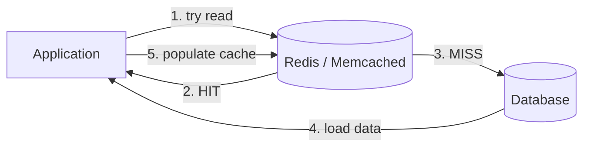
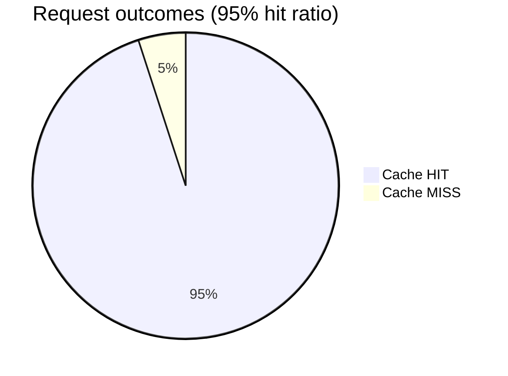
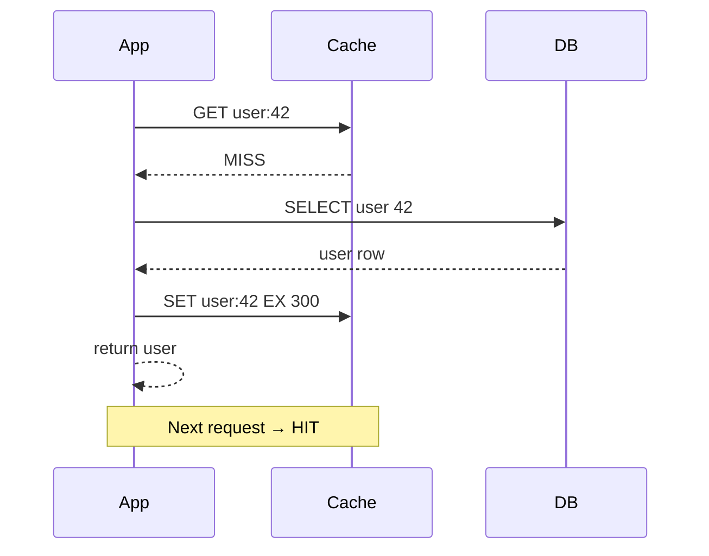
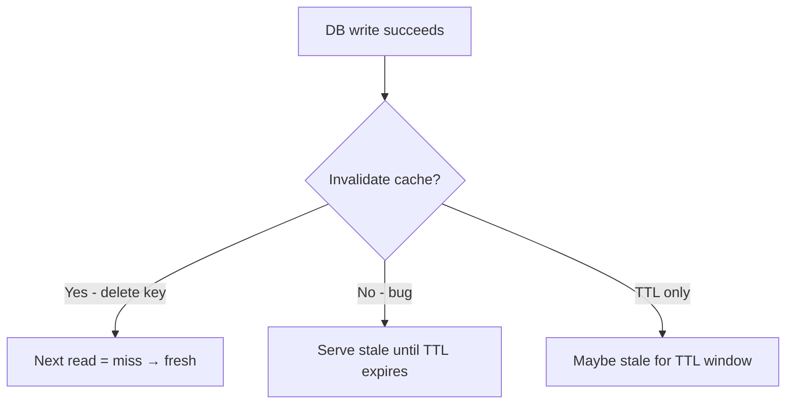
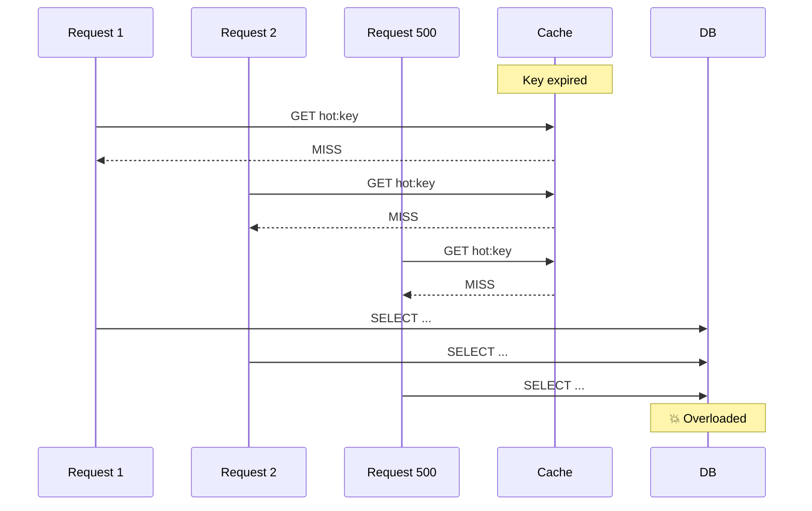
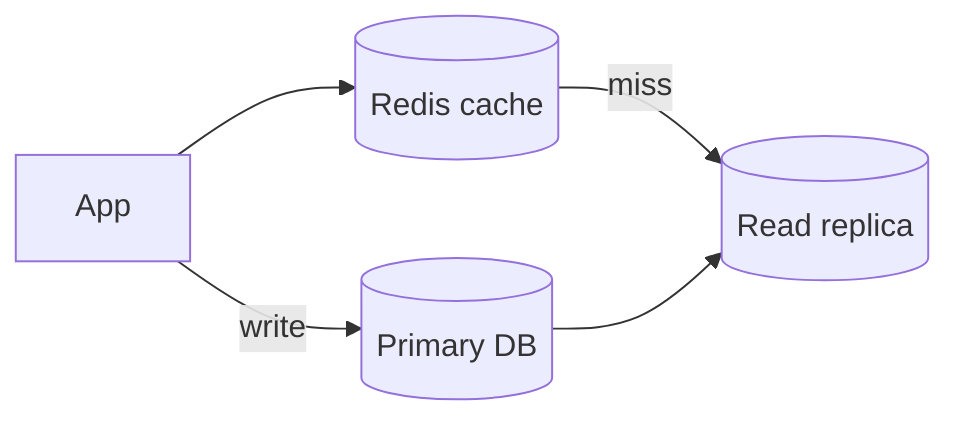

# 08. Caching

> **Where this fits:** Your database is the filing cabinet. But walking to the back office for every question is slow. **Caching** keeps the answers you need most often within arm's reach.

---

## Learning goals

By the end of this lesson, you should be able to:

- Explain **why caching** exists using the fridge vs grocery store analogy
- Define **cache hit**, **cache miss**, and **hit ratio**
- Implement **cache-aside** (lazy loading) step by step
- Compare common caching patterns: cache-aside, read-through, write-through, write-behind
- Use **TTL** (time to live) wisely and explain why it is a safety net
- Describe **cache invalidation** strategies and why they are hard
- Recognize and mitigate **cache stampede** (thundering herd)
- Decide **what to cache** and what to leave in the database only
- Place caching correctly in an HLD diagram

---

## The big picture

Databases are **durable** but relatively **slow** compared to in-memory stores. Under heavy read load, hitting the database for every request wastes CPU, increases latency, and costs money.

A **cache** is a fast storage layer — usually **RAM** — that holds **copies** of hot data close to your application.



**Everyday analogy — fridge vs grocery store:**

| | Grocery store (database) | Fridge (cache) |
|---|--------------------------|----------------|
| **Capacity** | Huge — everything exists | Small — only what you use often |
| **Speed** | Drive there, walk aisles, checkout | Walk to kitchen, open door |
| **Freshness** | Always the "official" inventory | Might be yesterday's milk |
| **Cost** | Trip time + effort every time | Upfront space; restock occasionally |
| **Disaster** | Store fire = big problem (source of truth) | Power outage = inconvenience; store still has food |

Smart households **keep eggs, butter, and coffee in the fridge** (hot data). They don't refrigerate a single spice they use once a year (cold data).

Smart apps **cache user sessions, hot product pages, and URL mappings** — not every archived log line.

---

## Cache hit vs cache miss

### Hit — found in cache

```text
GET cache["user:42"]  →  { "name": "Alice", "avatar": "..." }
                        ✅ HIT — return immediately (~1 ms)
```

### Miss — not in cache

```text
GET cache["user:42"]  →  (nil)
                        ❌ MISS — query database (~20–50 ms)
                        SET cache["user:42"] = {...}  EX 300
                        return to user
```

### Hit ratio

```text
Hit ratio = cache hits / (cache hits + cache misses)
```

| Hit ratio | Meaning |
|-----------|---------|
| **95%+** | Excellent for read-heavy workloads |
| **80–95%** | Good; investigate miss patterns |
| **< 80%** | Cache may be too small, wrong keys, or TTL too aggressive |

**Example:** 10,000 requests/minute, 95% hit ratio → only **500 DB queries/min** instead of 10,000.



---

## Where caches live in the stack

```text
Client → CDN (edge cache for static/media)
      → Load Balancer → App Server → Redis (app cache) → Database
```

| Cache layer | What it caches | Typical TTL |
|-------------|----------------|-------------|
| **Browser** | Static assets, API responses (HTTP cache headers) | Minutes to days |
| **CDN** | Images, JS, CSS, video | Hours to weeks |
| **App cache (Redis)** | Sessions, profiles, computed results | Seconds to hours |
| **Database buffer pool** | Disk pages in RAM (automatic) | Managed by DB |

This lesson focuses on **application caches** (Redis, Memcached). CDN is covered in lesson 11.

---

## Pattern 1: Cache-aside (lazy loading) — the default

The **application** manages the cache explicitly. This is the most common pattern in industry.

### Read path

```python
def get_user(user_id):
    key = f"user:{user_id}"

    # 1. Try cache
    cached = redis.get(key)
    if cached:
        return json.loads(cached)  # HIT

    # 2. MISS — load from DB
    user = db.query("SELECT * FROM users WHERE id = ?", user_id)

    # 3. Populate cache
    redis.set(key, json.dumps(user), ex=300)  # TTL 5 min

    return user
```

### Write path

```python
def update_user(user_id, new_name):
    # 1. Write to DB first (source of truth)
    db.execute("UPDATE users SET name = ? WHERE id = ?", new_name, user_id)

    # 2. Invalidate cache (delete stale copy)
    redis.delete(f"user:{user_id}")
```



**Why cache-aside is popular:**

- App controls exactly what is cached
- Cache can fail without losing data (fallback to DB)
- Works with any database

---

## Pattern 2: Read-through

The **cache library** loads from DB automatically on miss. App always talks to cache.

```text
App → Cache → (on miss) → DB
         ↑__________________|
              auto-fill
```

**Pros:** Cleaner app code.  
**Cons:** Cache layer must understand DB schema; less flexible.

---

## Pattern 3: Write-through

Writes go to **cache and DB together** (cache synchronously writes to DB).

```text
App → Cache → DB (sync)
```

**Pros:** Cache always warm after write.  
**Cons:** Write latency = cache + DB; cache stores data that may never be read.

---

## Pattern 4: Write-behind (write-back)

Write to cache **first**; flush to DB **asynchronously** later.

```text
App → Cache → (async batch) → DB
```

**Pros:** Very fast writes.  
**Cons:** **Data loss risk** if cache dies before flush. Use only when durability trade-off is acceptable (analytics buffers, view counters).

### Pattern comparison table

| Pattern | Read | Write | Durability | Complexity |
|---------|------|-------|------------|------------|
| **Cache-aside** | App checks cache | App writes DB, invalidates cache | Strong (DB first) | Low — **start here** |
| **Read-through** | Cache loads DB on miss | App writes DB + invalidates | Strong | Medium |
| **Write-through** | Same as read-through | Sync to cache + DB | Strong | Medium |
| **Write-behind** | Cache may lead DB | Async to DB | ⚠️ Weaker | High |

---

## TTL — time to live

Every cached entry should usually **expire**.

```text
SET user:42 "{...}" EX 300     # Redis: expire in 300 seconds
SET url:aZ9kQ2 "https://..." EX 86400   # 24 hours
```

### Why TTL matters

| Reason | Explanation |
|--------|-------------|
| **Bounds staleness** | Even if invalidation bugs exist, data refreshes eventually |
| **Memory management** | Old keys disappear instead of filling RAM forever |
| **Changing access patterns** | Yesterday's viral post cools off; evict automatically |

**Everyday analogy:** Milk in the fridge has a **"best by" date**. Even if you forget you bought it, you'll eventually throw it out and buy fresh — TTL prevents serving month-old data forever.

### Choosing TTL values

| Data type | Typical TTL | Why |
|-----------|-------------|-----|
| User session | 24h – 7d | Security vs convenience trade-off |
| Public user profile | 5 – 15 min | Changes infrequently |
| URL shortener mapping | 1 – 24h | Stable, high read volume |
| Product catalog page | 1 – 5 min | Price/inventory changes |
| Leaderboard top 10 | 30 – 60 sec | Competitive freshness |
| Config / feature flags | 30 – 60 sec | Fast propagation needed |

**Rule of thumb:** Shorter TTL = fresher data, more DB load. Longer TTL = higher hit ratio, staler data.

---

## Cache invalidation — the hard part

When data changes in the DB, cached copies can be **wrong**.

> *"There are only two hard things in Computer Science: cache invalidation and naming things."* — Phil Karlton

### Strategy 1: Delete on write (recommended baseline)

```python
def update_user(user_id, data):
    db.update(user_id, data)
    redis.delete(f"user:{user_id}")  # force reload on next read
```

Simple and effective. Next read is a miss → fresh data from DB.

### Strategy 2: Update cache on write

```python
def update_user(user_id, data):
    db.update(user_id, data)
    redis.set(f"user:{user_id}", json.dumps(data), ex=300)
```

Avoids miss penalty but **race conditions** possible if two writes interleave.

### Strategy 3: Short TTL + accept staleness

Don't invalidate; let TTL expire. Good for **like counts**, **view counts** where exact real-time value doesn't matter.

### Strategy 4: Versioned keys

```text
user:42:v7  →  current cached version
# On update, increment version → user:42:v8
# Old v7 entries naturally die unused
```

Useful for CDN and immutable content patterns.

### Invalidation failure modes

| Bug | Symptom | Fix |
|-----|---------|-----|
| Forgot to invalidate on write | Users see old data until TTL | Add delete to write path; integration tests |
| Invalidated wrong key | Some users still stale | Key naming convention docs |
| Race: read during write | Brief inconsistency | TTL as safety net; or write-through |
| Cached null forever | "User not found" stuck after user created | Cache nulls with **short TTL** only |



---

## Cache stampede (thundering herd)

Many requests **miss the same key simultaneously** — all hammer the database at once.

```text
Scenario: Popular key expires at T=0

T=0.000: Request 1 → MISS → query DB
T=0.001: Request 2 → MISS → query DB
T=0.002: Request 3 → MISS → query DB
...
T=0.050: Request 500 → MISS → query DB   ← DB overwhelmed
```



### Mitigations

| Technique | How it works |
|-----------|--------------|
| **Single-flight / lock** | Only one request loads DB; others wait for result |
| **Probabilistic early refresh** | Refresh cache *before* TTL expires (random jitter) |
| **Soft TTL + hard TTL** | Serve slightly stale data while one worker refreshes |
| **Never expire hot keys synchronously** | Background refresh job |
| **Request coalescing** | Middleware deduplicates in-flight identical queries |

```python
# Single-flight (conceptual)
def get_with_lock(key):
    if redis.set(f"lock:{key}", "1", nx=True, ex=10):
        data = load_from_db(key)
        redis.set(key, data, ex=300)
        redis.delete(f"lock:{key}")
        return data
    else:
        time.sleep(0.05)  # wait for winner
        return redis.get(key) or get_with_lock(key)
```

**Everyday analogy:** Black Friday doorbuster — one person shouldn't hold the door while 500 people all rush the stockroom. **One** employee restocks the display (single-flight); shoppers wait in line for the refreshed shelf.

---

## What to cache (and what not to)

### Good cache candidates ✅

| Data | Why |
|------|-----|
| **User sessions** | Read every request; rarely changes mid-session |
| **Public profiles** | Same data served to many users |
| **URL shortener mappings** | Massive read:write ratio |
| **Hot product pages** | Catalog browsing is repetitive |
| **Feed first page** | Most users only scroll top N |
| **Config / feature flags** | Read constantly; changes rarely |
| **Computed aggregates** | "Top 10 posts today" — expensive to compute |
| **Auth permissions** | Role checks on every API call |

### Poor cache candidates ❌

| Data | Why not |
|------|---------|
| **Bank balances (strong consistency)** | Stale = financial error unless carefully designed |
| **Rarely read rows** | Wastes RAM; never pays back |
| **Huge objects (10 MB JSON)** | Evicts useful small keys; serialization cost |
| **Unique one-off queries** | No repeat benefit |
| **Write-heavy counters (without strategy)** | Invalidation every write → no benefit |

### Cache sizing intuition

```text
If item = 2 KB, Redis has 4 GB RAM for this cache:
  Max entries ≈ 4 GB / 2 KB ≈ 2 million keys
```

Use **LRU eviction** (Least Recently Used) — when full, drop coldest keys. Hot data stays; long tail falls off.

---

## Worked example: URL shortener redirect

```text
Key:   url:aZ9kQ2
Value: https://example.com/very/long/path?utm=...
TTL:   86400 (24 hours)
```

```python
def redirect(short_code):
    key = f"url:{short_code}"

    long_url = redis.get(key)
    if long_url:
        return redirect_302(long_url)  # ~1ms total

    row = db.get_url(short_code)
    if not row:
        return 404

    redis.set(key, row.long_url, ex=86400)
    return redirect_302(row.long_url)
```

**On URL update/delete:** delete `url:{short_code}` from Redis.

**Expected hit ratio:** 99%+ for popular links — one DB read per link per day at most.

---

## Worked example: E-commerce product page

```text
Key:   product:8812:page
Value: { name, price, images, inventory_status, ... }
TTL:   120 seconds
```

- **Read-heavy:** thousands of views per minute during sale
- **Inventory changes:** invalidate on purchase or use short TTL
- **Stampede risk:** use single-flight on popular SKUs during flash sales

---

## Caching + replication together



- **Reads:** cache → replica → primary (fallback chain)
- **Writes:** primary + cache invalidation
- **After write:** read-your-writes may require skipping replica briefly

---

## Common mistakes

| Mistake | Consequence | Fix |
|---------|-------------|-----|
| Cache as source of truth | Data loss on eviction | DB commits first always |
| No TTL anywhere | Stale forever on invalidation bugs | Always set TTL |
| Caching everything | RAM full, low hit ratio | Cache hot paths only |
| Cache null permanently | New records invisible | Short TTL for negative cache |
| Ignoring stampede on hot keys | DB outage during expiry | Single-flight, early refresh |
| Same TTL for all data types | Wrong freshness/cost trade-off | Tune per data class |
| Not monitoring hit ratio | Silent performance regression | Dashboard: hits, misses, latency |

---

## Monitoring what matters

| Metric | Healthy signal |
|--------|----------------|
| **Hit ratio** | Stable or improving |
| **Cache latency p99** | < 5 ms |
| **Eviction rate** | Not constantly at max memory |
| **DB QPS after cache** | Drops when cache added |
| **Miss latency spike** | Correlates with stampede? |

---

## Interview phrases that sound solid

- "We use **cache-aside** with Redis: 5-minute TTL on profiles, **delete-on-write** invalidation."
- "URL redirects are **99%+ cache hits** — Postgres only on miss."
- "Flash sale SKU uses **single-flight** to prevent stampede when cache expires."
- "Sessions live in Redis with **24h TTL**; DB stores only user account data."

---

## Check your understanding

### Questions

1. Explain caching using the fridge vs grocery store analogy.
2. What is the difference between a cache hit and a cache miss?
3. Walk through cache-aside on both read and write paths.
4. Why use TTL even when you invalidate cache on every write?
5. What causes a cache stampede, and name two mitigations.
6. Should you cache a user's bank balance? Why or why not?
7. Compare write-through vs write-behind durability.
8. A URL shortener gets 1M redirects/day for 10k unique URLs. Roughly how many DB reads/day if TTL is 24h and cache never evicts?

### Answers

<details>
<summary>Click to reveal answers</summary>

1. **Database = grocery store** — complete inventory, slow to access every time. **Cache = fridge** — small, fast, holds frequently used items; may not have the absolute latest version of everything.

2. **Hit:** data found in cache → fast return. **Miss:** not in cache → must load from DB (slow), then usually populate cache for next time.

3. **Read:** check cache → on miss, read DB → set cache with TTL → return. **Write:** update DB first → delete (or update) cache key so next read gets fresh data.

4. TTL is a **safety net** against missed invalidations, bugs, race conditions, and manual errors. Data self-heals when TTL expires.

5. **Stampede:** many concurrent requests miss the same expired key and all query DB simultaneously. **Mitigations:** single-flight lock, probabilistic early refresh, serve stale while refreshing.

6. **Generally no** (without special design) — financial data requires **strong consistency**; stale cache could show wrong balance. If cached, use very short TTL + invalidation + read-from-primary after transactions.

7. **Write-through:** write goes to cache and DB sync → **durable** immediately. **Write-behind:** write to cache, async to DB → **faster** but data can be **lost** if cache fails before flush.

8. Roughly **10,000 DB reads/day** — one miss per unique URL per 24h TTL (first request of the day per URL), then all subsequent requests hit cache. (Ignores evictions and new URLs.)

</details>

---

## Quick reference card

```text
Hit          → found in cache (fast)
Miss         → not in cache → DB → populate
Cache-aside  → app manages cache; DB is truth
TTL          → auto-expire; safety net for bugs
Invalidate   → delete/update cache on DB write
Stampede     → many misses at once → lock / early refresh
Cache        → hot, read-heavy, tolerates slight staleness
Don't cache  → cold data, huge blobs, strong consistency needs
```

---

**Next:** [09. CAP & Consistency](09-cap-consistency.md) — when "fast" and "correct everywhere" pull in opposite directions.
