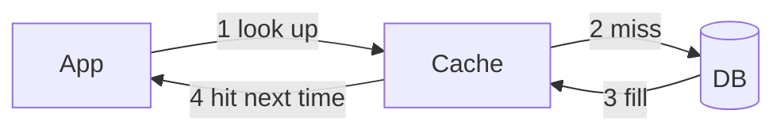

# 08. Caching

## Learning goals

- Know when caching helps  
- Use cache-aside confidently  
- Handle expiration and invalidation basics  

## Why cache?

Databases are durable but relatively slow and expensive under heavy read load.

A **cache** stores hot data in fast memory (usually Redis/Memcached).



## Cache hit vs miss

- **Hit:** found in cache → fast  
- **Miss:** not found → read DB → usually populate cache  

**Hit ratio** is the percentage of hits. Higher is better (until data is too stale).

## Common caching patterns

### 1) Cache-aside (lazy loading) — most common

App manages cache:

1. Read cache  
2. On miss, read DB  
3. Write to cache with TTL  

### 2) Read-through / write-through

Cache library/library layer loads DB automatically; writes go to cache and DB together.

### 3) Write-behind

Write cache first, flush to DB asynchronously — faster writes, riskier durability.

## TTL (time to live)

Every cached entry should usually expire.

```text
SET user:42 {...} EX 300   # 5 minutes
```

TTL bounds staleness when invalidation is imperfect.

## Invalidation — the hard part

When data changes, cached copies can be wrong.

Strategies:

- Delete/update cache key on write  
- Short TTL and accept brief staleness  
- Version keys (`user:42:v7`)  

Famous saying: *There are only two hard things in CS: cache invalidation and naming things.*

## What to cache

Good candidates:

- User sessions  
- Public profiles  
- URL shortener mappings  
- Hot product pages  
- Feed first pages  

Bad candidates (usually):

- Data that must be perfectly correct every millisecond (unless careful)  
- Rarely read data (wastes memory)  
- Huge objects that blow cache RAM  

## Cache stampede

Many requests miss the same key at once → DB thundering herd.

Mitigations: single-flight locks, soft TTL, probabilistic early refresh.

## Placement in HLD

Almost always:

```text
Client → LB → App → Redis → DB
```

CDN is also a cache, but at the edge for static/media (next lessons).

## Example: URL redirect

```text
key:  url:aZ9kQ2
val:  https://example.com/...
TTL:  24h
```

Redirect path: try Redis → on miss Postgres → set Redis → 302 redirect.

## Check your understanding

1. What is cache-aside?  
2. Why use TTL even if you invalidate on write?  
3. Name one stampede mitigation.  

<details>
<summary>Answers</summary>

1. App checks cache, loads DB on miss, then fills cache.  
2. Safety net against missed invalidations and bugs.  
3. Lock/single-flight so only one request loads DB for a key.

</details>

---

**Next:** [CAP & Consistency](09-cap-consistency.md)
