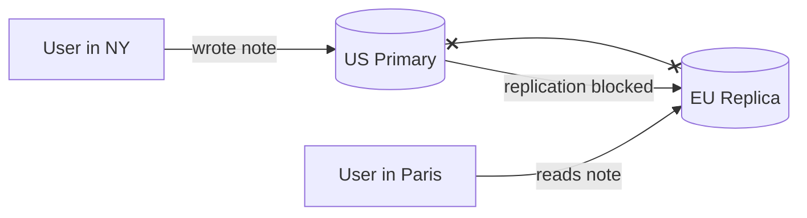
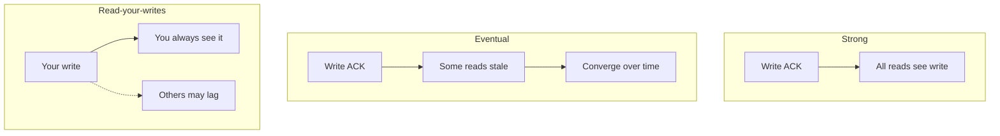
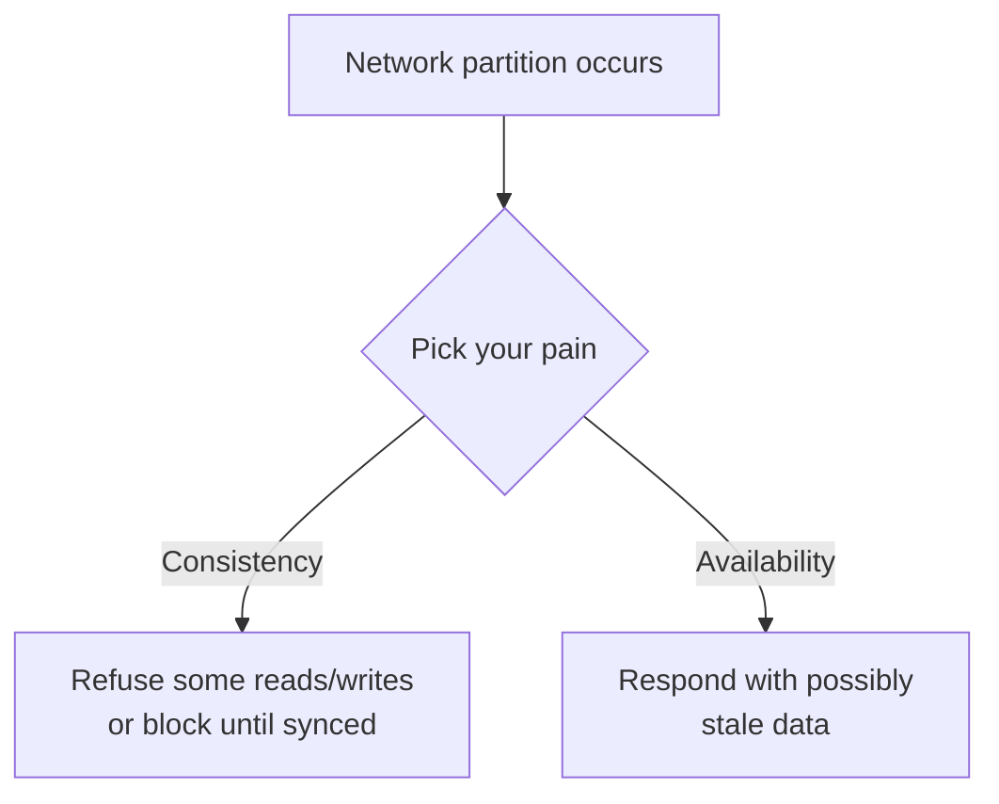
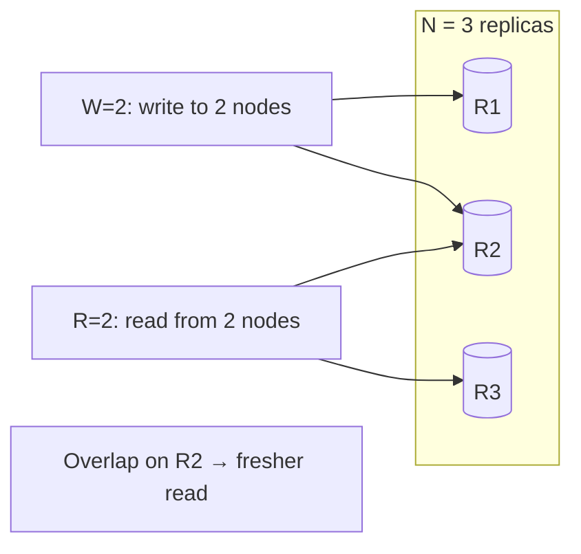
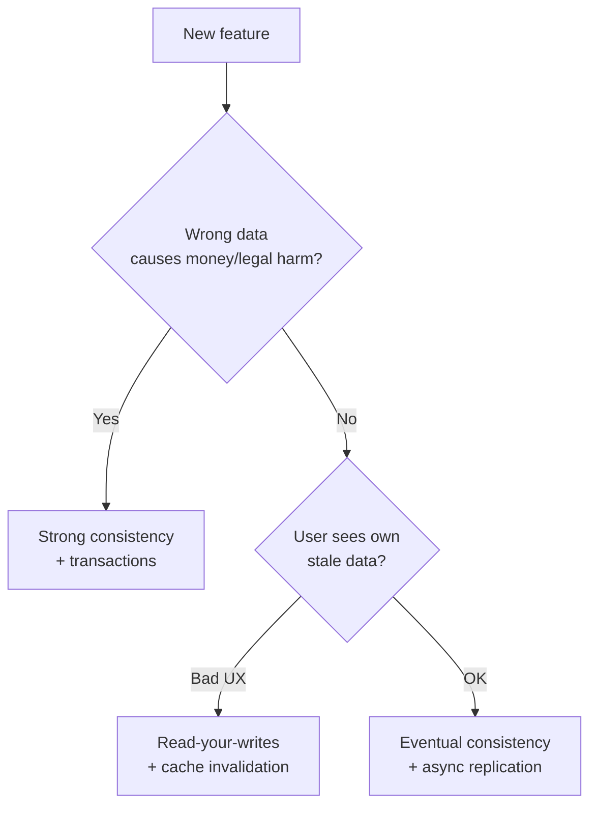
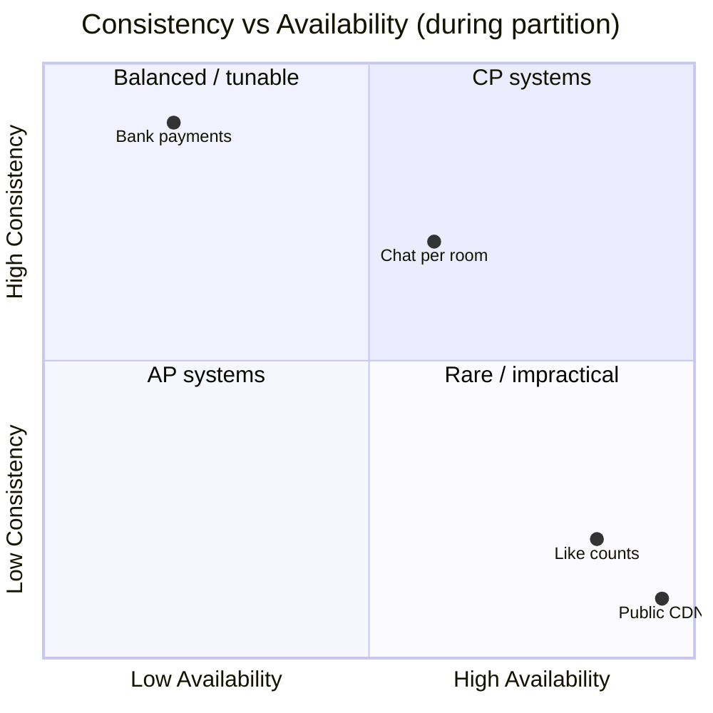

# 09. CAP & Consistency

> **Where this fits:** You have databases, replicas, caches, and maybe shards. Data now lives in **multiple places**. This lesson explains the trade-offs when those places disagree — and how to choose the right consistency for each product feature.

---

## Learning goals

By the end of this lesson, you should be able to:

- Explain **consistency** vs **availability** in plain English with everyday examples
- Name common **consistency models** (strong, eventual, read-your-writes) and when each fits
- State **CAP theorem** at a beginner level without treating it as gospel
- Use **PACELC** as a lightweight extension (latency vs consistency)
- Map **product features** to appropriate consistency choices
- Build intuition for **quorum reads/writes** (Dynamo-style)
- Connect **replication lag** to consistency guarantees
- Speak confidently about trade-offs in HLD interviews

---

## The everyday problem — two copies, one update

You run a notes app with database replicas in **US** and **Europe**. A user in New York edits a note at 3:00:00 PM.

At the **exact same moment**, the network link between US and Europe fails (a **partition**).

Questions:

1. Should a reader in Paris immediately see the edit?
2. If Paris cannot reach New York, should the app **refuse to respond** or **show the old note**?

There is no free lunch. This tension — **correctness vs staying online** — is what this chapter is about.



**Everyday analogy — two whiteboards in different offices:**

Company policy lives on a whiteboard. Office A updates "Vacation policy: 20 days." Office B's whiteboard still says "15 days" until someone syncs them.

- **Consistency-first:** Office B says *"I can't answer — my board might be wrong."* (refuse read)
- **Availability-first:** Office B says *"15 days"* — might be stale, but at least you got an answer.

---

## Consistency models — practical definitions

**Consistency** answers: *When I read data, how sure am I that I'm seeing the latest (or an acceptable) version?*

| Model | Plain English | Real-world example |
|-------|---------------|-------------------|
| **Strong consistency** | After a write succeeds, **every** read sees that write immediately | ATM balance after withdrawal |
| **Eventual consistency** | Reads **may be stale** for a while; replicas **converge** later | YouTube view count; Instagram like count |
| **Read-your-writes** | **You** always see **your own** updates; others might lag | Edit profile → you see new name; friend might not yet |
| **Monotonic reads** | Once you see version V, you never see an **older** version in same session | Timeline doesn't "undo" posts you already saw |
| **Causal consistency** | Related operations appear in cause-effect order | Reply appears after parent comment (harder at scale) |



### Strong consistency — when wrong is unacceptable

```text
User transfers $100:
  1. Debit account A
  2. Credit account B
  3. COMMIT

Any read of A or B before commit completes → must not show partial state
Any read after commit → must show new balances
```

**Cost:** Often requires **coordination** — talking to multiple nodes, locks, or reading from primary. **Higher latency**, lower availability during failures.

### Eventual consistency — when "soon enough" is fine

```text
Post gets 1,000 likes in 10 seconds:
  - Exact count of 1,000 vs 997 vs 1,003 → nobody cares
  - System stays fast and available
  - Counts merge asynchronously
```

**Benefit:** Fast writes, high availability, geographic spread.  
**Cost:** Temporary disagreement between replicas.

### Read-your-writes — the UX sweet spot

Users are **most confused** when *their own* action doesn't appear.

```text
Bad UX:
  User: "I changed my avatar."
  App:  (shows old avatar from replica)
  User: "It didn't work!" → support ticket

Fix:
  After user's write → route their reads to primary (or invalidate their cache)
  Other users can still read from slightly stale replicas
```

---

## CAP theorem — plain English version

**CAP** describes a trade-off during a **network partition** (nodes can't talk reliably):

| Letter | Meaning |
|--------|---------|
| **C** — Consistency | Every read returns the **latest** write (or the system errors) |
| **A** — Availability | Every request gets a **response** (not an error), even if data might be stale |
| **P** — Partition tolerance | The system **continues operating** when network links break between nodes |

**The theorem (simplified):** In a distributed system, when a **partition** happens, you cannot fully have **both** C and A. You must **lean** toward one.



### Why P is not optional in the cloud

Partitions **will** happen:

- Router misconfiguration
- Availability zone outage
- Undersea cable damage
- GC pause causing timeout
- Misconfigured security group

Real systems assume **P** and choose between **C and A during trouble**.

### CAP is intuition, not a product label

| Don't do this | Do this instead |
|---------------|-----------------|
| "We're CP so we're always consistent" | "During partition, we **prefer** consistency for payments — we may return errors rather than wrong balances" |
| "We're AP so CAP doesn't apply" | "Like counts are **eventually consistent**; checkout uses **stronger** guarantees" |
| Memorize CA / CP / AP badges | Explain **per-feature** trade-offs |

**Everyday analogy:** CAP is like choosing between **closing the store** during a supply truck strike (consistent inventory records) vs **selling what you think is on shelf** and fixing discrepancies later (available but maybe wrong count).

---

## PACELC — a lighter extension

**PACELC** (same author, extended idea):

> **If Partition:** choose **A** or **C**  
> **Else** (normal operation): choose **Latency (L)** or **Consistency (C)**

Even **without** a network partition, waiting for all replicas to agree adds **latency**.

| System bias | Normal operation | During partition |
|-------------|------------------|------------------|
| **Dynamo-style (AP-ish)** | Fast writes, async replicate | Stay available, stale reads OK |
| **Traditional RDBMS (CP-ish)** | Strong on single node | May block/fail cross-node |
| **Spanner / Cockroach** | Strong with higher latency | Consistency prioritized |

```text
Write to 3 replicas:
  Wait for 1 ACK  → fast, less consistent
  Wait for 3 ACKs → slow, stronger consistency
```

You don't need to cite PACELC in every interview — but it helps you say: *"Consistency isn't binary; we tune how many replicas must agree."*

---

## Quorum intuition — Dynamo-style (N, W, R)

For **N** replicas of a key:

- **W** = number of replicas that must acknowledge a **write**
- **R** = number of replicas read during a **read**

**Rule of thumb:** If **W + R > N**, reads and writes **overlap** on at least one node → stronger consistency.

### Example: N = 3

| W | R | W + R > 3? | Behavior |
|---|---|------------|----------|
| 1 | 1 | No (2) | Fastest; likely stale reads |
| 2 | 2 | Yes (4) | Read sees latest committed write (with caveats) |
| 3 | 1 | Yes (4) | Slow writes; safer reads |
| 1 | 3 | Yes (4) | Slow reads; fast writes |



**Everyday analogy — homework grading:**

Three teachers have copies of your essay. **W=2** means two must receive your revision before it's "submitted." **R=2** means two teachers are consulted for the grade. If W+R > 3, at least one teacher who saw the latest draft also grades you.

**Caveats for beginners:** Quorums handle many cases but not all (conf concurrent writes need **version vectors** / **last-write-wins** / conflict resolution — advanced topic).

---

## Product feature → consistency choice

| Feature | Typical choice | Why |
|---------|----------------|-----|
| **Bank transfer / payment** | Strong | Wrong balance = money lost, legal liability |
| **Inventory checkout (last item)** | Strong / transactional | Overselling causes refunds and angry customers |
| **Seat booking (airline)** | Strong | Double-booking is catastrophic |
| **URL redirect mapping** | Strong enough / tiny lag OK | Wrong link breaks trust; easy to cache + single-key |
| **User profile (self-view)** | Read-your-writes | User must see own edits immediately |
| **User profile (public view)** | Eventual | Friend sees new avatar 2 sec late — fine |
| **Like / view counters** | Eventual | Approximate counts acceptable |
| **News feed / timeline** | Eventual | "Fresh enough" beats perfectly ordered globally |
| **Chat messages** | Durable + ordered **per conversation** | Messages must not disappear or reorder wildly |
| **Analytics dashboard** | Eventual | Minutes-old metrics OK |
| **Search index** | Eventual | New post searchable seconds later OK |
| **Leaderboard (gaming)** | Eventual / periodic flush | Exact real-time rank less critical |
| **Feature flags** | Read-your-writes / short TTL | Ops needs changes to propagate quickly |



---

## Replication lag — consistency in disguise

From lesson 07: read replicas lag behind primary.

| Read from | Consistency level |
|-----------|-------------------|
| Primary | Strong (for that node) |
| Replica (0 lag) | Strong-ish |
| Replica (2 sec lag) | 2 sec stale — eventual |
| Cache (5 min TTL) | Up to 5 min stale |

**Mitigations recap:**

```text
1. Read-your-writes: user's reads → primary after write
2. Monotonic reads: sticky session to same replica
3. Synchronous replication: wait for replica ACK (slower writes)
4. Version numbers: client detects stale and retries
```

---

## Worked examples

### Example 1: Instagram-like count

```text
Architecture:
  Write path:  POST /like → increment counter in Redis → async flush to DB
  Read path:   GET /likes → read Redis (maybe ± few counts off)

Consistency: Eventual
Why OK:      Users expect approximate social proof, not audit-grade counts
```

### Example 2: Ticketmaster-style booking

```text
Architecture:
  BEGIN TRANSACTION
    SELECT seats WHERE id = 7 FOR UPDATE   -- lock row
    IF available: UPDATE status = 'sold'
  COMMIT

Consistency: Strong (pessimistic locking)
Why:         Two users cannot buy same seat
```

### Example 3: Multi-region notes app

```text
Option A (CP-ish):  Writes go to one region; reads from local replica
                    During partition → reject writes in minority region

Option B (AP-ish):  Writes accepted locally; merge conflicts later
                    "Last write wins" or CRDT merge

Product choice:     Personal notes → AP often OK
                    Shared legal docs → CP required
```

---

## Consistency vs caching (connecting lesson 08)

| Layer | Staleness window |
|-------|------------------|
| Strong DB read (primary) | Minimal |
| Read replica | Replication lag (ms–sec) |
| Redis cache | TTL (sec–min) |
| CDN | Minutes–hours |
| Browser cache | User-controlled |

**Stacked staleness:** A cached value on a replica can be **double stale**. Design invalidation carefully.

---

## Common mistakes

| Mistake | Reality |
|---------|---------|
| "We need strong consistency everywhere" | Kills latency and availability; expensive |
| "Eventual consistency means data is random" | Replicas **converge**; staleness is **bounded** by design |
| Ignoring read-your-writes in UX | #1 user confusion after profile edits |
| Treating CAP as three checkboxes | It's a **trade-off during partition**, not a brand |
| Strong consistency without transactions | Labeling alone doesn't fix race conditions |
| Quorum without conflict resolution | Concurrent writes to same key still conflict |
| Same consistency for reads and writes | Often writes are strong, reads are relaxed |

---

## How to talk about this in HLD interviews

Use **feature-specific** sentences:

> "Checkout inventory decrement runs in a **Postgres transaction** with row-level lock — **strong consistency**."

> "Like counts are **eventually consistent**: we increment in Redis and batch-persist; displaying 1,003 vs 1,000 is fine."

> "After profile update, we **invalidate cache** and route that user's reads to the **primary** for **read-your-writes**."

> "Cross-region, we accept **seconds of lag** on public timelines; payment service stays in a **single region** with sync replication."

That sounds senior — because it is **specific**, not buzzword soup.

---

## Visual summary



*(Diagram is illustrative — real systems tune per feature, not one dot per company.)*

---

## Check your understanding

### Questions

1. In plain English, what tension does CAP describe?
2. Can a system be strongly consistent, fully available, and partition-tolerant all at once during a network split?
3. What's the difference between strong consistency and eventual consistency? Give one example of each.
4. What does read-your-writes protect against?
5. Why are like counts often eventually consistent?
6. In quorum terms, why does W=2, R=2, N=3 give stronger reads than W=1, R=1?
7. Should checkout inventory use strong or eventual consistency? Why?
8. What does the "ELC" part of PACELC remind you to consider during normal (non-partition) operation?

### Answers

<details>
<summary>Click to reveal answers</summary>

1. When the network breaks between nodes, you often must choose between returning **possibly stale data** (availability) vs **refusing or blocking** until data is correct (consistency).

2. **No** — during a partition, you effectively sacrifice **either** C or A (while assuming P). You cannot guarantee both perfect consistency and always getting a response.

3. **Strong:** every read sees latest write immediately (bank balance). **Eventual:** replicas may disagree temporarily but converge (YouTube view count).

4. It prevents **users from seeing their own outdated data** immediately after they make an update — e.g., editing profile and still seeing old name.

5. Exact real-time like count **rarely matters** to users; high **availability and speed** matter more. Off-by-a-few is acceptable.

6. **W+R=4 > N=3**, so at least one node participating in the read also received the latest write → overlap increases freshness. **W=1,R=1** has no overlap guarantee.

7. **Strong** — selling the same last item twice causes refunds, fraud, and customer anger. Overselling is a correctness bug with monetary impact.

8. **Latency vs consistency** — even without partitions, waiting for more replicas to agree **slows** responses. Normal operation still involves trade-offs.

</details>

---

## Quick reference card

```text
Strong         → always latest; slower; may error during partition
Eventual       → stale OK temporarily; converges; fast + available
Read-your-writes → you see your edits; others may lag
CAP            → during partition: pick C or A (P assumed)
PACELC         → else: latency vs consistency
Quorum         → W + R > N → read/write overlap → stronger
Per-feature    → payments strong; likes eventual; profile RYW
```

---

**Next:** [10. Queues & Async Processing](10-queues-async.md) — when the user shouldn't wait for the whole job to finish.
