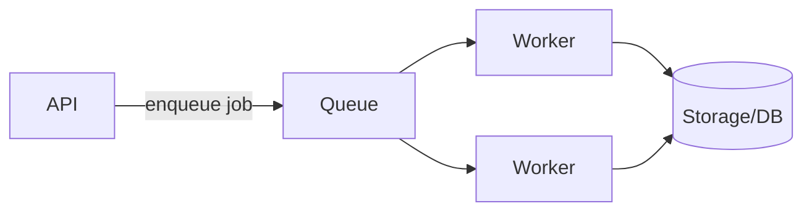

# 10. Queues & Async Processing

## Learning goals

- Know when to process work asynchronously  
- Sketch producers, queues, and consumers  
- Understand retries and idempotency with queues  

## Sync vs async

**Synchronous:** user waits until everything finishes.

Example: upload photo → server waits for virus scan + thumbnail + ML tags → then responds. Slow and fragile.

**Asynchronous:** accept work quickly, process later.

Example: upload photo → store file → enqueue `photo.uploaded` → return “accepted” → workers create thumbnails.



## Why queues help

1. **Smooth traffic spikes** — absorb bursts  
2. **Decouple services** — API doesn’t call every dependency directly  
3. **Retries** — failed jobs retry without failing the user request  
4. **Parallelism** — many workers consume jobs  

## Common queue products

RabbitMQ, Amazon SQS, Kafka (log/stream), Google Pub/Sub, Redis streams.

Beginner distinction:

- **Task queue** (SQS/Rabbit): “do this job”  
- **Event log** (Kafka): “here is a stream of facts” many consumers can read  

## At-least-once delivery

Most queues deliver **at least once**. Duplicates happen.

Therefore consumers must be **idempotent**:

```text
process(job_id):
  if already_done(job_id): return
  do_work()
  mark_done(job_id)
```

## Poison messages

A bad job fails forever.

Use:

- max retry count  
- dead-letter queue (DLQ) for inspection  

## Ordering

- Global ordering across everything is expensive  
- Per-key ordering (per `user_id` / `conversation_id`) is common  

Kafka partitions give order **within a partition**.

## Example use cases

| Feature | Queue job |
|---------|-----------|
| Email/SMS | `send_email` |
| Thumbnails | `image_resize` |
| Feed fanout | `fanout_post` |
| Analytics | `track_event` |
| Notifications | `push_notify` |

## HLD pattern you’ll redraw often

```text
Client → API → DB
            ↘ Queue → Workers → DB/Email/Push
```

## Check your understanding

1. Why not do thumbnail generation inside the upload HTTP request?  
2. Why must consumers be idempotent?  
3. What is a DLQ for?  

<details>
<summary>Answers</summary>

1. Too slow/fragile; user waits on non-critical work.  
2. At-least-once delivery can replay jobs.  
3. Hold repeatedly failing messages for debugging without blocking the queue.

</details>

---

**Next:** [CDN & Object Storage](11-cdn-object-storage.md)
