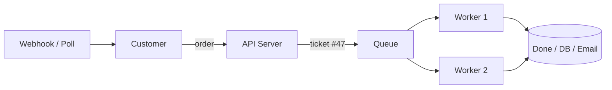
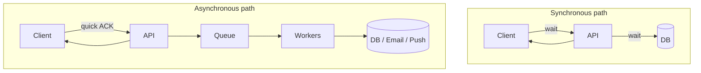
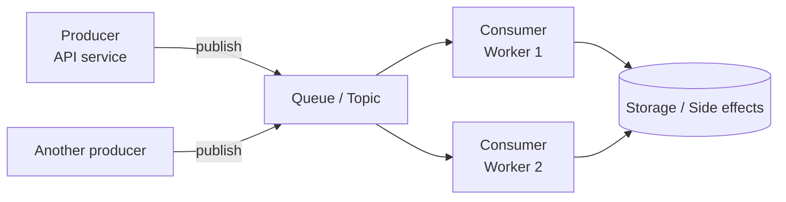
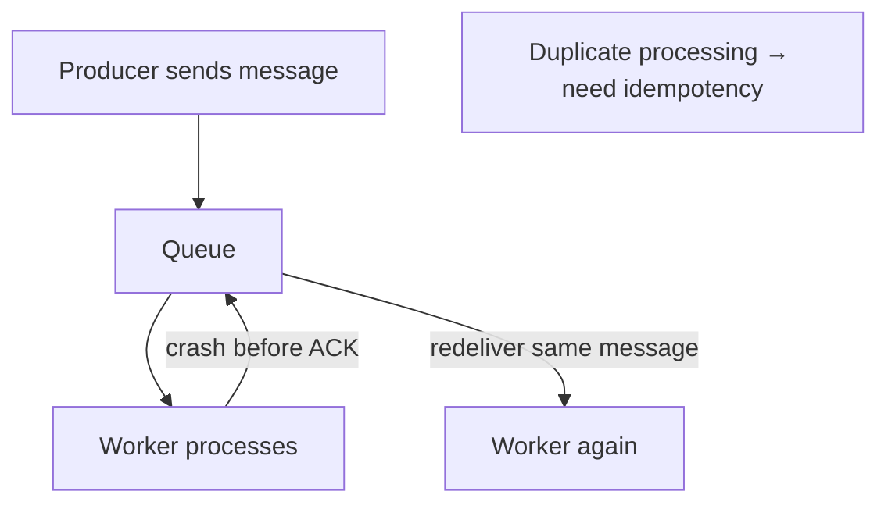
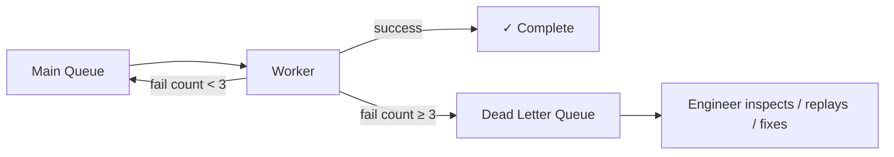
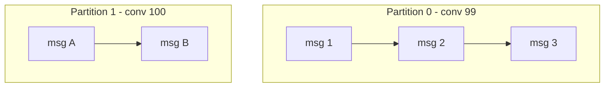
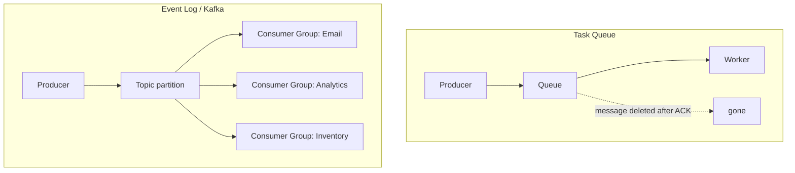
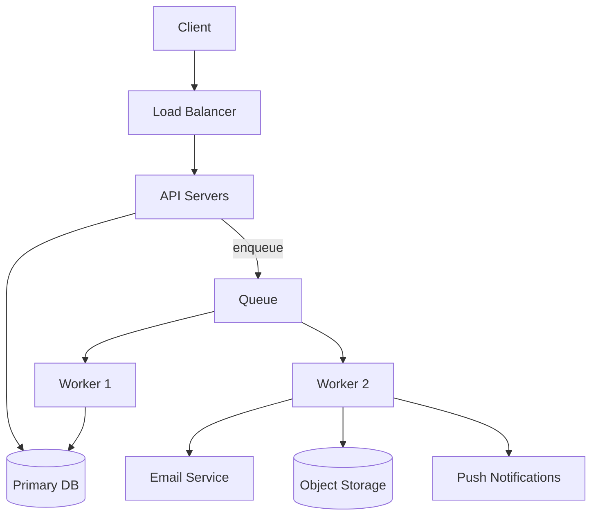
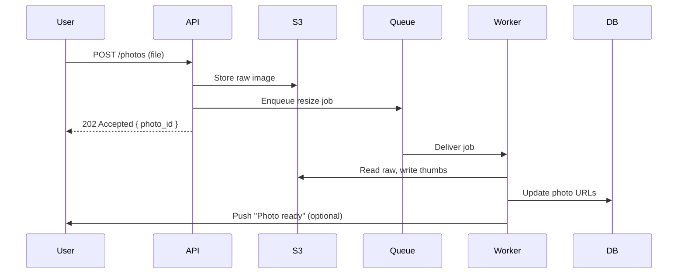

# 10. Queues & Async Processing

> **Where this fits:** Not every task must finish before you respond to the user. **Queues** let your API say "got it!" quickly while workers handle the slow stuff in the background — like a restaurant kitchen ticket system.

---

## Learning goals

By the end of this lesson, you should be able to:

- Explain **sync vs async** processing using the restaurant kitchen ticket analogy
- Draw **producers, queues, and consumers** in an HLD diagram
- List **why queues help** (spike absorption, decoupling, retries, parallelism)
- Understand **at-least-once delivery** and why **idempotency** is mandatory
- Describe **dead-letter queues (DLQ)** and poison message handling
- Compare **ordering** guarantees: global vs per-key
- Distinguish **task queues** (SQS/RabbitMQ) vs **event logs** (Kafka)
- Map common product features to queue-based workflows

---

## The restaurant analogy — why async exists

Imagine a sit-down restaurant:

### Synchronous (bad kitchen model)

```text
You order pasta.
Waiter stands at your table.
Waiter walks to kitchen, cooks pasta, plates it, returns.
You stare at waiter for 20 minutes.
No other tables get served.
```

This is like an HTTP request that **blocks** until virus scan + thumbnail generation + ML tagging + email notification all complete.

### Asynchronous (real kitchen model)

```text
You order pasta.
Waiter writes ticket #47, pins it to kitchen rail, brings bread immediately.
You chat, drink water — not blocked.
Kitchen cooks when ready; runner delivers pasta when done.
```

This is **async processing**:

1. API **accepts** the request quickly
2. **Enqueues** work (ticket)
3. Returns **202 Accepted** or success with "processing"
4. **Workers** consume jobs in the background



**Everyday mapping:**

| Restaurant | System |
|------------|--------|
| Customer order | HTTP request |
| Waiter | API server |
| Ticket on rail | Message in queue |
| Cooks | Worker processes |
| Dish window | Database / email / push service |
| "Your table's food is up!" | Webhook, push notification, or poll status |

---

## Sync vs async — when to use which

### Synchronous — user waits for result

```text
POST /login
  → verify password
  → create session
  → return token

User NEEDS the token to proceed — must be sync.
```

**Use sync when:**

- User **immediately needs** the result to continue
- Operation is **fast** (< 200–300 ms typical UX budget)
- **Strong consistency** required in the response (account balance display)
- Failure must be shown **right now** (payment declined)

### Asynchronous — user can wait or get notified later

```text
POST /photos/upload
  → store raw file in S3
  → enqueue { photo_id, user_id, sizes: [thumb, medium, large] }
  → return 202 { "status": "processing", "photo_id": "abc" }

Background workers:
  → resize images
  → run moderation ML
  → update DB with URLs
  → push notification "Your photo is ready"
```

**Use async when:**

- Work is **slow** (seconds to minutes)
- Work can **fail and retry** without user staring at spinner
- **Spiky traffic** — queue absorbs bursts
- Multiple **downstream services** must react to same event
- User doesn't need result in the same HTTP response



---

## Core components



| Component | Role | Example |
|-----------|------|---------|
| **Producer** | Sends messages/jobs | API server after upload |
| **Queue / Topic** | Durable buffer | SQS, RabbitMQ, Kafka |
| **Consumer / Worker** | Processes messages | `thumbnail-worker` pod |
| **Broker** | Software managing the queue | RabbitMQ server, Kafka cluster |

---

## Why queues help — four superpowers

### 1. Smooth traffic spikes

```text
Black Friday: 50,000 orders in 1 minute

Without queue: API tries to send 50k emails inline → timeouts, crashes
With queue:    API enqueues 50k jobs in seconds → workers drain at steady rate
```

**Everyday analogy:** Ticket rail holds orders during rush hour; kitchen processes at **its** pace, not the dinner rush pace.

### 2. Decouple services

```text
Order service → publishes order.created
                ↘ Email service listens
                ↘ Inventory service listens
                ↘ Analytics service listens

Order service doesn't call email API directly — fewer cascading failures
```

### 3. Retries without failing the user

```text
User uploads photo → API returns success
Worker tries ML moderation → external API timeout
Worker retries with backoff (1s, 2s, 4s...) → eventually succeeds

User already got "upload accepted" — no spinner of death
```

### 4. Parallelism

```text
One queue, ten workers → ten jobs processed concurrently
Scale workers horizontally without changing API
```

---

## Delivery guarantees — what "done" means

| Guarantee | Meaning | Typical use |
|-----------|---------|-------------|
| **At-most-once** | Message delivered 0 or 1 time; may **lose** messages | Metrics where loss OK |
| **At-least-once** | Message delivered 1+ times; **duplicates possible** | **Most common** (SQS, RabbitMQ default) |
| **Exactly-once** | Processed once and only once | Hard; often simulated with idempotency |

**Beginner reality:** Assume **at-least-once**. Plan for duplicates from day one.



---

## Idempotency — handling duplicates safely

An operation is **idempotent** if doing it **twice** has the same effect as doing it **once**.

```python
def process_thumbnail_job(job):
    photo_id = job["photo_id"]

    # Idempotency check
    if db.job_already_completed(photo_id, "thumbnail"):
        return  # safe no-op on duplicate

    image = s3.download(job["s3_key"])
    thumb = resize(image, 200, 200)
    s3.upload(f"thumbs/{photo_id}.jpg", thumb)
    db.mark_job_completed(photo_id, "thumbnail")
```

### Idempotency patterns

| Pattern | How |
|---------|-----|
| **Natural idempotency** | `SET status = 'shipped' WHERE id = 5` — same result twice |
| **Idempotency key table** | Store `job_id` or `message_id` after success |
| **Upsert by unique key** | `INSERT ... ON CONFLICT DO NOTHING` |
| **Version / state machine** | Only transition `pending → processing → done` if valid |

**Everyday analogy:** Paying a bill online with confirmation #8821. If you click "Pay" twice, the bank checks confirmation #8821 already processed — second click doesn't double-charge.

### Where to store idempotency keys

```text
Option A: DB table (job_id PRIMARY KEY, status, completed_at)
Option B: Redis SET with TTL (fast dedup window)
Option C: SQS deduplication ID (FIFO queues, 5-min window)
```

---

## Poison messages and dead-letter queues (DLQ)

A **poison message** is a job that **always fails** — malformed payload, bug in code, missing foreign key.

```text
Job: { "photo_id": "xyz", "format": "webp" }
Error: WebP codec not installed → fail → retry → fail → retry → ∞
```

Without handling, poison messages **block the queue** or waste infinite retries.

### Solution: max retries + DLQ



```text
SQS example:
  maxReceiveCount = 3
  deadLetterTargetArn = arn:...:my-dlq

After 3 failed processing attempts → message moves to DLQ
Alert on DLQ depth > 0
Engineer fixes bug, replays messages
```

**Everyday analogy:** Kitchen ticket for "allergic to everything burger" — impossible order. After 3 failed attempts, ticket goes to **manager's desk (DLQ)** instead of clogging the line forever.

---

## Ordering — global vs per-key

### Global ordering — expensive

```text
All events worldwide processed in exact order: E1, E2, E3, ...
Requires single consumer or heavy coordination → bottleneck
```

### Per-key (partition) ordering — common and practical

```text
All events for conversation_id = 99 processed in order
Events for conversation_id = 100 independent

Kafka: messages with same partition key → same partition → ordered within partition
```

| Need | Approach |
|------|----------|
| Chat messages in one thread | Partition by `conversation_id` |
| User account events | Partition by `user_id` |
| Global analytics | Ordering often **not** required |



**Trade-off:** Strict ordering within a key **limits parallelism** for that key — one consumer per partition at a time.

---

## Task queue vs event log (Kafka)

Beginners confuse these — they're different tools for overlapping problems.

### Task queue — "do this job"

**Examples:** Amazon SQS, RabbitMQ, Celery, Sidekiq, Google Cloud Tasks

```text
Producer:  "Please send email to alice@example.com"
Queue:     One consumer typically processes message → deletes it
Model:     Work queue — job done, message gone
```

**Best for:**

- Background jobs (email, thumbnails, PDF generation)
- Task distribution among workers
- Retry + DLQ per job

### Event log (stream) — "this fact happened"

**Examples:** Apache Kafka, Amazon Kinesis, Google Pub/Sub (hybrid), Redpanda

```text
Producer:  "order.created { order_id: 42, ... }"
Log:       Message appended to topic; retained for days/weeks
Consumers: Many independent consumer groups read same stream
Model:     Immutable ledger of events
```

**Best for:**

- Event sourcing patterns
- Multiple services reacting to same event
- High-throughput analytics pipelines
- Replay history ("reprocess last 7 days")



### Comparison table

| | Task Queue | Event Log (Kafka) |
|---|------------|-------------------|
| **Message lifecycle** | Deleted after processing | Retained by policy |
| **Consumers** | Usually one worker per message | Many consumer groups |
| **Replay** | Hard / no | Yes — re-read offset |
| **Ordering** | Per queue (FIFO options) | Per partition |
| **Mental model** | To-do list | Newspaper archive |
| **Complexity** | Lower | Higher (partitions, offsets, rebalance) |

**Beginner advice:** Start with a **task queue** (SQS + workers). Adopt Kafka when you need **multiple consumers**, **replay**, or **very high throughput event streams**.

---

## Common queue products (quick reference)

| Product | Type | Notes |
|---------|------|-------|
| **Amazon SQS** | Task queue | Fully managed, simple, at-least-once |
| **RabbitMQ** | Task queue | Flexible routing, exchanges |
| **Redis Streams / Bull** | Lightweight queue | Good for smaller apps; durability caveats |
| **Celery + Redis/Rabbit** | Python task framework | Popular in Django/Flask |
| **Sidekiq** | Ruby task framework | Redis-backed |
| **Apache Kafka** | Event log | Partitions, consumer groups, replay |
| **Google Pub/Sub** | Hybrid | Push/pull, multiple subscribers |
| **AWS EventBridge** | Event bus | Serverless routing rules |

---

## Example use cases — feature to job mapping

| Product feature | Queue message / event | Why async |
|-----------------|----------------------|-----------|
| Welcome email on signup | `{ "type": "send_email", "template": "welcome", "user_id": 42 }` | SMTP slow; retries needed |
| Image thumbnail | `{ "photo_id": "abc", "sizes": [64, 256, 1024] }` | CPU-heavy resize |
| Feed fanout | `{ "post_id": 99, "author_id": 7, "follower_ids": [...] }` | Millions of followers — can't inline |
| Search index update | `{ "event": "document.updated", "id": "prod_8812" }` | Elasticsearch bulk indexing |
| Push notification | `{ "user_id": 42, "title": "...", "body": "..." }` | FCM/APNs rate limits |
| PDF invoice generation | `{ "order_id": 1001 }` | Slow; retry on failure |
| Analytics tracking | `{ "event": "page_view", "url": "/shoes", "ts": "..." }` | Fire-and-forget; huge volume |
| Fraud check | `{ "payment_id": "pay_xyz", "amount_cents": 5000 }` | External API; don't block checkout ACK |
| Video transcoding | `{ "video_id": "v1", "formats": ["720p", "1080p"] }` | Minutes of processing |
| Delete user (GDPR) | `{ "user_id": 42, "cascade": true }` | Many tables/services to clean |

---

## End-to-end HLD pattern (you'll redraw often)



```text
Sync path:  Client → API → DB → response (fast CRUD)
Async path: Client → API → DB (minimal) + Queue → Workers → side effects
```

### Upload photo — sequence diagram



---

## Backpressure and worker scaling

```text
Queue depth growing?  → Add more workers (scale consumers)
Queue always empty?   → Maybe over-provisioned workers
Processing lag > SLA? → Scale workers or optimize job handler
```

| Metric | Meaning |
|--------|---------|
| **Queue depth** | Jobs waiting — backlog size |
| **Age of oldest message** | How far behind you are |
| **Processing rate** | Jobs/sec consumed |
| **Error rate / DLQ depth** | Poison messages or bugs |

**Autoscaling rule (conceptual):** If queue depth > 1000 for 5 min → add worker instances.

---

## Common mistakes

| Mistake | Consequence | Fix |
|---------|-------------|-----|
| Non-idempotent consumers | Duplicate emails, double charges | Idempotency keys |
| No DLQ | Poison message blocks queue forever | max retries → DLQ + alerts |
| Async without status tracking | User doesn't know when done | Job status table + poll/webhook |
| Putting huge payloads in queue | Broker bloat, slow | Store in S3; queue only reference ID |
| Sync call chain instead of queue | Cascading failures | Publish event; let consumers react |
| Kafka for simple emails | Over-engineering | SQS is enough |
| Ignoring ordering needs | Chat messages shuffled | Partition by conversation_id |
| No visibility timeout tuning | Message reprocessed while still running | Extend heartbeat / adjust timeout |

---

## Interview phrases that sound solid

- "Upload returns **202 immediately**; thumbnail generation runs on **SQS** with **idempotent** workers keyed by `photo_id`."
- "Failed jobs retry **3 times** with exponential backoff, then land in a **DLQ** for ops review."
- "Chat messages publish to Kafka **partitioned by `conversation_id`** for per-thread ordering."
- "Feed fanout is **async** — posting completes in 50ms; followers' timelines update via background workers."

---

## Check your understanding

### Questions

1. Explain async processing using the restaurant ticket analogy.
2. Why shouldn't thumbnail generation run inside the upload HTTP request?
3. What is at-least-once delivery, and what must consumers do about it?
4. Write pseudocode for an idempotent email-sending worker.
5. What is a dead-letter queue for?
6. When do you need per-key ordering vs global ordering?
7. What's the main difference between SQS (task queue) and Kafka (event log)?
8. Name three product features that should be async and one that should stay sync.

### Answers

<details>
<summary>Click to reveal answers</summary>

1. Waiter (API) takes order, writes **ticket** (enqueue), brings bread (quick response). Kitchen (**workers**) cooks when ready. Customer isn't blocked while food prepares.

2. Thumbnail generation is **slow and CPU-heavy** (seconds). Blocking the HTTP request causes **timeouts**, poor UX, and can't **scale** independently. User only needs "upload accepted" immediately.

3. **At-least-once** means a message may be delivered **more than once** (retries after crash). Consumers must be **idempotent** — processing twice must not double-charge, double-email, etc.

4. ```python
   def send_email_job(job):
       msg_id = job["message_id"]
       if db.already_sent(msg_id):
           return
       smtp.send(job["to"], job["body"])
       db.mark_sent(msg_id)
   ```

5. **DLQ** holds messages that **failed repeatedly** (poison messages) so they don't block the main queue. Engineers inspect, fix bugs, and **replay**.

6. **Per-key ordering** when related events must stay ordered (chat in one conversation) but unrelated keys can parallelize. **Global ordering** when entire system needs strict sequence — rare and expensive.

7. **SQS:** job queue — one consumer typically processes and **deletes** message. **Kafka:** append-only **log** — many consumer groups, **retention**, **replay**, partition-based ordering.

8. **Async:** thumbnails, welcome email, feed fanout. **Sync:** login (need token now), payment authorization response, real-time password verification.

</details>

---

## Quick reference card

```text
Sync         → user waits; fast; result needed now
Async        → enqueue ticket; workers process later
At-least-once → duplicates happen → idempotency required
DLQ          → poison messages after max retries
Ordering     → per-key (conversation_id) not global
Task queue   → do this job (SQS, RabbitMQ)
Event log    → fact happened (Kafka) — replay, multi-consumer
HLD pattern  → API → DB + Queue → Workers → side effects
```

---

**Next:** [11. CDN & Object Storage](11-cdn-object-storage.md) — caching at the edge for static files and media.
