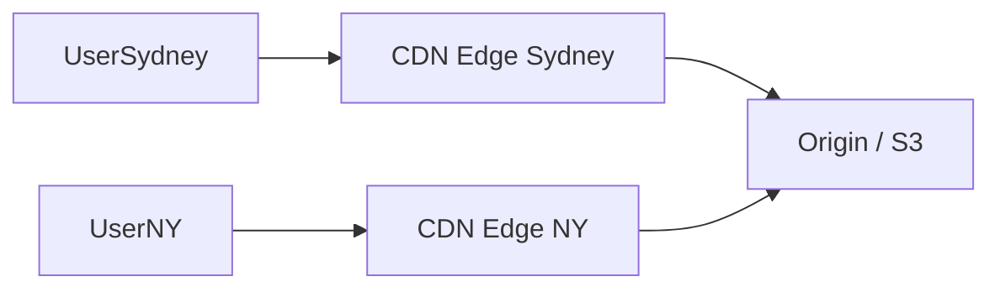
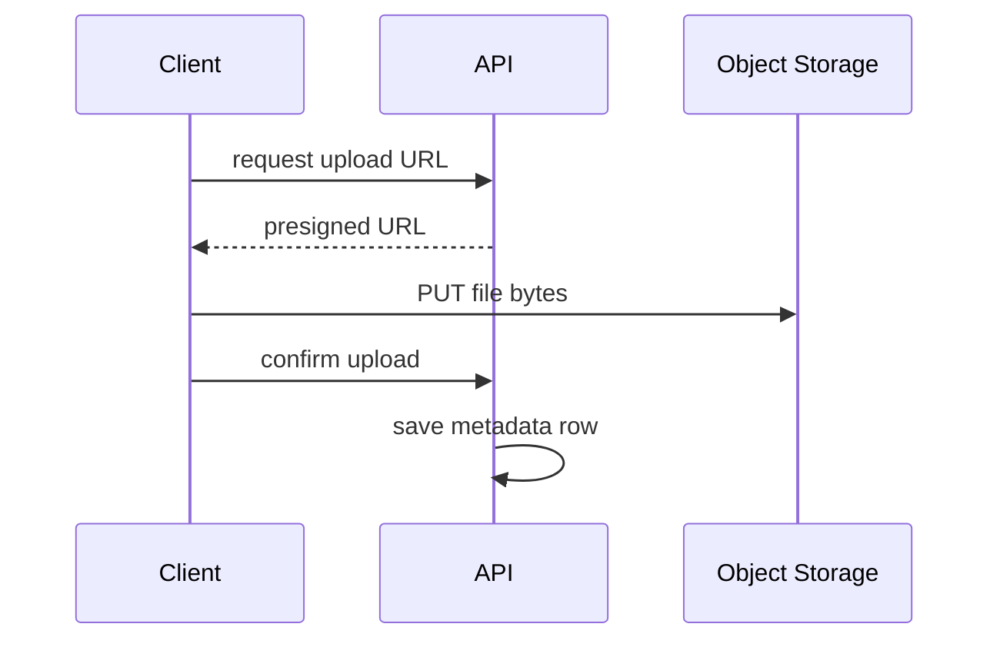

# 11. CDN & Object Storage

## Learning goals

- Separate “files” from “database rows”  
- Explain why CDNs make media fast worldwide  
- Place object storage + CDN in HLD  

## Databases are bad at big files

Storing 50 MB videos as BLOBs in Postgres is usually a bad idea.

Use **object storage** for blobs:

- Amazon S3, Google Cloud Storage, Azure Blob, MinIO  

Objects are files addressed by a key:

```text
s3://bucket/videos/2026/07/abc.mp4
```

## Object storage properties

- Virtually unlimited capacity  
- Durable (multi-disk / multi-AZ under the hood)  
- Cheap for large data  
- Access via URL / SDK  
- Not ideal for complex queries (that’s the DB’s job)  

Typical split:

- **DB:** metadata (`video_id`, title, owner, `s3_key`)  
- **Object store:** actual bytes  

## CDN (Content Delivery Network)

A **CDN** caches copies of content at edge locations near users.



First user in a region may hit origin; later users get edge cache hits.

## What to put on a CDN

- Images, CSS, JS  
- Video segments  
- Public downloadable files  
- Sometimes API responses (carefully, for public GETs)  

## Upload patterns

### Simple upload

Client → API → Object storage (API streams bytes). Hard on API servers for large files.

### Direct/presigned upload (preferred for large media)

1. Client asks API for a **presigned URL**  
2. Client uploads **directly to S3**  
3. Client confirms upload; API saves metadata  



## Signed URLs & privacy

Private files shouldn’t be world-readable.

Use short-lived signed URLs so only authorized users can download for a limited time.

## Image/video processing

Usually async:

1. Upload original to S3  
2. Queue message  
3. Worker creates thumbnails / transcodes  
4. Store derivatives in S3  
5. Update DB metadata  
6. Serve via CDN  

## HLD fragment for Instagram-like apps

```text
Client → API (metadata)
Client → S3 (bytes via presigned URL)
S3 → CDN → Client (reads)
API → Queue → Transcode workers → S3
```

## Check your understanding

1. Why store video in S3 instead of MySQL?  
2. What problem does a CDN solve?  
3. Why use presigned uploads?  

<details>
<summary>Answers</summary>

1. Cost, size, throughput; DB keeps metadata only.  
2. Latency and origin load by caching near users.  
3. Offload heavy bandwidth from app servers; scalable uploads.

</details>

---

**Next:** [Monolith vs Microservices](12-monolith-microservices.md)
