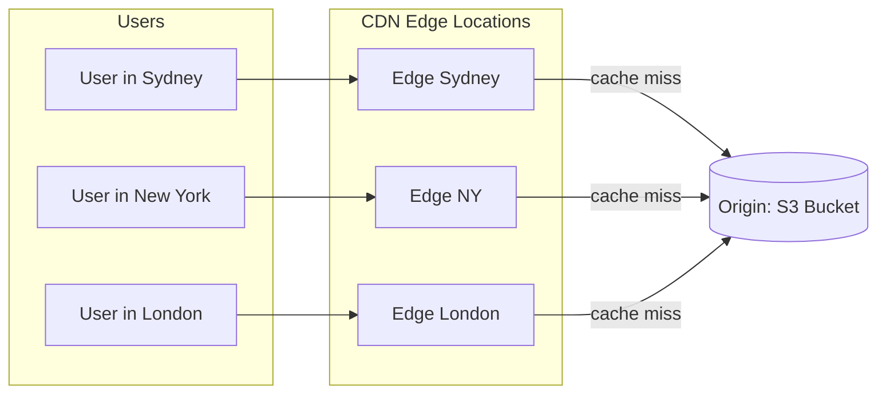
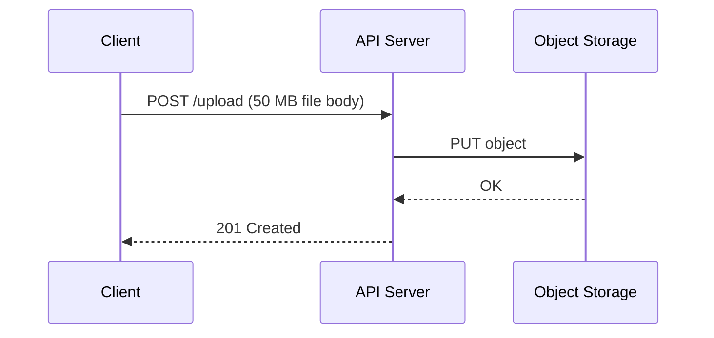
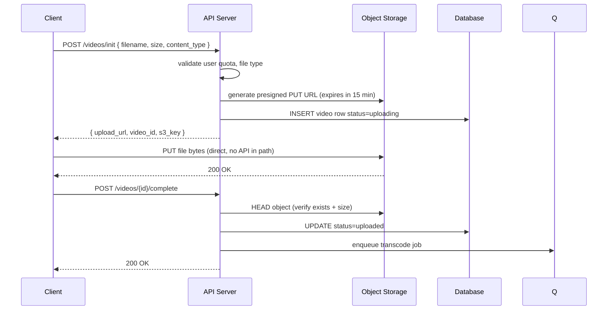
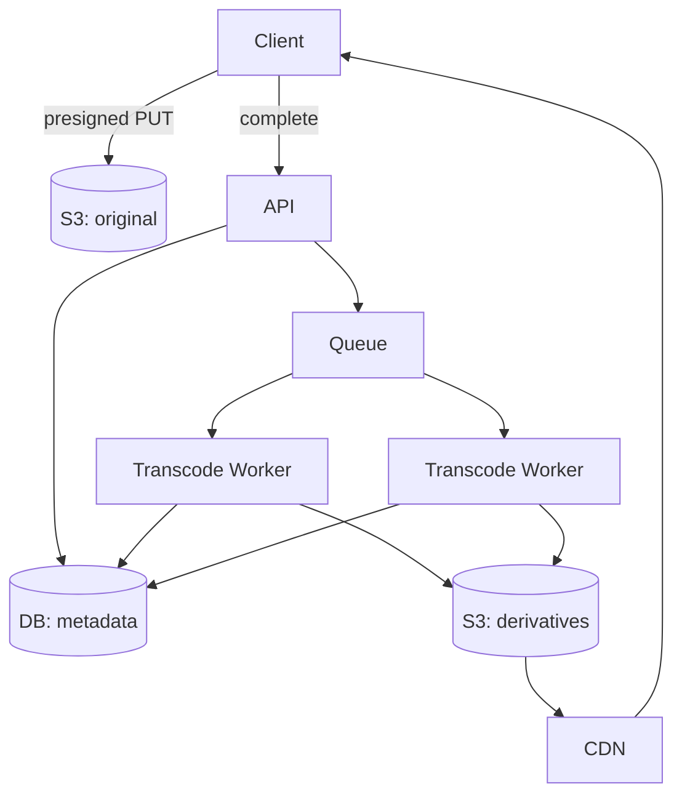
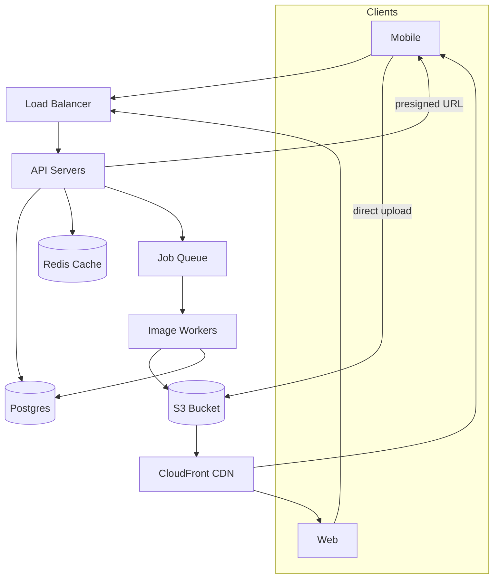

# 11. CDN & Object Storage

> **Big picture:** Your app stores *facts* in a database and *files* in object storage. A CDN puts copies of popular files close to users so downloads feel instant — like stocking neighborhood kiosks instead of making everyone drive to one central warehouse.

---

## Learning goals

After this chapter you should be able to:

- [ ] Explain why databases are the wrong place for large files (videos, PDFs, profile photos)
- [ ] Describe what object storage is and how keys/URLs work
- [ ] Draw a CDN in an HLD and explain cache hits vs origin fetches
- [ ] Compare simple upload vs presigned (direct) upload and when to use each
- [ ] Explain signed URLs for private content
- [ ] Sketch a media pipeline: upload → queue → transcode → CDN
- [ ] Place S3 + CDN correctly in an Instagram/Netflix-style design

**Prerequisites:** [06-databases.md](06-databases.md), [08-caching.md](08-caching.md), [10-queues-async.md](10-queues-async.md)

---

## Everyday analogy: library warehouse vs neighborhood kiosk

Imagine a city with **one giant library warehouse** in the middle of the country. Every time someone in Sydney wants a book, a truck drives from the warehouse to Sydney. It works — but it's slow and expensive when millions of people want the same bestseller.

Now imagine **neighborhood kiosks**: copies of popular books sit in small shelves near where people live. The first person in Sydney might still trigger a delivery from the warehouse (a **cache miss**). After that, everyone in Sydney gets the book from the local kiosk (a **cache hit**).

| Real-world piece | System design piece |
|------------------|---------------------|
| Central warehouse | **Origin** (S3 bucket, your API, origin server) |
| Neighborhood kiosk | **CDN edge node** (CloudFront, Cloudflare, Fastly) |
| Book title / shelf location | **Object key** (`videos/2026/abc.mp4`) |
| Library card catalog | **Database** (metadata: title, owner, `s3_key`) |
| The actual book pages | **Object bytes** (file content in S3) |

**Key insight:** The warehouse (origin) has unlimited shelf space and is cheap to run at scale. The kiosks (CDN edges) are about **speed** and **reducing load** on the warehouse — not about being the system of record.

---

## Databases are bad at big files

A relational database like Postgres or MySQL is excellent at:

- Structured rows with relationships
- Transactions ("deduct balance AND insert order" atomically)
- Queries with filters, joins, indexes

It is **terrible** at storing 50 MB video files as BLOB columns because:

| Problem | Why it hurts |
|---------|--------------|
| Size | DB storage is expensive; backups and replication balloon |
| Throughput | Streaming bytes through DB connections wastes app + DB CPU |
| Scaling | You scale reads/writes for *metadata*, not for *media bandwidth* |
| Tooling | No built-in CDN integration, transcoding hooks, or lifecycle policies |

### The standard split

```text
Database (Postgres):     video_id, title, owner_id, duration, s3_key, status
Object storage (S3):     actual bytes at key "videos/2026/07/abc.mp4"
CDN (CloudFront):        cached copies of abc.mp4 at edge locations worldwide
```

**Rule of thumb:** If a user would "download" or "stream" it, it probably belongs in object storage — not in a DB row.

---

## Object storage basics

**Object storage** treats data as **files addressed by a key**, stored in a **bucket** (a namespace/container).

Examples: Amazon S3, Google Cloud Storage (GCS), Azure Blob Storage, MinIO (self-hosted).

```text
s3://my-app-bucket/videos/2026/07/abc.mp4
     └─ bucket ─┘ └────── object key ──────┘
```

### Properties that matter in interviews

| Property | What it means | Interview phrase |
|----------|---------------|------------------|
| Virtually unlimited capacity | No "disk full" at app scale | "We won't run out of space for user uploads" |
| Durability | Data replicated across disks/AZs | "S3 gives 11 nines durability for the bytes" |
| Cheap at scale | Pennies per GB/month | "Storage cost is negligible vs DB" |
| Key-value access | GET/PUT/DELETE by key | "No SQL queries on file contents" |
| HTTP-friendly | REST API, presigned URLs | "Clients upload directly without touching our API" |

### What object storage is NOT

- Not a replacement for Postgres (no joins, no transactions across objects)
- Not a filesystem with fast random writes (bad for constantly mutating small files)
- Not automatically fast worldwide (that's what the CDN is for)

---

## CDN (Content Delivery Network)

A **CDN** is a network of **edge servers** geographically distributed near users. They cache copies of static (or cacheable) content.



### Cache hit vs cache miss

| Event | What happens | Latency | Origin load |
|-------|--------------|---------|-------------|
| **Cache hit** | Edge already has the file | Low (~10–50 ms) | None |
| **Cache miss** | Edge fetches from origin, stores copy | Higher first time | One origin read |
| **Cache eviction** | Edge runs out of space; old files removed | Next request may miss again | Occasional origin read |

**Analogy:** The kiosk ran out of shelf space and removed a less-popular book. Next person asking for it triggers another warehouse delivery.

### TTL and cache control

CDNs respect HTTP headers like `Cache-Control: max-age=3600`. You control:

- How long edges cache content
- Whether content is public (cacheable) or private (user-specific)

| Content type | Typical cache strategy |
|--------------|------------------------|
| Public profile photo | Long TTL (hours/days), immutable URL with hash in path |
| Video segment (HLS) | Medium TTL, versioned paths |
| Private medical PDF | No public CDN; signed URLs with short expiry |
| HTML with user name | Often **not** CDN-cached (personalized) |

---

## What belongs on a CDN

**Good candidates:**

- Images (avatars, product photos, thumbnails)
- CSS, JavaScript, fonts (web app static assets)
- Video/audio segments
- Public downloadable files (PDFs, installers)
- Some **read-heavy API responses** if they are identical for many users (public product catalog page JSON — use carefully)

**Usually NOT on CDN:**

- Personalized API responses ("your feed")
- Write operations (POST/PUT/DELETE)
- Content that must never be cached without auth (bank balances)
- Very large files that are downloaded once (direct S3 may be fine)

---

## Upload patterns

Uploading files is where many beginners hurt their API servers.

### Pattern 1: Simple upload (API as middleman)



| Pros | Cons |
|------|------|
| Simple mental model | API server handles all bandwidth |
| Central validation in one place | Timeouts on large files |
| | Hard to scale; expensive egress through app tier |

**When OK:** Small files (< few MB), low volume, MVP prototypes.

### Pattern 2: Presigned / direct upload (preferred for large media)

The client uploads **directly to S3** using a temporary, scoped URL the API generates.



**Analogy:** Instead of mailing your package through the post office front desk clerk's desk (API), the clerk hands you a **one-time gate pass** (presigned URL) so you drive directly to the loading dock (S3).

| Step | Why it matters |
|------|----------------|
| Init on API | Auth, quotas, virus-scan policy, metadata row |
| Direct PUT to S3 | Scales bandwidth without scaling app servers |
| Complete callback | Confirms upload finished; triggers async pipeline |

### Multipart upload (very large files)

For files > 100 MB (or GB-scale), S3 supports **multipart upload**: client splits file into chunks, uploads in parallel, S3 assembles. Same presigned pattern — API issues URLs per part.

---

## Signed URLs & private content

Public buckets (`s3://bucket/photo.jpg` world-readable) are a **common security mistake**.

For private content:

1. Bucket is **private** (no anonymous access)
2. API checks authorization ("can user 42 view this video?")
3. API returns a **signed URL** — temporary link with cryptographic signature
4. Client downloads directly from S3/CDN using that URL
5. URL expires (e.g., 15 minutes)

```text
https://cdn.example.com/videos/abc.mp4
  ?X-Amz-Expires=900
  &X-Amz-Signature=...
```

**Analogy:** A concert venue doesn't leave all doors open. You show your ticket at the gate; they give you a **wristband valid for tonight only** (signed URL).

| Approach | Use when |
|----------|----------|
| Public CDN URL | Content is truly public (marketing images) |
| Signed S3 URL | Private downloads, expiring access |
| Signed CDN URL | Private content but still served from edge (CloudFront signed URLs/cookies) |
| Proxy through API | Small private files only; doesn't scale for video |

---

## Media pipeline (image/video processing)

Users upload a raw file; the app serves optimized versions (thumbnails, 720p, 1080p). This is **CPU-heavy** and **slow** — never block the HTTP upload response on transcoding.



### Typical steps

| Step | Action | Storage |
|------|--------|---------|
| 1 | Client uploads original | `s3://bucket/originals/{id}.mp4` |
| 2 | API sets DB status = `processing` | Postgres row |
| 3 | Worker picks job from queue | SQS / RabbitMQ |
| 4 | Worker transcodes (FFmpeg) | Writes `720p/{id}.mp4`, `thumb/{id}.jpg` |
| 5 | Worker updates DB | `status=ready`, `cdn_urls=[...]` |
| 6 | Client reads via CDN | Fast playback worldwide |

**Why async?** A 10-minute video might take 5 minutes to transcode. The user shouldn't stare at a spinner — show "Processing…" and notify when ready (WebSocket, poll, push notification).

---

## End-to-end HLD: Instagram-like photo app



### Read path (viewing a friend's photo)

1. Client: `GET /feed` → API returns post metadata including `cdn_url`
2. Client loads image from CDN edge (cache hit for popular content)
3. API never streams image bytes

### Write path (uploading a photo)

1. Client: `POST /photos/init` → presigned URL + `photo_id`
2. Client: PUT to S3
3. Client: `POST /photos/{id}/complete`
4. Worker: resize to 1080p, 400px thumb, WebP variant → S3
5. DB updated; feed can show the post

---

## Storage classes & lifecycle (bonus)

S3 offers tiers for cost optimization:

| Class | Use case | Trade-off |
|-------|----------|-----------|
| Standard | Hot, frequently accessed | Highest cost, lowest latency |
| Infrequent Access | Backups, old uploads | Cheaper, retrieval fee |
| Glacier | Archives, compliance | Cheapest, minutes–hours retrieval |

**Lifecycle rules:** Automatically move objects older than 90 days to cheaper storage — like moving old warehouse boxes to a distant archive facility.

---

## Common mistakes (and how to fix them)

| Mistake | Why it's bad | Fix |
|---------|--------------|-----|
| Storing videos in Postgres BLOBs | Expensive, slow, doesn't CDN well | Metadata in DB, bytes in S3 |
| Public S3 bucket for "private" app | Anyone with URL accesses data | Private bucket + signed URLs |
| API proxies all downloads | Bandwidth bottleneck | CDN + direct/signed access |
| No `complete` step after presigned upload | Orphan files, broken metadata | Client confirms; API verifies with HEAD |
| CDN-caching personalized responses | User A sees User B's data | Cache-Control: private or no CDN |
| Blocking upload response on transcode | Timeouts, bad UX | Queue + async workers |
| Same key for updated file | Stale CDN cache | Version keys (`photo_v2.jpg`) or cache purge |

---

## Real-world examples

| Product | Object storage | CDN | Notes |
|---------|----------------|-----|-------|
| Netflix | S3 (origin) | Open Connect (custom CDN) | Encoded segments, not raw uploads |
| Instagram | S3/GCS | Meta CDN | Presigned uploads, async image processing |
| GitHub | S3 | Fastly | Release assets, user attachments |
| Notion | S3 | CloudFront | File blocks, image previews |

---

## Interview talking points

When the prompt mentions images, video, or file uploads, say:

> "I'll store metadata in Postgres and the actual bytes in S3. Uploads go through presigned URLs so our API isn't a bandwidth bottleneck. Processed derivatives are served via CDN for low latency globally. Private content uses short-lived signed URLs after auth checks."

That single paragraph signals senior awareness.

---

## Check your understanding (Q&A)

### 1. Why store video in S3 instead of MySQL?

<details>
<summary>Answer</summary>

MySQL is optimized for structured, queryable rows — not streaming multi-megabyte blobs. S3 offers cheap durable storage, horizontal bandwidth scaling, and direct client uploads via presigned URLs. The database keeps **metadata** (title, owner, processing status, S3 key) where queries and indexes make sense.

</details>

### 2. What problem does a CDN solve?

<details>
<summary>Answer</summary>

**Latency:** Users fetch from nearby edge servers instead of a distant origin. **Origin load:** Popular content is served from cache, so S3/origin handles far fewer requests. **Bandwidth cost:** CDNs are designed for massive egress at the edge.

</details>

### 3. Why use presigned uploads?

<details>
<summary>Answer</summary>

The API server doesn't sit in the data path for large file bytes. Clients upload directly to S3 using a temporary scoped credential. This scales upload bandwidth independently of app server count and avoids timeout/memory issues on the API tier.

</details>

### 4. What's the difference between a presigned **upload** URL and a signed **download** URL?

<details>
<summary>Answer</summary>

**Presigned upload (PUT):** Grants temporary permission to **write** an object to a specific key — used during upload init. **Signed download (GET):** Grants temporary permission to **read** a private object — used after auth check so authorized users can stream/download without making the bucket public.

</details>

### 5. When would you NOT put content on a CDN?

<details>
<summary>Answer</summary>

When content is personalized per user (private feed HTML), frequently changing without cache invalidation, or highly sensitive and shouldn't be cached on shared edge infrastructure without encryption and short TTLs. Also when files are huge one-off downloads where CDN benefit is minimal.

</details>

### 6. Walk through what happens on a CDN cache miss.

<details>
<summary>Answer</summary>

User requests `https://cdn.example.com/img/abc.jpg`. Nearest edge doesn't have it. Edge fetches from origin (S3 or origin server), stores a copy locally, returns to user. Subsequent users in that region get a cache hit until TTL expires or the object is evicted.

</details>

### 7. Why enqueue a transcode job instead of transcoding in the API request?

<details>
<summary>Answer</summary>

Transcoding is CPU-intensive and slow (seconds to minutes). Blocking the HTTP request would cause timeouts and tie up API worker threads. A queue decouples acceptance from processing, allows retries, and lets you scale transcode workers independently.

</details>

---

## Quick reference card

```text
┌─────────────────────────────────────────────────────────────┐
│  METADATA  →  Database (Postgres)                           │
│  BYTES     →  Object Storage (S3)                           │
│  FAST READ →  CDN (CloudFront)                              │
│  UPLOAD    →  Presigned URL (client → S3 direct)            │
│  PRIVATE   →  Signed URL (short TTL after authz check)      │
│  PROCESS   →  Queue → Workers → S3 derivatives → CDN        │
└─────────────────────────────────────────────────────────────┘
```

---

**Next:** [12. Monolith vs Microservices](12-monolith-microservices.md) — when to keep everything in one deployable vs split into separate services.
