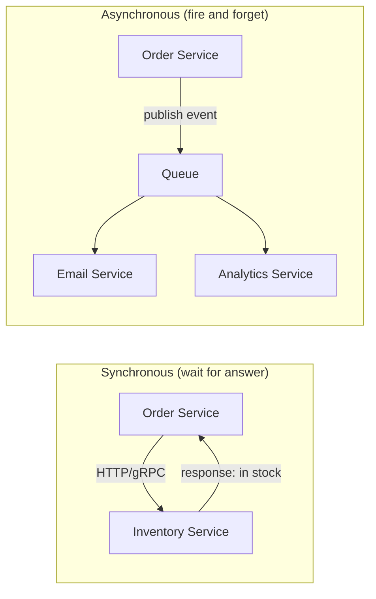
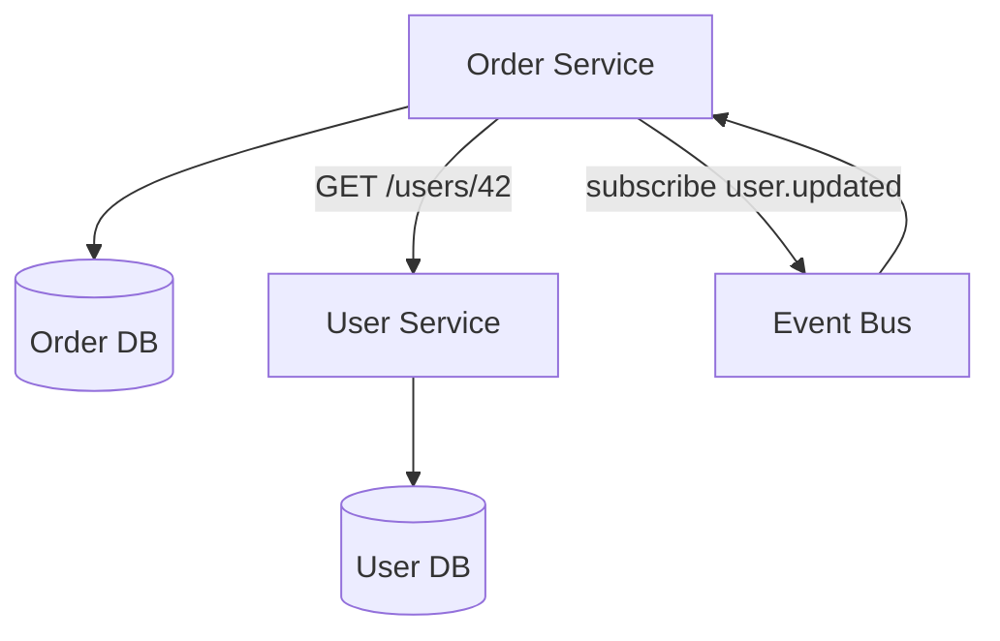
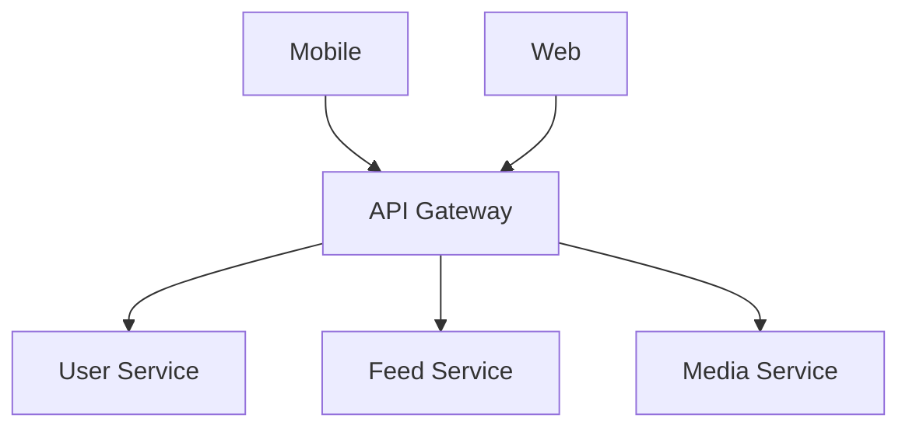
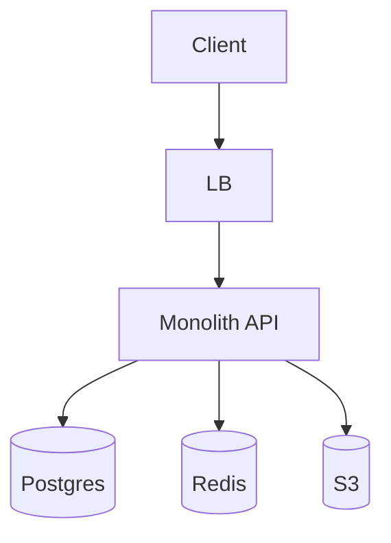
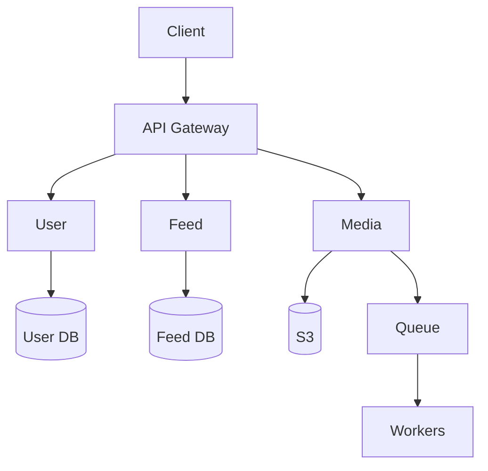

# 12. Monolith vs Microservices

> **Big picture:** A **monolith** is one kitchen cooking everything; **microservices** are separate stalls in a food court. Both can serve great food — the question is whether you need independent kitchens, menus, and staffing *yet*.

---

## Learning goals

After this chapter you should be able to:

- [ ] Define monolith, modular monolith, and microservices in plain language
- [ ] List pros/cons of each approach without treating microservices as "always better"
- [ ] Explain when **not** to split services (most early products)
- [ ] Draw either architecture cleanly in an HLD diagram
- [ ] Choose sync vs async communication between components
- [ ] Spot the **shared database anti-pattern**
- [ ] Describe a realistic evolution path from MVP to extracted services

**Prerequisites:** [04-clients-servers-apis.md](04-clients-servers-apis.md), [06-databases.md](06-databases.md), [10-queues-async.md](10-queues-async.md)

---

## Everyday analogy: food truck vs food court

### The food truck (monolith)

One **food truck** has one chef, one menu, one cash register. They make tacos, burgers, and fries in the same small kitchen.

| Advantage | Why |
|-----------|-----|
| Simple operations | One vehicle to maintain, one health inspection |
| Easy coordination | Chef sees entire order; fries and burger ready together |
| Fast to start | Open tomorrow with one setup |

| Disadvantage | Why |
|--------------|-----|
| Can't scale one item | Burger demand spikes → you scale the *whole* truck |
| One grease fire | Kitchen problem shuts down everything |
| Crowded kitchen | More menu items → chefs bump into each other |

### The food court (microservices)

A **food court** has separate stalls: Taco Stand, Burger Bar, Smoothie Shop. Each has its own staff, ingredients, and line. A central seating area (API gateway / frontend) connects them for the customer.

| Advantage | Why |
|-----------|-----|
| Scale independently | 10x burger demand → hire at Burger Bar only |
| Team ownership | Taco team deploys new salsa recipe without touching burgers |
| Technology choice | Smoothie shop buys industrial blender; taco stand doesn't need one |

| Disadvantage | Why |
|--------------|-----|
| Coordination overhead | "Combo meal" needs two stalls + payment split |
| Partial failure | Burger Bar open, Smoothie Shop closed — awkward experience |
| More infrastructure | Separate inventory, staffing, health permits per stall |

**Beginner takeaway:** Most successful apps start as a **food truck** (monolith). They become a **food court** (microservices) when clear boundaries, team size, and scaling needs justify the overhead.

---

## Monolith

A **monolith** is **one deployable application** that implements many features — often one codebase compiled into one binary or one Docker image.

```text
┌─────────────────────────────────────────────┐
│              Monolith API App               │
│  ┌─────────┐ ┌─────────┐ ┌──────────────┐  │
│  │  Auth   │ │  Feed   │ │   Payments   │  │
│  └─────────┘ └─────────┘ └──────────────┘  │
│  ┌─────────────┐ ┌───────────────────────┐  │
│  │ Notifications│ │      Search         │  │
│  └─────────────┘ └───────────────────────┘  │
└─────────────────────────────────────────────┘
         │                    │
         ▼                    ▼
    [(Postgres)]         [(Redis)]
```

Real examples of successful monoliths (often for years):

- Shopify (modular monolith)
- Stack Overflow
- Many early-stage startups running a single Rails/Django/Spring app

### Pros

| Benefit | Explanation |
|---------|-------------|
| **Simple development** | One repo, one build, one debug session |
| **Easy transactions** | `BEGIN … UPDATE inventory … INSERT order … COMMIT` in one DB |
| **Single deployment** | No version skew between "auth service v2" and "feed service v1" |
| **Lower ops burden** | One process to monitor, one log stream (initially) |
| **Refactoring is local** | Rename a function; IDE finds all callers |

### Cons

| Drawback | Explanation |
|----------|-------------|
| **Scaling is coarse** | Traffic spike on media uploads scales entire app |
| **Blast radius** | Memory leak in search indexer crashes payments |
| **Team friction at scale** | 50 engineers stepping on same codebase |
| **Technology lock-in** | Hard to use Python for ML and Go for gateway in one binary |
| **Long build/test cycles** | Full test suite runs for every small change |

---

## Microservices

**Microservices** split the system into **independently deployable services**, each owning a business capability, communicating over the network (HTTP, gRPC, message queues).

```text
┌──────────┐  ┌──────────┐  ┌──────────┐  ┌──────────────────┐
│   User   │  │   Feed   │  │  Media   │  │  Notification    │
│ Service  │  │ Service  │  │ Service  │  │  Service         │
└────┬─────┘  └────┬─────┘  └────┬─────┘  └────────┬─────────┘
     │             │             │                  │
     ▼             ▼             ▼                  ▼
 [(User DB)]  [(Feed DB)]  [(S3 + Queue)]    [(Queue + Email)]
```

Each service ideally:

- Has its **own data store** (or clearly owned tables)
- Can be **deployed independently**
- Is maintained by a **team** with clear ownership

Real examples:

- Netflix (hundreds of services)
- Uber (domain-oriented services)
- Amazon ( famously "two-pizza teams")

### Pros

| Benefit | Explanation |
|---------|-------------|
| **Independent scaling** | Scale chat gateway for 1M WebSockets without scaling billing |
| **Independent deployment** | Ship notification fix Friday without redeploying feed |
| **Team autonomy** | Feed team owns feed SLA end-to-end |
| **Polyglot tech** | ML ranking in Python, payments in Java |
| **Fault isolation** | Recommendation service down; core feed still loads |

### Cons

| Drawback | Explanation |
|----------|-------------|
| **Distributed complexity** | Network latency, partial failures, eventual consistency |
| **Harder debugging** | One user request spans 8 services — need tracing |
| **No free transactions** | Cross-service "all or nothing" requires sagas/compensation |
| **Operational overhead** | CI/CD per service, service discovery, more dashboards |
| **Integration testing** | Contract tests, staging environments, version compatibility |

---

## Side-by-side comparison

| Dimension | Monolith | Microservices |
|-----------|----------|---------------|
| Deploy units | 1 | Many |
| Cross-feature transaction | Easy (single DB) | Hard (saga, outbox) |
| Scale granularity | Whole app | Per service |
| Team structure | One team early | Team per service later |
| Failure blast radius | Whole app | Isolated (if done well) |
| Best for | MVP, small teams, unclear boundaries | Clear domains, large org, different scale profiles |
| Interview default | "Modular monolith, extract later" | Draw logical services; note MVP may be one deployable |

---

## Modular monolith: the smart middle ground

A **modular monolith** is one deployable application with **clear internal module boundaries** — like a food truck with separate prep stations that don't share cutting boards.

```text
monolith/
  auth/          ← module: no imports from feed/
  feed/
  payments/
  shared/        ← minimal shared kernel only
```

### Rules that keep it modular

| Rule | Why |
|------|-----|
| Modules communicate via **public interfaces**, not direct DB access across modules | Extraction to service later is easy |
| Each module owns its **tables** | Avoid shared-database trap inside monolith |
| No "god module" importing everything | Boundaries stay honest |
| Feature flags / package boundaries enforced in CI | Prevents spaghetti |

**Interview phrase:**

> "I'll draw this as separate logical components — User, Feed, Media — but for MVP they'd live in one deployable modular monolith. We'd extract Media Service first when transcoding CPU justifies independent scaling."

This shows maturity: you understand microservices **and** know when not to pay their cost.

---

## When to split (and when NOT to)

### Do NOT split when:

- Team is < ~10 engineers
- Product boundaries are still shifting weekly
- You haven't felt pain (deploy conflicts, scaling bottleneck, ownership confusion)
- You're splitting because "Netflix does it"

### Consider splitting when:

| Signal | Example | Service to extract |
|--------|---------|-------------------|
| **Different scaling needs** | Video transcoding is CPU-heavy | Media Processing Service |
| **Different traffic patterns** | Notifications are spiky, async | Notification Service |
| **Different storage** | Full-text search needs Elasticsearch | Search Service |
| **Different SLA / release cadence** | Payments needs slow, audited releases | Payment Service |
| **Team ownership** | 8 engineers only work on chat | Chat Gateway Service |
| **Regulatory isolation** | PCI scope reduction | Payment Service with own DB |

### How to split: domain boundaries, not technical layers

**Good splits** (business capabilities):

- `UserService` — accounts, profiles, auth
- `OrderService` — cart, checkout, order history
- `InventoryService` — stock levels, reservations

**Bad splits** (technical layers):

- `DatabaseService` — all SQL for everyone ❌
- `ValidationService` — all input validation ❌
- `UtilsService` — shared helpers as a network call ❌

**Analogy:** You wouldn't split a restaurant into "Knife Service" and "Plate Service." You split by cuisine or by front-of-house vs kitchen.

---

## Communication styles: sync vs async

When services (or modules) talk to each other:



### Comparison table

| Style | Protocol | User waits? | Use when | Risk |
|-------|----------|-------------|----------|------|
| **Sync** | HTTP REST, gRPC | Yes (usually) | Need immediate answer: "Is seat available?" | Cascading latency & failures |
| **Async** | SQS, Kafka, RabbitMQ | No | Side effects: send email, update analytics | Eventual consistency, duplicate handling |

### Sync example: checkout asks inventory

```text
POST /inventory/reserve { sku, qty }
→ 200 { reserved: true, reservation_id }
→ 409 { reserved: false, reason: "out of stock" }
```

User's checkout flow **depends** on the answer — sync makes sense.

### Async example: order placed → side effects

```text
Event: order.placed { order_id, user_id, items }
Consumers:
  - NotificationService → send confirmation email
  - AnalyticsService → increment revenue metrics
  - WarehouseService → print pick list
```

User doesn't wait for email to send — async decouples.

### Choosing in interviews

| Question | Sync | Async |
|----------|------|-------|
| Does the user need the result to continue? | ✓ | |
| Can this fail without failing the main action? | | ✓ |
| Is fan-out to many subscribers needed? | | ✓ |
| Is strong consistency required across steps? | ✓ (or single monolith TX) | |

---

## The shared database anti-pattern

The worst microservices mistake: **three services, one database, shared tables**.

```text
┌──────────┐     ┌──────────┐     ┌──────────┐
│  Order   │     │  User    │     │ Inventory│
│ Service  │     │ Service  │     │ Service  │
└────┬─────┘     └────┬─────┘     └────┬─────┘
     │                │                │
     └────────────────┼────────────────┘
                      ▼
              [(One Postgres)]
              orders, users, inventory
              ← all services read/write all tables
```

This is a **distributed monolith**:

- Can't deploy Order Service without coordinating schema changes with User Service
- No true isolation — one bad query locks tables for everyone
- You pay microservices complexity **without** microservices benefits

### The fix: database per service (logical or physical)

| Approach | Description |
|----------|-------------|
| **Physical separation** | Each service has its own Postgres instance |
| **Logical separation** | One Postgres cluster, but Order Service **only** accesses `orders` schema; enforced by credentials/code review |
| **Integration via API/events** | User Service exposes `GET /users/{id}`; Order Service stores `user_id`, not a copy of user profile (or caches denormalized snapshot via events) |



**Data duplication is OK** when intentional: Order Service might store `user_display_name` denormalized, updated by `user.updated` events — trading consistency for autonomy.

---

## Example evolution: social app

### Phase 1 — MVP monolith

```text
Single Rails/Node app
  → Postgres (all tables)
  → Redis (sessions, cache)
  → S3 (photos)
One team, one deploy per day
```

**Good enough for:** 10K DAU, 5 engineers.

### Phase 2 — modular monolith

```text
Same deployable, but modules:
  auth/, feed/, media/, notifications/
CI enforces: media/ cannot import from notifications/ internals
```

**Good enough for:** 500K DAU, 15 engineers, occasional deploy conflicts.

### Phase 3 — extract first service

**Extract Media Service** because:

- CPU-heavy image processing saturates API servers
- Needs GPU workers, different autoscaling rules
- Team of 4 owns media pipeline

```text
Monolith (auth, feed, social graph)
Media Service (upload, transcode, CDN URLs)
  ↔ communicate via HTTP + SQS events
```

### Phase 4 — extract Notification Service

Because:

- Spiky traffic (viral post → millions of push notifications)
- Async by nature
- Third-party integrations (FCM, SendGrid) isolated

```text
Monolith → publishes post.created
Notification Service → consumes, fans out push/email
```

---

## API Gateway in microservices

Clients shouldn't call 12 internal services directly.



Gateway handles: auth token validation, rate limiting, routing, SSL termination.

**Analogy:** Food court has **one ordering kiosk** facing customers; individual stalls work in the back.

---

## Common mistakes

| Mistake | Reality |
|---------|---------|
| "Microservices from day 1" | Most startups fail from complexity, not from monolith limits |
| Splitting by layer | Creates chatty, fragile systems |
| Shared database | Distributed monolith — worst of both worlds |
| Sync chains A→B→C→D | 400ms+ latency, fragile; use async or consolidate |
| No distributed tracing | Impossible to debug cross-service requests |
| Ignoring eventual consistency | "But the UI shows stale data!" — design for it |
| Extracting before measuring | Split when data shows bottleneck, not because diagram looks cool |

---

## How to draw this in HLD interviews

### Option A: Monolith (say it explicitly)



> "Single deployable with internal modules for auth, feed, and media metadata."

### Option B: Logical microservices (MVP still one box)



> "Logical separation for clarity; MVP could merge User+Feed into one service."

Both are valid if you **explain your reasoning**.

---

## Check your understanding (Q&A)

### 1. Name one advantage of a monolith for early products.

<details>
<summary>Answer</summary>

Faster development with one codebase and one deployment pipeline. Cross-feature operations (e.g., creating a user and their first post) can use a single database transaction without distributed coordination.

</details>

### 2. Why are distributed transactions hard?

<details>
<summary>Answer</summary>

Multiple services may each commit to their own database. If step 3 fails after steps 1–2 succeed, there's no single "ROLLBACK" across services. You need patterns like **sagas** (compensating actions), **outbox**, or accept **eventual consistency** — all more complex than a monolith transaction.

</details>

### 3. What is a modular monolith?

<details>
<summary>Answer</summary>

One deployable application structured into well-bounded internal modules (auth, feed, payments) with explicit interfaces and owned data. It deploys as one unit but is organized so modules can later become separate microservices with minimal rewrite.

</details>

### 4. What is the shared database anti-pattern?

<details>
<summary>Answer</summary>

Multiple "microservices" reading and writing the same database tables directly. Coupling remains as tight as a monolith, but you also suffer network latency and operational overhead between services — a **distributed monolith**.

</details>

### 5. When would you choose async over sync between services?

<details>
<summary>Answer</summary>

When the caller doesn't need an immediate result for the user-facing flow: sending emails, updating analytics, fan-out notifications, or any side effect that can happen eventually. Async also absorbs traffic spikes and allows retries without blocking the user.

</details>

### 6. Give a good reason to extract a service from a monolith.

<details>
<summary>Answer</summary>

Different scaling profile: e.g., media transcoding is CPU-bound and needs worker pools autoscaling separately from stateless API servers. Or organizational: a dedicated team owns payments and needs independent release cadence for compliance.

</details>

### 7. Why shouldn't you split into a "DatabaseService"?

<details>
<summary>Answer</summary>

That's splitting by technical layer, not business domain. Every feature still depends on it, creating a bottleneck and tight coupling. The network hop adds latency without independent business ownership or scaling benefit.

</details>

---

## Quick reference card

```text
┌──────────────────────────────────────────────────────────────┐
│  START: modular monolith (one deploy, clear modules)         │
│  SPLIT WHEN: scale, team, or domain boundary justifies cost  │
│  SPLIT BY: business capability (User, Order, Media)          │
│  AVOID: shared DB across services (distributed monolith)     │
│  SYNC: need immediate answer                                 │
│  ASYNC: side effects, fan-out, spike absorption              │
└──────────────────────────────────────────────────────────────┘
```

---

**Next:** [13. Reliability, Security & Observability](13-reliability-security-observability.md) — how to design systems that fail gracefully, stay secure, and tell you when something breaks.
