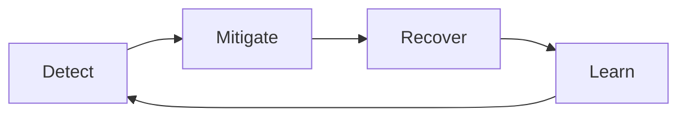
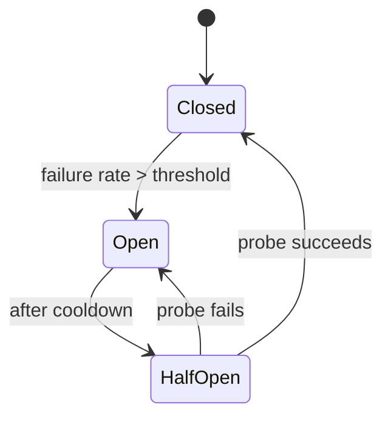
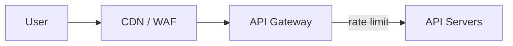
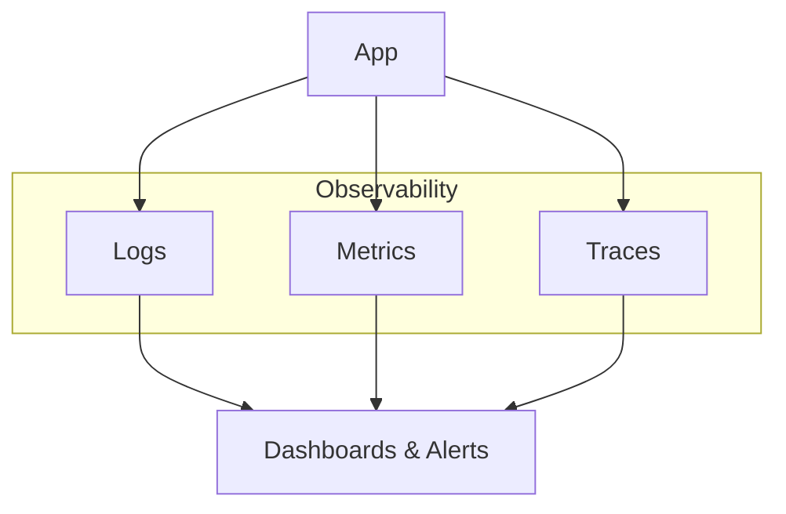

# 13. Reliability, Security & Observability

> **Big picture:** A reliable system assumes things **will** break and plans for it — like airplanes with redundant hydraulics. Security controls **who** gets in and **what** they can do. Observability is the cockpit dashboard: without it, you're flying blind.

---

## Learning goals

After this chapter you should be able to:

- [ ] Adopt a "everything fails" mindset in every design
- [ ] Apply redundancy, timeouts, retries, circuit breakers, and graceful degradation
- [ ] Explain RPO/RTO and basic backup/disaster recovery
- [ ] Place rate limiting and basic authn/authz in an HLD
- [ ] Describe logs, metrics, and traces — and when to use each
- [ ] Define an SLO and connect it to user-visible pain
- [ ] Write a "Failure modes" and "Security" section in a design doc

**Prerequisites:** [05-load-balancing.md](05-load-balancing.md), [07-replication-sharding.md](07-replication-sharding.md), [12-monolith-microservices.md](12-monolith-microservices.md)

---

## Everyday analogy: airplane redundancy

Commercial airplanes are designed knowing components fail:

| Airplane idea | System design equivalent |
|---------------|-------------------------|
| Two (or three) hydraulic systems | Multi-AZ deployment, redundant instances |
| Cockpit alarms | Alerting on SLO breaches |
| Checklists before takeoff | Health checks, readiness probes |
| Pilots trained for engine-out | Runbooks, game days, chaos testing |
| Black box recorder | Logs, traces, audit trails |
| Oxygen masks drop before pilot speech | **Graceful degradation** — core survival first |

No one says "engines never fail, so one is enough." Your API's dependency on a flaky recommendation service shouldn't crash checkout.

---

## Reliability mindset

**Reliability** = the system works correctly **even when parts break**.

Everything fails eventually:

- Disks corrupt
- Networks partition
- Deploys introduce bugs
- Dependencies (Stripe, S3, DNS) have outages
- Traffic spikes overwhelm capacity

Design for a loop:



| Phase | Question | Example |
|-------|----------|---------|
| **Detect** | How do we know it's broken? | Error rate alert, health check fails |
| **Mitigate** | How do we limit damage? | Circuit breaker, serve cached feed |
| **Recover** | How do we return to healthy? | Failover to replica, rollback deploy |
| **Learn** | How do we prevent repeat? | Postmortem, add retry budget, fix root cause |

---

## High availability patterns

### Redundancy

Never run **one** of anything that matters in production.

```text
Bad:  1 app server, 1 DB instance
Good: 3+ app servers behind LB, DB with standby replica in another AZ
```

| Layer | Redundancy pattern |
|-------|-------------------|
| App servers | N instances across AZs behind load balancer |
| Database | Primary + synchronous/async replica, automatic failover |
| Cache | Redis Cluster or replica with sentinel |
| Object storage | Built-in (S3 replicates across AZs) |
| DNS | Multiple NS records, health-checked endpoints |

**Analogy:** Two engines on a plane — either alone can land safely.

### Health checks + auto replacement

Load balancers ping `/health` every few seconds. Unhealthy instances stop receiving traffic; orchestrator (Kubernetes, ASG) replaces them.

```text
GET /health → 200 { "db": "ok", "cache": "ok" }
GET /health → 503 { "db": "timeout" }  → removed from rotation
```

### Timeouts

**Never wait forever** for a dependency.

| Without timeout | With timeout (e.g., 2s) |
|-----------------|-------------------------|
| Thread blocked indefinitely | Thread freed; return error or fallback |
| Retry storms amplify outage | Fail fast; circuit breaker opens |
| User sees spinning loader | User sees error or degraded response in 2s |

```text
HTTP client config:
  connect_timeout: 500ms
  read_timeout: 2000ms
```

**Golden rule:** Set timeouts **shorter** than client-facing timeouts. If the user waits 5s max, internal calls should fail at 2s to leave room for retries/fallbacks.

### Retries with exponential backoff

Transient failures (blip, TCP reset) often succeed on retry.

```text
attempt 1: fail → wait 100ms
attempt 2: fail → wait 200ms
attempt 3: fail → wait 400ms
attempt 4: fail → give up, return error
```

| Retry safely when | Don't retry when |
|-------------------|------------------|
| GET (idempotent read) | Non-idempotent POST without idempotency key |
| Transient 503/timeout | 400 Bad Request (client error) |
| Idempotent PUT with same body | Payment already charged |

Add **jitter** (random ±20%) so all clients don't retry in sync ("thundering herd").

### Circuit breaker

Stop calling a dependency that is clearly sick.



| State | Behavior |
|-------|----------|
| **Closed** | Normal calls |
| **Open** | Fail immediately (fast fallback); don't hammer sick service |
| **Half-open** | Allow one probe request to test recovery |

**Analogy:** Breaker switch trips when wiring overheats — stops damage until electrician checks.

### Bulkhead

Isolate resource pools so one slow dependency doesn't exhaust all threads.

```text
Thread pool for payments: 50 threads
Thread pool for recommendations: 20 threads
→ Slow recommendations can't starve payments
```

Kubernetes: separate deployments. JVM: separate connection pools.

### Graceful degradation

When non-critical parts fail, **core features still work**.

| Failure | Degraded behavior | Core preserved |
|---------|-------------------|----------------|
| Recommendation service down | Feed without "Suggested for you" | User still sees friends' posts |
| Analytics pipeline lagging | Skip real-time view counts | Redirects still work |
| Cache down | Read from DB (slower) | Data still correct |
| CDN miss storm | Higher origin latency | Content still loads |

**Interview phrase:**

> "Recommendations are best-effort. If the service times out after 200ms, we render the feed without that block."

---

## Backups & disaster recovery

### Key terms

| Term | Meaning | Example |
|------|---------|---------|
| **RPO** (Recovery Point Objective) | Max data loss acceptable | "Lose at most 5 minutes of writes" |
| **RTO** (Recovery Time Objective) | Max downtime acceptable | "Back online within 1 hour" |
| **Backup** | Point-in-time copy of data | Nightly DB snapshot + WAL archiving |
| **Failover** | Switch to standby when primary dies | Promote read replica to primary |
| **Multi-AZ** | Same region, multiple data centers | Survives one AZ fire |
| **Multi-region** | Copies in distant regions | Survives entire region outage |

### When to use what

| Requirement | Pattern | Cost/complexity |
|-------------|---------|-----------------|
| Survive server crash | Multi-instance + auto-restart | Low |
| Survive AZ failure | Multi-AZ DB, LB across AZs | Medium |
| Survive region disaster | Multi-region active-passive or active-active | High |
| Accidental delete recovery | Backups + PITR (point-in-time restore) | Medium |

**Beginner rule:** Multi-AZ for most production apps. Multi-region only when business **truly** requires it (global SLA, regulatory, massive scale).

### Restore drills

Backups you never tested are **wishful thinking**. Schedule quarterly restore to staging.

---

## Rate limiting & abuse protection

Public APIs attract bots, scrapers, accidental infinite loops, and DDoS.



### Common strategies

| Strategy | How | Use |
|----------|-----|-----|
| **Fixed window** | 100 req/min per IP | Simple, edge-friendly |
| **Token bucket** | Burst allowed, steady rate over time | APIs with burst tolerance |
| **Sliding window** | Smoother than fixed window | Fairer limiting |
| **Per-user limits** | By API key / user ID | Prevent one account abusing |
| **Per-endpoint limits** | Stricter on `POST /urls` vs `GET /r/:code` | Protect expensive writes |

### Response when limited

```http
HTTP/1.1 429 Too Many Requests
Retry-After: 60
X-RateLimit-Remaining: 0
```

**Where to enforce:** Edge (Cloudflare), API gateway, or app middleware — often layered.

---

## Security basics for HLD/LLD

Security is not a separate chapter at the end — weave it into every design.

### Authentication vs authorization

| Term | Question | Mechanisms |
|------|----------|------------|
| **Authn** (authentication) | Who are you? | Login/password, OAuth (Google), JWT, session cookie, API keys |
| **Authz** (authorization) | What may you do? | RBAC (roles), ACLs, resource ownership checks |

```text
Authn: JWT says user_id=42
Authz: Can user 42 DELETE /posts/99? → only if owner or admin
```

**Analogy:** Authn = showing ID at building entrance. Authz = your badge only opens certain doors.

### Security checklist for designs

| Control | HLD mention | Example |
|---------|-------------|---------|
| **TLS everywhere** | Client → LB → internal | HTTPS only; no plaintext passwords |
| **Secrets management** | Not in git | AWS Secrets Manager, Vault |
| **Input validation** | Size limits, schema | Max 10 MB upload; reject SQL in fields |
| **Least privilege IAM** | S3/DB credentials scoped | App can write `uploads/` only, not delete bucket |
| **Encryption at rest** | Sensitive PII, health data | DB encryption, S3 SSE |
| **Encryption in transit** | TLS + mTLS for service-to-service (at scale) | gRPC with certs |
| **Audit logs** | Admin actions, payments | Immutable log: who refunded order X |
| **Signed URLs** | Private media | Short-lived CDN URLs after authz |
| **CORS / CSRF** | Web apps | SameSite cookies, CSRF tokens |

### Common security mistakes

| Mistake | Fix |
|---------|-----|
| Secrets in GitHub repo | Secrets manager, rotate keys |
| Public S3 bucket | Private + signed URLs |
| Trust client-sent `user_id` | Derive identity from validated token server-side |
| No rate limits on login | Brute-force protection, CAPTCHA |
| Logging full credit card numbers | PCI violation; log last 4 digits only |

---

## Observability: logs, metrics, traces

You cannot operate what you cannot see. **Observability** answers: "Why is it slow/broken for user 42's request?"

### The three pillars



| Pillar | What it is | Best for | Example |
|--------|------------|----------|---------|
| **Logs** | Discrete events with context | Debugging specific failures | `ERROR order_id=abc payment declined code=insufficient_funds` |
| **Metrics** | Aggregated numbers over time | Trends, alerting, capacity | `redirect_latency_p99 = 45ms`, `error_rate = 0.1%` |
| **Traces** | Request journey across services | Latency breakdown in microservices | Span: API 120ms → Payment 80ms → DB 15ms |

### Logs — structured beats printf

```json
{
  "level": "info",
  "msg": "redirect",
  "short_code": "aZ9kQ2",
  "latency_ms": 12,
  "cache_hit": true,
  "request_id": "req-uuid-123"
}
```

Correlate with **request_id** across services.

### Metrics — the four golden signals

From Google SRE:

| Signal | Measures | Alert example |
|--------|----------|---------------|
| **Latency** | Time to serve request | p99 > 500ms for 5 min |
| **Traffic** | Demand (QPS, bandwidth) | Capacity planning |
| **Errors** | Failed requests | 5xx rate > 1% |
| **Saturation** | How full resources are | CPU > 80%, DB connections maxed |

Plus **USE** for resources: Utilization, Saturation, Errors.

### Traces — follow one request

```text
Trace id: abc123
├─ span: API Gateway        12ms
├─ span: URL Service        85ms
│  ├─ span: Redis GET       2ms  (cache hit)
│  └─ span: enqueue click   3ms
└─ total: 97ms
```

Tools: Jaeger, Zipkin, Datadog APM, AWS X-Ray.

**When critical:** Microservices with 5+ hops. Monoliths benefit too but logs may suffice early.

### Dashboards vs alerts

| Dashboards | Alerts |
|------------|--------|
| Human explores trends | Wakes engineer on-call |
| "What's normal?" | "Users are hurting NOW" |

**Alert on symptoms** (error rate, SLO burn), not only causes (CPU 90% — might be fine).

---

## SLOs, SLAs, and error budgets

| Term | Definition |
|------|------------|
| **SLI** (Indicator) | Measurable aspect of service | "Successful redirects / total redirects" |
| **SLO** (Objective) | Target for SLI | "99.9% redirects succeed in < 100ms" |
| **SLA** (Agreement) | Contract with customers | "99.9% uptime or credit" — legal/business |
| **Error budget** | Allowed unreliability | 0.1% of requests can miss SLO before feature freeze |

### Example SLO for URL shortener

```text
SLI: proportion of GET /r/:code returning 302 within 100ms
SLO: 99.9% over 30-day rolling window
Error budget: 0.1% ≈ 43 minutes of bad minutes/month
```

When budget is burned:

- Stop shipping risky features
- Focus on reliability work
- Improve tests, canaries, rollback

**Interview tip:** Mention one SLO tied to **user experience**, not "CPU under 70%."

---

## Putting it together in a design doc

Strong designs end with explicit failure and security sections.

### Example: social feed service

```text
Failure modes:
- Redis cache down     → read Postgres directly; latency +50ms; alert ops
- Recommendation timeout → omit recommendations block; core feed loads
- Primary DB failure   → automatic failover to replica; ~30s blip
- Queue backlog        → notifications delayed; post creation unaffected

Security:
- Auth: OAuth + JWT on all write APIs
- Authz: users edit only own posts; admin role for moderation
- Rate limit: 100 posts/hour/user; 1000 req/min/IP at edge
- Media: private bucket; CloudFront signed URLs after ownership check
- Secrets: DB creds in Vault; rotated quarterly

Observability:
- Metrics: feed_load_latency p50/p99, cache_hit_ratio, error_rate
- Logs: structured JSON with request_id, user_id
- Traces: feed read path across Feed + User + Recommendation services
- SLO: 99.5% feed loads < 500ms
- Alerts: 5xx > 0.5% for 5 min pages on-call
```

---

## Pattern reference table

| Pattern | Problem solved | One-line description |
|---------|----------------|----------------------|
| Redundancy | Single point of failure | Run N≥2 instances |
| Health checks | Routing to dead nodes | LB probes `/health` |
| Timeouts | Hung threads | Fail at 2s, not ∞ |
| Retries + backoff | Transient blips | Retry 3x with increasing delay |
| Circuit breaker | Cascading failure | Stop calling sick dependency |
| Bulkhead | Resource exhaustion | Isolate thread pools |
| Graceful degradation | Partial outage | Core works without extras |
| Rate limiting | Abuse / overload | 429 after threshold |
| Idempotency keys | Safe retries on writes | Same key → same result |
| Dead-letter queue | Poison messages | Failed jobs go to DLQ for inspection |

---

## Common mistakes

| Mistake | Consequence | Fix |
|---------|-------------|-----|
| No timeouts | Cascading outage | Timeout every outbound call |
| Unlimited retries | Amplify failure | Cap retries; exponential backoff |
| Alert on everything | Alert fatigue | SLO-based alerts |
| Logs without request_id | Can't trace user issue | Propagate correlation ID |
| Security as afterthought | Breach | Authn/authz in HLD from start |
| Multi-region "because scale" | Cost, complexity | Multi-AZ first; region when required |
| Monitoring only CPU | Miss user pain | Golden signals + SLOs |

---

## Check your understanding (Q&A)

### 1. What is graceful degradation?

<details>
<summary>Answer</summary>

When non-essential components fail, the system continues delivering **core functionality** with reduced features rather than complete failure. Example: show feed without recommendations when the recommendation service is down.

</details>

### 2. Why are timeouts as important as retries?

<details>
<summary>Answer</summary>

Without timeouts, threads block forever waiting for dead dependencies. Retries on hung calls multiply blocked threads and can **amplify** an outage. Timeouts fail fast, freeing resources for fallbacks and preventing retry storms.

</details>

### 3. Name the three observability pillars.

<details>
<summary>Answer</summary>

**Logs** (discrete events), **metrics** (aggregated numbers over time), **traces** (end-to-end request paths across services).

</details>

### 4. What's the difference between authn and authz?

<details>
<summary>Answer</summary>

**Authentication (authn)** verifies identity — who you are (login, JWT). **Authorization (authz)** verifies permissions — what you're allowed to do (owner can delete post; stranger cannot).

</details>

### 5. When does a circuit breaker open?

<details>
<summary>Answer</summary>

When failure rate (or consecutive failures) exceeds a threshold. While open, calls fail immediately without hitting the sick dependency. After a cooldown, a probe request tests half-open state.

</details>

### 6. What are RPO and RTO?

<details>
<summary>Answer</summary>

**RPO (Recovery Point Objective):** maximum acceptable data loss measured in time (e.g., 5 minutes of writes). **RTO (Recovery Time Objective):** maximum acceptable downtime to restore service (e.g., 1 hour).

</details>

### 7. Why alert on error rate instead of only CPU?

<details>
<summary>Answer</summary>

CPU can be high while users are happy, or low while errors spike (e.g., dependency timeout). **Symptom-based alerts** (errors, latency SLO breaches) reflect user pain directly.

</details>

### 8. How does rate limiting help reliability?

<details>
<summary>Answer</summary>

It protects the system from overload — accidental loops, scrapers, DDoS — by rejecting excess requests with 429. This preserves capacity for legitimate users and prevents cascade failures from resource exhaustion.

</details>

---

## Quick reference card

```text
┌───────────────────────────────────────────────────────────────┐
│  ASSUME FAILURE → detect, mitigate, recover                   │
│  TIMEOUTS + RETRIES + CIRCUIT BREAKERS on every dependency    │
│  DEGRADE gracefully — core path first                         │
│  AUTHN (who) + AUTHZ (what) + TLS + secrets + least privilege │
│  OBSERVE: logs (why this request), metrics (trends), traces   │
│  SLO: user-visible target → alert when error budget burns     │
└───────────────────────────────────────────────────────────────┘
```

---

**Next:** [14. How to do HLD](14-how-to-hld.md) — a repeatable checklist for high-level design in interviews and real projects.
