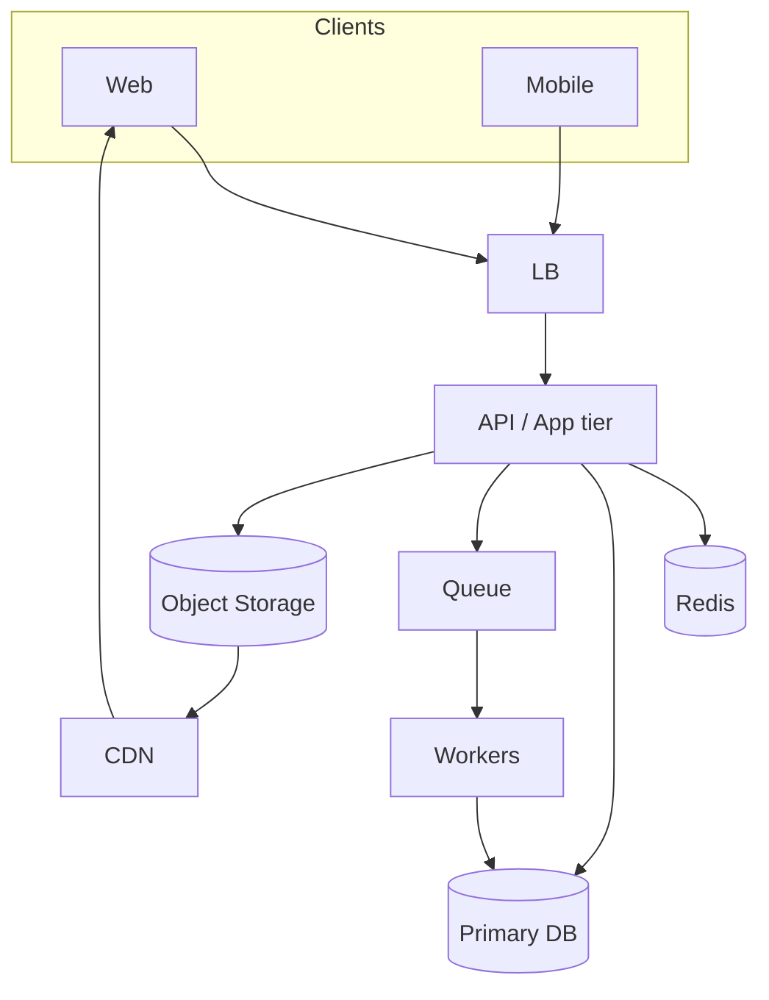

# 14. How to do HLD (High-Level Design)

## Learning goals

- Follow a repeatable HLD checklist  
- Draw a clear component diagram  
- Narrate data flow and bottlenecks  

## What HLD is

**High-Level Design** shows major components and how data moves — not every class method.

Audience: interviewers, teammates, your future self.

## The 8-step HLD checklist

Use this every time (including all case studies in Part 2):

### 1) Clarify requirements

MVP features + non-functionals + out of scope.

### 2) Estimate scale

QPS, storage, bandwidth — order of magnitude.

### 3) Define APIs (surface area)

Even in HLD, list 3–7 core endpoints.

### 4) Start with a simple core

```text
Client → LB → App servers → Database
```

### 5) Add components driven by bottlenecks

| Pain | Add |
|------|-----|
| Heavy reads | Cache, read replicas |
| Large files | Object storage + CDN |
| Slow side work | Queue + workers |
| Spiky traffic | LB scale-out, rate limits |
| Huge data | Sharding / specialized store |
| Realtime | WebSockets / gateway |

### 6) Draw the diagram

Boxes + arrows. Label protocols lightly (`HTTPS`, `SQL`, `SQS`).

### 7) Walk core flows

Example flows:

- Write path  
- Read path  
- Async path  

### 8) Call out trade-offs & failures

What is skipped for MVP? What breaks first at 10×?

## Diagram template



Not every system needs every box — **add with reason**.

## How to speak while designing

Good narration:

> “Writes go to Postgres. Redirects are read-heavy, so Redis cache-aside in front. Click analytics can be async via a queue so redirects stay fast.”

Bad narration:

> “We’ll use Kubernetes, Kafka, Flink, Druid, and service mesh…” with no justification.

## HLD depth for interviews (~35–40 minutes)

Spend time proportional to risk:

- 5 min requirements  
- 5 min estimates  
- 15 min core diagram + flows  
- 10–15 min deep dive on hardest part  

## Deliverable checklist

Your HLD section should include:

- [ ] Requirements summary  
- [ ] Scale assumptions  
- [ ] Component diagram  
- [ ] Read/write flows  
- [ ] Storage choices  
- [ ] Bottlenecks & next scaling steps  

## Practice exercise

Design HLD only for a **URL shortener** before opening the case study.

Then compare.

## Check your understanding

1. Should HLD list every DB index?  
2. Name three components you add for a media-heavy app.  
3. What should drive adding a queue?  

<details>
<summary>Answers</summary>

1. No — that’s LLD detail.  
2. Object storage, CDN, async transcoding workers (and maybe metadata DB).  
3. Work that shouldn’t block the user request / needs retries / absorbs spikes.

</details>

---

**Next:** [How to do LLD](15-how-to-lld.md)
