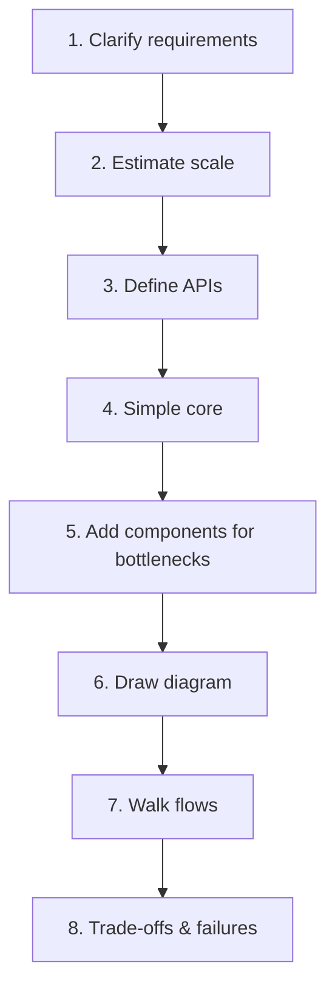
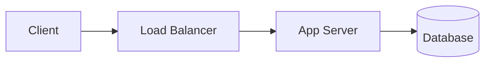
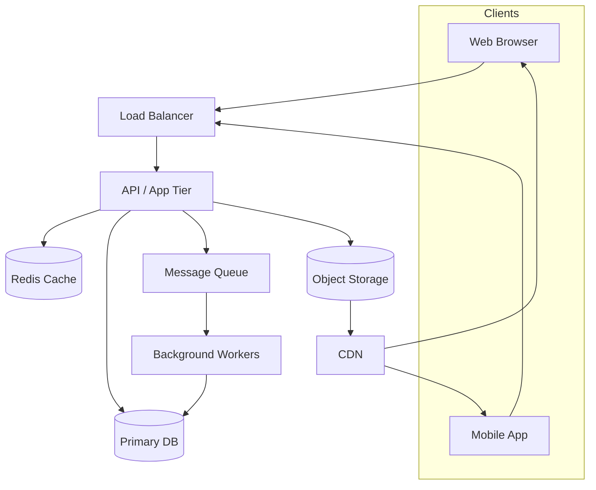
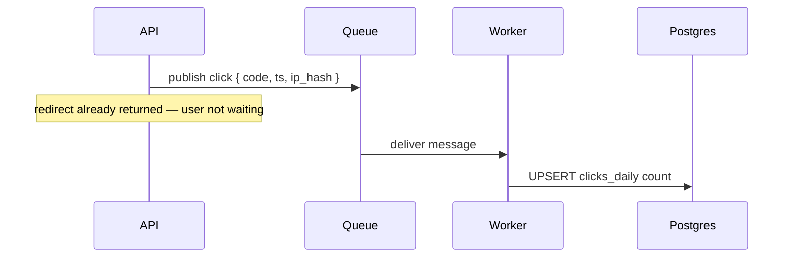
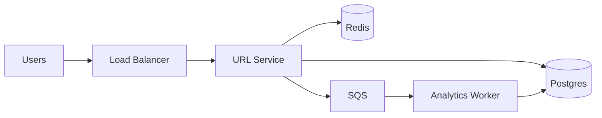

# 14. How to do HLD (High-Level Design)

> **Big picture:** HLD is **city planning** — you decide where the roads, power grid, hospitals, and neighborhoods go. You don't draw every floor plan of every building (that's LLD). You show how the city **works as a whole**.

---

## Learning goals

After this chapter you should be able to:

- [ ] Explain what HLD is and what it is not
- [ ] Follow an 8-step checklist on any design prompt
- [ ] Draw a clear component diagram with justified boxes
- [ ] Walk read, write, and async flows out loud
- [ ] Narrate trade-offs instead of name-dropping technologies
- [ ] Timebox an interview HLD in ~35–40 minutes
- [ ] Practice with the URL shortener before reading the case study

**Prerequisites:** All fundamentals chapters 01–13 (especially [03-estimates.md](03-estimates.md), [08-caching.md](08-caching.md))

---

## Everyday analogy: city planning

Imagine you're planning a new city district:

| City planning | HLD equivalent |
|---------------|----------------|
| "We need housing, shops, a school, transit" | Functional requirements |
| "500K residents, rush-hour traffic peaks" | Scale estimates |
| Highway map, power substations, water mains | Component diagram |
| "Commuters flow: suburb → highway → downtown" | Data flow walkthrough |
| "Flood zone — build elevated roads" | Failure modes & trade-offs |
| Individual apartment floor plans | **LLD** (separate chapter) |

A city planner doesn't specify tile color in bathroom #3. Similarly, HLD doesn't list every DB index or class name — it shows **major components** and **how data moves**.

---

## What HLD is (and is not)

### HLD **is**

- Major components (clients, LB, API, cache, DB, queue, CDN, etc.)
- Protocols at a high level (HTTPS, SQL, Redis, SQS)
- Read/write/async paths narrated clearly
- Storage choices with **why**
- Bottlenecks identified + next scaling steps
- Explicit trade-offs and out-of-scope items

### HLD **is not**

- Every table column and index (→ LLD)
- Every API query parameter (→ LLD)
- Kubernetes YAML, exact instance types (unless asked)
- A buzzword salad ("Kafka, Flink, Cassandra, Istio") without justification

**Audience:** Interviewers, teammates, your future self in six months.

---

## The 8-step HLD checklist

Use this **every time** — including all case studies in Part 2.



---

### Step 1: Clarify requirements (~5 min)

Split into three buckets:

| Bucket | Questions to ask | Example (URL shortener) |
|--------|------------------|-------------------------|
| **Functional (MVP)** | What must it do? | Create short URL, redirect, basic analytics |
| **Non-functional** | How well? | Redirect p99 < 100ms, 99.9% availability |
| **Out of scope** | What are we NOT building? | Custom domains, malware scanning, A/B tests |

**Interview tip:** Ask 3–5 clarifying questions, then **state assumptions** aloud:

> "I'll assume custom slugs are out of scope for MVP and we need anonymous short link creation."

Write this on the board — it anchors the rest of the design.

---

### Step 2: Estimate scale (~5 min)

Order-of-magnitude math from [03-estimates.md](03-estimates.md):

| Metric | Formula intuition | URL shortener example |
|--------|-------------------|----------------------|
| Write QPS | events/day ÷ 86400 | 100M URLs/month → ~40 avg, ~200 peak |
| Read QPS | writes × read:write ratio | 100:1 → ~4K avg, ~20K peak |
| Storage/year | objects × size × months | ~600 GB/year for URL rows |
| Bandwidth | read QPS × payload size | Usually secondary for redirects |

**Why bother?** Numbers tell you **what breaks first**:

- High read QPS → cache
- Large files → object storage + CDN
- Heavy writes → sharding, async pipelines

One paragraph of math is enough. Don't spend 15 minutes on precision.

---

### Step 3: Define APIs (~3 min)

List **3–7 core endpoints** — even in HLD. This grounds the diagram.

```text
POST   /api/v1/urls          create short URL
GET    /r/:code              redirect (302)
GET    /api/v1/urls/:code    metadata + stats
DELETE /api/v1/urls/:code    deactivate (optional MVP)
```

| Why in HLD? | |
|-------------|---|
| Shows read vs write split | Redirect is anonymous GET; create needs auth optional |
| Reveals hot paths | `GET /r/:code` is 100× hotter than POST |
| Interviewers see you think about surface area | Not just boxes |

---

### Step 4: Start with a simple core (~2 min)

Every system begins as:

```text
Client → Load Balancer → App servers → Database
```



**Say explicitly:** "This works for MVP at small scale. Let me identify bottlenecks."

Don't skip this step — jumping straight to 15 boxes looks unfocused.

---

### Step 5: Add components driven by bottlenecks (~10 min)

Each addition needs a **pain → solution** sentence.

| Pain you identified | Component to add | One-line justification |
|---------------------|------------------|------------------------|
| Read QPS >> write QPS | **Redis cache** | Redirect path is read-heavy; cache short_code → long_url |
| Large media uploads | **S3 + presigned URLs** | Offload bytes from API |
| Slow side work (email, transcode) | **Queue + workers** | Don't block user request |
| Traffic spikes | **Auto-scaling + rate limits** | Protect from overload |
| Data too big for one DB | **Sharding / read replicas** | Scale storage or reads |
| Real-time updates | **WebSocket gateway** | Persistent connections |
| Full-text search | **Elasticsearch** | DB poor at fuzzy search |
| Global media latency | **CDN** | Cache at edge |

**Rule:** Not every box in the template below belongs in every design. **Add with reason.**

---

### Step 6: Draw the diagram (~5 min)

Standard template (customize):



**Diagram hygiene:**

| Do | Don't |
|----|-------|
| Label arrows lightly (`HTTPS`, `SQL`) | Cross every wire — clutters |
| Group related boxes | Draw 20 microservices on day one without justification |
| Put hot path visually central | Forget the async path off to the side |
| Mention MVP vs future | Present final-state only without evolution story |

---

### Step 7: Walk core flows (~8 min)

Pick **three paths** and narrate step by step.

#### Write path example (create short URL)

```text
1. Client POST /api/v1/urls { long_url }
2. LB → API server
3. API validates URL, generates short_code
4. API INSERT into Postgres (unique constraint on short_code)
5. API SET Redis cache short_code → long_url
6. API returns 201 { short_url: "https://go/xYz123" }
```

#### Read path example (redirect — optimize this!)

```text
1. Client GET /r/xYz123
2. LB → API
3. API GET Redis key url:xYz123
   3a. HIT → long_url
   3b. MISS → SELECT from Postgres → populate Redis with TTL
4. API returns 302 Location: long_url
5. (Async) enqueue click event to queue → worker increments counter
```

#### Async path example (click analytics)



**Interview gold:** Separating sync user path from async analytics shows maturity.

---

### Step 8: Call out trade-offs & failures (~5 min)

Answer explicitly:

| Question | Example answer |
|----------|----------------|
| What did we skip for MVP? | Custom domains, geo routing, bot detection |
| What breaks first at 10× traffic? | DB read load if cache cold; need more Redis memory |
| Single points of failure? | Single Redis — add cluster; single AZ — multi-AZ |
| Consistency vs availability? | Cache may be stale 60s after delete — acceptable for redirects |

Reference [13-reliability-security-observability.md](13-reliability-security-observability.md):

```text
Failure modes:
- Cache down → read DB directly (slower but correct)
- Queue lag → delayed analytics, redirects unaffected
- DB primary fail → promote replica (~30s failover)
```

---

## Full worked example: URL shortener HLD sketch

*Try this yourself before opening [case study 01](../case-studies/01-url-shortener.md).*

### Requirements (assumed)

- Create + redirect + click count
- 100:1 read:write
- Redirects fast, highly available

### Scale

- ~20K peak read QPS → **cache is mandatory**
- ~200 peak write QPS → single Postgres OK for years

### Diagram



### Narration (30 seconds)

> "Creates write to Postgres and warm Redis. Redirects read Redis first — that's our hot path at 20K QPS. Cache miss falls through to Postgres. Click counting is async via SQS so redirects stay under 50ms. MVP is one URL service; logical modules for create vs redirect."

---

## How to speak while designing

### Good narration (cause → effect)

> "Writes go to Postgres — durable source of truth. Redirects are read-heavy at roughly 100:1, so I'll put Redis cache-aside in front. Click analytics goes through a queue because the user shouldn't wait for a counter increment."

> "Media uploads use presigned S3 URLs so our API never proxies gigabytes. Thumbnails are async workers. Reads hit CloudFront."

> "I'm drawing four logical services for clarity, but MVP would be a modular monolith — we'd extract Media when transcoding CPU becomes painful."

### Bad narration (buzzword bingo)

> "We'll use Kubernetes, Kafka, Flink, Cassandra, and a service mesh."

**Why bad?** No problem stated, no trade-off, no MVP path. Interviewers infer you memorized architecture porn.

### Phrases that signal senior thinking

| Phrase | Implies |
|--------|---------|
| "Bottleneck-driven" | You add boxes for reasons |
| "MVP vs evolution" | Pragmatism |
| "Hot path vs cold path" | Performance focus |
| "Async so user doesn't wait" | UX + reliability |
| "Accept brief staleness because…" | Consistency trade-off |
| "I'll deep-dive redirect path because…" | Time management |

---

## HLD depth for interviews (~35–40 minutes)

### Suggested timebox

| Segment | Minutes | Activity |
|---------|---------|----------|
| Requirements + assumptions | 5 | Ask questions; list MVP / out of scope |
| Estimates | 5 | One paragraph QPS/storage |
| Core diagram + flows | 15 | Draw; walk write/read/async |
| Deep dive | 10–15 | Hardest part (cache, sharding, fanout) |
| Wrap-up | 3 | Failures, security, monitoring |

### Where to deep dive

Choose **one** area aligned with the prompt:

| System type | Deep dive topic |
|-------------|-----------------|
| URL shortener | Cache-aside redirect path |
| Twitter/Instagram | Feed fanout (push vs pull) |
| Uber | Matching + geospatial index |
| WhatsApp | Message delivery + WebSocket gateway |
| YouTube | Upload + transcode pipeline |
| Ticketmaster | Seat reservation concurrency |

Don't spread thin — **one area in depth** beats five areas superficially.

### When interviewer redirects

- "What if cache is down?" → failure modes (Step 8)
- "How would you shard?" → only if scale warrants; explain shard key
- "Design the schema" → transition toward LLD — offer API + table sketch

---

## Deliverable checklist

Before saying "done," verify:

- [ ] Requirements summary (functional + non-functional + out of scope)
- [ ] Scale assumptions (even rough)
- [ ] 3–7 core APIs listed
- [ ] Component diagram with labeled flows
- [ ] Write path narrated
- [ ] Read path narrated (hot path optimized)
- [ ] At least one async path (if applicable)
- [ ] Storage choices justified
- [ ] Bottleneck → component mapping explicit
- [ ] Trade-offs and failure modes stated
- [ ] Security touchpoints (auth, rate limits) mentioned
- [ ] MVP vs future evolution stated

---

## Common HLD mistakes

| Mistake | Why it hurts | Fix |
|---------|--------------|-----|
| Skip requirements | Design wrong system | 5 min clarifying + assumptions |
| No numbers | Can't justify cache/shard | Quick estimates |
| Diagram with no flows | Boxes without behavior | Walk 3 paths aloud |
| Technology first | "Let's use Kafka" with no producer | Pain → solution |
| Only happy path | Interviewer probes failures | Preload 3 failure modes |
| LLD too early | 20 min on schema | "I'll sketch APIs; schema in LLD" |
| No deep dive | Looks shallow | 10 min on hardest component |
| Ignore security | Major red flag | Auth + rate limits on writes |

---

## Practice exercise

### Design HLD only: URL shortener

**Before** opening [../case-studies/01-url-shortener.md](../case-studies/01-url-shortener.md):

1. Set timer: 35 minutes
2. Use the 8-step checklist on paper/whiteboard
3. Draw diagram + narrate flows out loud
4. Write 3 failure modes + 2 security controls
5. **Then** read case study and diff your design

### Other prompts to practice (HLD only)

| Prompt | Focus component |
|--------|-----------------|
| Pastebin | Object storage for large text blobs |
| Rate limiter | Token bucket at edge |
| News feed | Fanout + cache |
| Parking lot | State machine + concurrency |

---

## HLD vs LLD: boundary reminder

| Topic | HLD | LLD |
|-------|-----|-----|
| Components | ✓ boxes | which classes/modules inside one box |
| APIs | ✓ list endpoints | ✓ request/response JSON, errors |
| Database | ✓ "Postgres for URLs" | ✓ columns, indexes, constraints |
| Algorithms | ✓ "cache-aside" | ✓ pseudocode for code generation |
| Sequence diagrams | ✓ major flows | ✓ detailed edge cases |

When interview says "go deeper," ask: "Would you like me to zoom into the schema and API contracts?" — smooth transition to LLD.

---

## Check your understanding (Q&A)

### 1. Should HLD list every DB index?

<details>
<summary>Answer</summary>

No. Indexes, column types, and constraint details belong in **LLD**. HLD names the storage technology and what data lives there ("Postgres stores URL mappings") without full schema.

</details>

### 2. Name three components you'd add for a media-heavy app.

<details>
<summary>Answer</summary>

**Object storage (S3)** for raw uploads, **CDN** for fast global delivery of processed media, **queue + transcode workers** for async thumbnail/video processing. Metadata stays in a relational DB.

</details>

### 3. What should drive adding a queue?

<details>
<summary>Answer</summary>

Work that should **not block** the user-facing request: emails, analytics, transcoding, search index updates. Also work needing **retries**, **spike absorption**, or **decoupling** between producer and consumer.

</details>

### 4. Why start with "Client → LB → App → DB"?

<details>
<summary>Answer</summary>

It proves the problem is solvable simply, establishes baseline, and lets you **justify each addition** as a bottleneck fix. Skipping straight to complex architecture suggests memorization over reasoning.

</details>

### 5. How long should estimates take in an interview?

<details>
<summary>Answer</summary>

About **5 minutes** for order-of-magnitude QPS, storage, and bandwidth. Enough to drive decisions (cache yes/no); not a accounting spreadsheet.

</details>

### 6. What's a good deep-dive topic for a URL shortener?

<details>
<summary>Answer</summary>

The **redirect hot path**: cache-aside with Redis, cache miss handling, TTL strategy, what happens on delete, and why click analytics is async.

</details>

### 7. What should you say when drawing microservices in an interview?

<details>
<summary>Answer</summary>

Clarify whether boxes are **logical components** or separate deployables. State MVP might be a **modular monolith** and which service you'd extract first (and why).

</details>

---

## Quick reference card

```text
┌────────────────────────────────────────────────────────────────┐
│  1. Requirements (MVP / non-functional / out of scope)         │
│  2. Estimates (QPS, storage → what breaks first)               │
│  3. APIs (3–7 endpoints)                                       │
│  4. Simple core (Client → LB → App → DB)                       │
│  5. Add boxes ONLY for bottlenecks (cache, queue, CDN, …)      │
│  6. Draw diagram                                               │
│  7. Walk write / read / async flows                            │
│  8. Trade-offs, failures, security, MVP vs future              │
│  NARRATE: pain → solution, not buzzwords                       │
└────────────────────────────────────────────────────────────────┘
```

---

**Next:** [15. How to do LLD](15-how-to-lld.md) — zoom into schemas, APIs, modules, and algorithms for one component.
