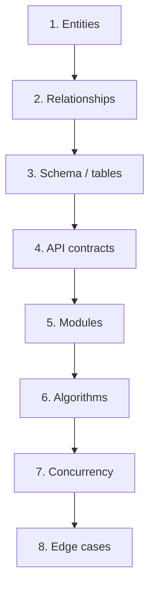
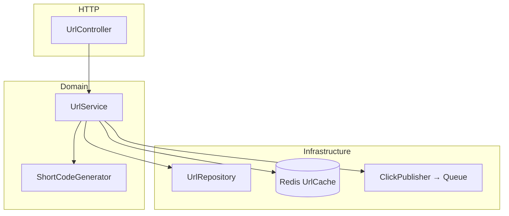
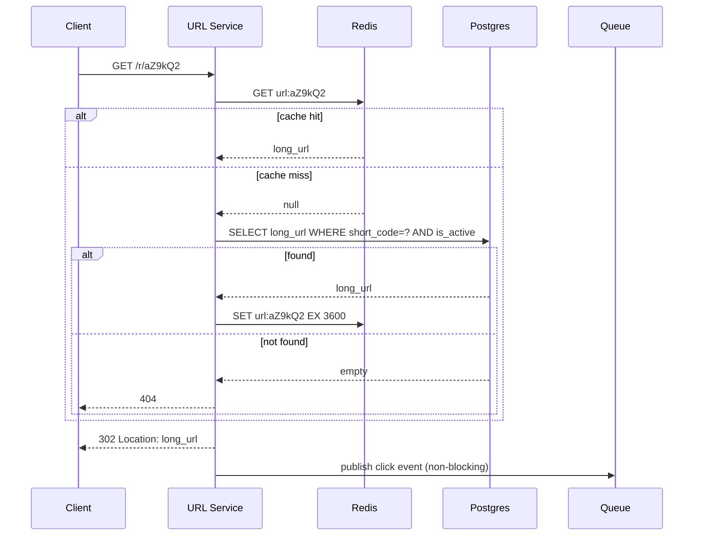

# 15. How to do LLD (Low-Level Design)

> **Big picture:** If HLD is **city planning**, LLD is the **building blueprint** — room layout, plumbing, electrical, load-bearing walls. You zoom into *one building* (one service) and specify exactly how it works internally.

---

## Learning goals

After this chapter you should be able to:

- [ ] Explain what LLD adds beyond HLD
- [ ] Follow the entities → schema → API → modules → algorithms pipeline
- [ ] Produce API contracts, table definitions, and module diagrams
- [ ] Write pseudocode for critical algorithms
- [ ] Handle concurrency with constraints, locks, and idempotency keys
- [ ] Deep-dive 1–2 paths in an interview (not every module)
- [ ] Apply this framework to the URL shortener before reading the full case study

**Prerequisites:** [14-how-to-hld.md](14-how-to-hld.md), [06-databases.md](06-databases.md), [08-caching.md](08-caching.md)

---

## Everyday analogy: building blueprint

| Blueprint element | LLD equivalent |
|-------------------|----------------|
| List of rooms (kitchen, bedroom) | **Entities** (User, Url, Click) |
| Which rooms connect | **Relationships** (User has many Urls) |
| Pipe diameter, wire gauge | **Schema** (columns, types, indexes) |
| Door schedule (swing, lock type) | **API contracts** (endpoints, status codes) |
| Floor layout zones | **Modules** (Controller → Service → Repository) |
| Elevator capacity algorithm | **Core algorithms** (short code generation, rate limit) |
| Fire egress plan | **Edge cases & failure handling** |

An architect doesn't specify HLD city-wide traffic patterns on the blueprint — but the building must **fit** the city plan. LLD must be **consistent with HLD**.

---

## What LLD is (and is not)

### LLD **is**

- Detailed **API** request/response shapes and error codes
- **Database schema** with keys, indexes, constraints
- **Module/class responsibilities** inside one service
- **Pseudocode** for non-obvious logic
- **Sequence diagrams** for tricky flows (redirect, booking seat, idempotent payment)
- **Concurrency strategy** (unique constraints, transactions, idempotency)
- **Edge cases** (expired URL, duplicate retry, deleted user)

### LLD **is not**

- Full production code line-by-line
- Every module detailed (pick 1–2 critical paths)
- Infrastructure provisioning (Kubernetes node sizes)
- Re-doing entire HLD from scratch

**When asked in interviews:** "We agreed on HLD — I'll low-level design the **URL Service** redirect and create paths."

---

## The LLD pipeline

Work **top-down** in this order:



Each step constrains the next. Jumping to code before schema leads to rework.

---

## Step 1: Entities

List the **nouns** in the problem.

**URL shortener nouns:**

| Entity | Description |
|--------|-------------|
| **User** | Optional account owner of links |
| **Url** | Mapping short_code ↔ long_url + metadata |
| **ClickEvent** | Single redirect event (or aggregated ClickDaily) |

**Ticket booking nouns:** User, Event, Seat, Reservation, Order, Payment.

**Chat nouns:** User, Conversation, Message, ReadReceipt.

**Tip:** 3–7 entities is normal for one service. More suggests scope creep.

---

## Step 2: Relationships

Draw cardinality:

```text
User 1 ──── * Url        (user may own many links; anonymous urls have null user_id)
Url  1 ──── * ClickDaily (aggregated counts per day)
```

| Relationship | Implementation hint |
|--------------|---------------------|
| One-to-many | FK on "many" side (`urls.user_id`) |
| Many-to-many | Junction table (`conversation_participants`) |
| Optional ownership | Nullable FK (`user_id NULL`) |

---

## Step 3: Schema / tables

Translate entities to storage. Be explicit about **primary keys**, **indexes**, and **constraints**.

### URL shortener schema

```sql
-- Core mapping table
CREATE TABLE urls (
  short_code   CHAR(7) PRIMARY KEY,
  long_url     TEXT NOT NULL,
  user_id      BIGINT NULL REFERENCES users(id),
  created_at   TIMESTAMPTZ NOT NULL DEFAULT now(),
  expires_at   TIMESTAMPTZ NULL,
  is_active    BOOLEAN NOT NULL DEFAULT true,
  -- optional denormalized fields
  click_count  BIGINT NOT NULL DEFAULT 0  -- or use separate analytics table
);

-- For range queries: "my urls", cleanup job
CREATE INDEX idx_urls_user_created ON urls(user_id, created_at DESC)
  WHERE user_id IS NOT NULL;

-- For expiry sweeper
CREATE INDEX idx_urls_expires ON urls(expires_at)
  WHERE expires_at IS NOT NULL AND is_active = true;

-- Aggregated analytics (async worker writes)
CREATE TABLE clicks_daily (
  short_code   CHAR(7) NOT NULL REFERENCES urls(short_code),
  day          DATE NOT NULL,
  count        BIGINT NOT NULL DEFAULT 0,
  PRIMARY KEY (short_code, day)
);
```

### Why each index exists

| Index | Query it serves |
|-------|-----------------|
| PK on `short_code` | Redirect lookup by code |
| `idx_urls_user_created` | List user's URLs paginated |
| `idx_urls_expires` | Cron job deactivates expired links |

### Constraints as correctness tools

| Constraint | Prevents |
|------------|----------|
| `PRIMARY KEY (short_code)` | Duplicate codes at DB level |
| `NOT NULL long_url` | Empty redirects |
| `REFERENCES users(id)` | Orphan ownership (optional) |
| `CHECK (length(short_code)=7)` | Invalid code format (if enforced) |

**Interview phrase:** "Unique constraint on short_code is our last line of defense against collision under concurrent creates."

---

## Step 4: API detailed contracts

Beyond HLD endpoint names — specify JSON, status codes, errors.

### POST /api/v1/urls — create

**Request:**

```json
{
  "long_url": "https://example.com/path?query=1",
  "custom_alias": null,
  "expires_in_days": 365
}
```

**Response 201:**

```json
{
  "short_code": "aZ9kQ2x",
  "short_url": "https://go.example/aZ9kQ2x",
  "long_url": "https://example.com/path?query=1",
  "expires_at": "2027-08-06T00:00:00Z"
}
```

**Errors:**

| Code | When |
|------|------|
| 400 | Invalid URL format, URL too long (> 2048 chars) |
| 409 | custom_alias already taken |
| 401 | Auth required but missing (if policy requires login) |
| 429 | Rate limit exceeded |

### GET /r/:code — redirect

| Code | Body |
|------|------|
| 302 | `Location: {long_url}` |
| 404 | `{ "error": "not_found" }` — unknown or inactive code |
| 410 | `{ "error": "expired" }` — past expires_at |

**Note:** Redirect endpoint often **unauthenticated**; don't leak existence of private codes via timing attacks in sensitive apps.

### GET /api/v1/urls/:code/stats

```json
{
  "short_code": "aZ9kQ2x",
  "total_clicks": 1542,
  "clicks_by_day": [
    { "day": "2026-08-05", "count": 120 },
    { "day": "2026-08-06", "count": 89 }
  ]
}
```

---

## Step 5: Service modules

Layer responsibilities — names vary by stack (Controller/Handler, Service, Repository).

```text
UrlController     HTTP parsing, status codes, auth middleware
    ↓
UrlService        business rules: validate URL, create, resolve, deactivate
    ↓
UrlRepository     SQL queries only
ShortCodeGenerator   collision-resistant code generation
UrlCache          Redis get/set/invalidate
ClickPublisher    enqueue async analytics events
```



### Module rules

| Layer | May do | Must not |
|-------|--------|----------|
| Controller | Parse HTTP, call service | SQL queries |
| Service | Orchestrate, business rules | Know about HTTP status codes deeply |
| Repository | CRUD SQL | Business validation |

---

## Step 6: Core algorithms (pseudocode)

### Algorithm A: create short URL

```text
function create_url(long_url, user_id?, expires_in_days?):
  if not is_valid_http_url(long_url):
    throw ValidationError

  expires_at = now() + expires_in_days if set else null

  for attempt in 1..MAX_RETRIES:
    code = ShortCodeGenerator.next()   // e.g. 7-char base62

    try:
      db.insert(urls { code, long_url, user_id, expires_at, is_active: true })
      cache.set("url:" + code, long_url, TTL=3600)
      return { short_code: code, short_url: BASE + code }
    catch UniqueViolation:
      continue   // collision — retry with new code

  throw ServiceUnavailable("could not allocate code")
```

**Design choices to mention:**

| Choice | Alternative | Trade-off |
|--------|-------------|-----------|
| Random base62 | Auto-increment ID encoded | Random hides volume; counter is guessable |
| 7 chars (~3.5T space) | 6 chars | Shorter URL vs collision risk at scale |
| Insert-then-cache | Cache-then-insert | Cache only after durable write |

### Algorithm B: resolve redirect (cache-aside)

```text
function resolve(code):
  if not is_valid_code_format(code):
    return NotFound

  cached = cache.get("url:" + code)
  if cached == EXPIRED_SENTINEL:
    return Gone
  if cached:
    long_url = cached
  else:
    row = db.find_active_by_code(code)
    if row == null:
      return NotFound
    if row.expires_at && row.expires_at < now():
      cache.set("url:" + code, EXPIRED_SENTINEL, TTL=300)
      return Gone
    long_url = row.long_url
    cache.set("url:" + code, long_url, TTL=3600)

  click_publisher.enqueue({ code, ts, ip_hash })   // async, best-effort
  return Redirect(long_url)
```

### Sequence diagram: redirect path



---

## Step 7: Concurrency & correctness

Multiple app instances run simultaneously — LLD must be safe under parallel requests.

### Toolbelt

| Tool | When to use | URL shortener example |
|------|-------------|----------------------|
| **UNIQUE constraint** | Prevent duplicate rows | `short_code` PK |
| **Database transaction** | Multi-row atomic update | Transfer + ledger (not needed for simple create) |
| **Optimistic locking** | Concurrent edits same row | `version` column on Url if updates frequent |
| **Pessimistic row lock** | Scarce inventory | `SELECT FOR UPDATE` on seat row (ticket system) |
| **Idempotency key** | Safe client retries | `Idempotency-Key` header on POST /urls |
| **Redis SETNX** | Distributed lock (careful) | Optional rate limit counter |

### Idempotent create example

```text
Client sends: POST /urls  Idempotency-Key: uuid-abc-123

Server:
  if store.contains(uuid-abc-123):
    return cached_response(uuid-abc-123)
  response = create_url(...)
  store.save(uuid-abc-123, response, TTL=24h)
  return response
```

Duplicate POST due to network retry → same short URL returned, no double insert.

### Cache invalidation on delete

```text
function deactivate(code, user):
  verify ownership
  db.update(urls SET is_active=false WHERE short_code=code)
  cache.delete("url:" + code)
```

Without delete: stale cache serves redirect for 3600s after user "deleted" link.

---

## Step 8: Edge cases

Brainstorm **what breaks** at low level:

| Edge case | Behavior |
|-----------|----------|
| Duplicate long URL allowed? | Policy: yes (different codes) or no (dedupe) — state assumption |
| Expired URL | 410 Gone; optional cache sentinel |
| Inactive / soft-deleted | 404 (don't reveal existed) |
| Malformed code in URL | 404 early without DB hit |
| Concurrent create same custom alias | UNIQUE on alias; one wins, one 409 |
| Click queue down | Redirect still works; analytics loss acceptable briefly |
| Long URL > max length | 400 at validation |
| Unicode / IDN URLs | Punycode normalization before store |

Document assumptions in interview:

> "I'll allow multiple short links for the same long URL. Expired links return 410."

---

## Class / module sketch (OOP style)

Pseudocode classes — clarity over language:

```text
class UrlService:
  create(long_url, user?, opts?) -> ShortUrlResult
  resolve(code) -> RedirectResult
  deactivate(code, user) -> void
  get_stats(code, user) -> Stats

class ShortCodeGenerator:
  next_code() -> str   // thread-safe or stateless random

class UrlRepository:
  insert(url: UrlEntity) -> void   // throws on unique violation
  find_active_by_code(code) -> UrlEntity?
  deactivate(code) -> bool

class UrlCache:
  get(code) -> str?
  set(code, long_url, ttl_sec)
  delete(code)

class ClickPublisher:
  publish(event: ClickEvent) -> void   // fire-and-forget to queue
```

Functional/module style is equally valid — match your interview language.

---

## LLD depth guidance for interviews

You **cannot** detail every module in 45 minutes. Pick **1–2 critical paths**.

| System | Deep-dive paths |
|--------|-----------------|
| URL shortener | Code generation + collision; redirect cache-aside |
| Ticket booking | Seat hold with TTL; `SELECT FOR UPDATE` |
| Chat | Message insert + fanout to online recipients |
| Rate limiter | Token bucket in Redis with Lua atomicity |
| Payment | Idempotency key + webhook retry handling |

**Script:**

> "At HLD we have URL Service, Redis, Postgres, queue. I'll LLD the create and redirect flows — they're the correctness and performance core."

Spend ~15–20 min here; leave admin APIs as "similar CRUD."

---

## HLD → LLD mapping (URL shortener)

| HLD box | LLD artifacts produced |
|---------|-------------------------|
| URL Service | Modules, APIs, algorithms above |
| Postgres | `urls`, `clicks_daily` schema |
| Redis | Key pattern `url:{code}`, TTL policy |
| Queue | `ClickEvent` payload schema, idempotent consumer |
| Load Balancer | (Usually no LLD — infra) |

---

## Async consumer LLD (click worker)

```text
function process_click_event(event):
  // idempotent: at-least-once delivery from SQS
  if dedup_store.seen(event.event_id):
    return

  db.execute("""
    INSERT INTO clicks_daily (short_code, day, count)
    VALUES (?, ?, 1)
    ON CONFLICT (short_code, day)
    DO UPDATE SET count = clicks_daily.count + 1
  """, event.code, event.day)

  dedup_store.mark_seen(event.event_id, TTL=7d)
```

---

## Common LLD mistakes

| Mistake | Fix |
|---------|-----|
| Schema with no indexes for hot queries | Index redirect lookup path |
| Cache before DB write | Write DB first, then cache |
| No unique constraint on short_code | DB enforces under concurrent creates |
| God class doing everything | Layer controller / service / repository |
| Ignoring idempotency | At-least-once queues duplicate work |
| Over-design every endpoint | Deep-dive 1–2 paths only |
| LLD inconsistent with HLD | "We said Redis cache-aside" — show key names |

---

## Bridging to Part 2: case studies

Every case study in Part 2 follows:

```text
1. Requirements & estimates
2. HLD  (chapter 14 checklist)
3. LLD  (this chapter's pipeline)
4. Scale evolution
5. Recap & interview Q&A
```

### Recommended next step

You've learned HLD and LLD process. Apply both to:

**→ [Case Study 01: URL Shortener](../case-studies/01-url-shortener.md)**

Read it after attempting your own design. Compare:

- Did you cache the redirect path?
- Did you async the click counter?
- Is your schema close?

Then continue through case studies 02–10 for spaced practice.

---

## Check your understanding (Q&A)

### 1. Name three artifacts an LLD should produce.

<details>
<summary>Answer</summary>

Detailed **API contracts** (request/response/errors), **database schema** (tables, indexes, constraints), and **module structure** with **algorithms** in pseudocode. Sequence diagrams and edge-case lists are also common artifacts.

</details>

### 2. Why are unique constraints part of LLD, not only application code?

<details>
<summary>Answer</summary>

Multiple app instances can race on the same insert. Application-level checks alone can't guarantee uniqueness under concurrency. A **database UNIQUE constraint** (or PK) enforces correctness even if two servers generate the same code simultaneously.

</details>

### 3. What should you deep-dive for a ticket booking system?

<details>
<summary>Answer</summary>

**Seat reservation concurrency**: holding a seat with TTL, `SELECT FOR UPDATE` or optimistic locking, preventing double-booking when two users checkout the same seat, and releasing holds on payment timeout.

</details>

### 4. What's the cache-aside pattern for redirect?

<details>
<summary>Answer</summary>

On read: check cache first. On miss: read DB, populate cache with TTL, return result. On write/create: write DB, then set cache. On delete: invalidate cache key. App code orchestrates — cache isn't the source of truth.

</details>

### 5. Why enqueue click tracking instead of synchronous DB increment?

<details>
<summary>Answer</summary>

Redirect is the hot path — users wait for 302. Synchronous increment adds DB write latency to every redirect. Async queue decouples analytics; brief analytics loss during outage is acceptable if redirects still work.

</details>

### 6. How does idempotency key help POST /urls?

<details>
<summary>Answer</summary>

Client retries duplicate POSTs on timeout. Server stores `Idempotency-Key → response` mapping. Second request with same key returns original response without creating a second short URL.

</details>

### 7. Entity → schema → API — why this order?

<details>
<summary>Answer</summary>

Entities define **what exists**. Schema defines **persistent shape**. API defines **external interface** over that data. Modules and algorithms implement API using schema. Skipping early steps causes APIs that don't fit the data model.

</details>

### 8. When would you use optimistic vs pessimistic locking?

<details>
<summary>Answer</summary>

**Optimistic** (version column): low contention, read-heavy, conflicts rare — retry on version mismatch. **Pessimistic** (`SELECT FOR UPDATE`): high contention scarce resources (last seat) — lock row during transaction to prevent others booking.

</details>

---

## Quick reference card

```text
┌─────────────────────────────────────────────────────────────────┐
│  LLD PIPELINE:                                                  │
│    Entities → Relationships → Schema → API → Modules          │
│    → Algorithms → Concurrency → Edge cases                      │
│  DEEP-DIVE: 1–2 critical paths (redirect, booking, payment)   │
│  CORRECTNESS: UNIQUE constraints, transactions, idempotency     │
│  CACHE: write DB first; invalidate on delete                    │
│  ASYNC: hot path stays lean; queue for side effects             │
└─────────────────────────────────────────────────────────────────┘
```

---

**Next:** Start Part 2 → [Case Study 01: URL Shortener](../case-studies/01-url-shortener.md)
