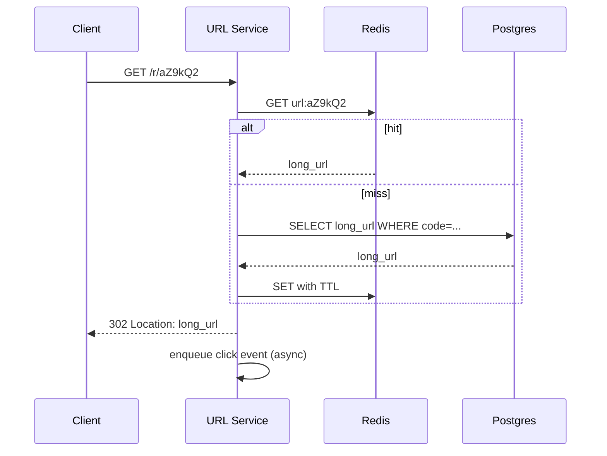

# 15. How to do LLD (Low-Level Design)

## Learning goals

- Turn an HLD into APIs, schemas, and modules  
- Specify critical algorithms  
- Handle edge cases and concurrency  

## What LLD is

**Low-Level Design** zooms into *how* a component works:

- API contracts  
- Data models / tables  
- Class or module responsibilities  
- Key algorithms (rate limit, short code, fanout)  
- Sequence diagrams for tricky flows  

## LLD checklist

### 1) Entities

List nouns: User, Url, Message, Ride, Ticket…

### 2) Relationships

One-to-many? Many-to-many? Ownership?

### 3) Tables / collections

Columns, PKs, useful secondary indexes.

### 4) API detailed contracts

Request/response JSON, error codes.

### 5) Service modules

```text
UrlController → UrlService → UrlRepository
                         ↘ CacheClient
```

### 6) Core algorithms

Write steps in pseudocode.

### 7) Concurrency & correctness

Locks, unique constraints, idempotency keys.

### 8) Edge cases

Expiry, deleted users, duplicate retries, oversized input.

## Example: from HLD box to LLD

HLD says: **URL Service** + **DB** + **Cache**

LLD adds:

### Schema

```text
urls(
  short_code CHAR(7) PRIMARY KEY,
  long_url TEXT NOT NULL,
  user_id BIGINT NULL,
  created_at TIMESTAMP,
  expires_at TIMESTAMP NULL,
  is_active BOOLEAN
)
clicks_daily(
  short_code,
  day,
  count,
  PRIMARY KEY(short_code, day)
)
```

### API

```text
POST /api/v1/urls
GET  /r/:code  → 302
GET  /api/v1/urls/:code/stats
```

### Algorithm: create short code

```text
loop up to N times:
  code = base62(random 64-bit)[0:7]
  try insert urls(code, long_url)
  if unique_violation: continue
  return code
cache set code → long_url
```

### Sequence: redirect



## Class / module sketch (OOP style)

```text
class UrlService:
  create(long_url, user) -> ShortUrl
  resolve(code) -> long_url
  disable(code, user)

class ShortCodeGenerator:
  next_code() -> str

class UrlRepository:
  save(entity)
  find_by_code(code)

class UrlCache:
  get(code)
  set(code, long_url, ttl)
```

You can use layered modules instead of classes — clarity matters more than OOP purity.

## Correctness tools

| Tool | Use |
|------|-----|
| UNIQUE constraint | Prevent duplicate short codes |
| Transactions | Multi-row updates |
| Optimistic locking / version column | Concurrent edits |
| Idempotency keys | Safe retries |
| Row-level locks | Scarce inventory |

## LLD depth guidance

You cannot detail every module in an interview. Pick **1–2 critical paths**.

For URL shortener: code generation + redirect path.  
For ticket booking: seat reservation concurrency.  
For chat: message delivery + connection gateway.

## Bridging to Part 2

Every case study uses this structure:

1. Requirements & estimates  
2. **HLD**  
3. **LLD**  
4. Scale evolution  
5. Recap  

You’re ready.

## Check your understanding

1. Name three artifacts an LLD should produce.  
2. Why are unique constraints part of LLD, not only code?  
3. What should you deep-dive for a ticket booking system?  

<details>
<summary>Answers</summary>

1. APIs, schema, modules/algorithms (also sequences/edge cases).  
2. They enforce correctness even with concurrent app instances.  
3. Inventory/seat reservation under concurrent checkout.

</details>

---

**Next:** start Part 2 → [URL Shortener](../case-studies/01-url-shortener.md)
