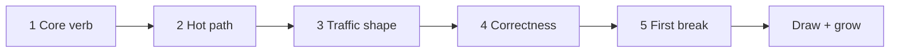

# 01. The Thinking Loop

> **Goal:** Stop memorizing architectures. Learn a repeatable loop you can run on *any* blank prompt.

Interviewers rarely ask “draw Instagram.” They ask something unfamiliar and watch **how you think**. This lesson is that method.

---

## Learning goals

After this chapter you should be able to:

- [ ] Run the same 5 questions on every design prompt
- [ ] Separate the **hot path** from background work
- [ ] Name the first bottleneck *before* picking Kafka/Redis
- [ ] Say assumptions out loud instead of guessing silently
- [ ] Grow a design: simple core → scale → failures

**Prerequisites:** Fundamentals 01–13 help, but you can skim this anytime. Best after [How to do HLD](../fundamentals/14-how-to-hld.md).

---

## Memorizing vs thinking

| Memorizing | Thinking |
|------------|----------|
| “News feed = fan-out on write + Redis” | “Reads dominate → precompute if cheap; celebrities break fan-out → hybrid” |
| Recites a diagram from a blog | Starts with Client → API → DB, then adds boxes with reasons |
| Panics on a new prompt | Runs the same loop; only the *answers* change |

You will still study case studies. Use them to **train the loop**, not to collect templates.

---

## The loop (memorize this, not the diagrams)

```text
1. Core verb     → What is the one job?
2. Hot path      → What must be fast / online?
3. Shape         → Read-heavy, write-heavy, or both?
4. Correctness   → What must be exact vs eventually OK?
5. First break   → At 10× traffic, what dies first?
```

Then draw:

```text
Simple core → Fix the bottleneck → Walk failures → State trade-offs
```



---

## Question 1 — What is the **core verb**?

Every product collapses to one primary action. Name it in a few words.

| Prompt | Core verb |
|--------|-----------|
| URL shortener | **Redirect** `code → long URL` |
| Chat | **Deliver** message A → B (fast, ordered-ish) |
| Ticket booking | **Hold + confirm** a scarce seat |
| News feed | **Assemble** recent posts for a user |
| Video streaming | **Serve** bytes at watch bitrate |
| Analytics | **Ingest** events, then **aggregate** later |

If you cannot name the verb, you are not ready to draw boxes.

**Say out loud:**  
“The core job is X. Everything else is supporting.”

---

## Question 2 — What is the **hot path**?

The hot path is what a user waits on. Background work can be slower.

| System | Hot path (user waits) | Background (async OK) |
|--------|----------------------|------------------------|
| URL shortener | Redirect lookup | Click analytics |
| Photo app | Upload ACK + show thumbnail | Image resize variants |
| Payments | Ledger write + balance | Fraud ML scoring (with limits) |
| Search | Query → ranked results | Indexing new pages |

**Rule of thumb:** If the user is staring at a spinner, it is hot path. Put queues *beside* the hot path, not *on* it — unless the product is allowed to say “we’ll email you.”

---

## Question 3 — What is the **traffic shape**?

You do not need perfect numbers. You need the **shape**.

Ask:

1. Rough **QPS** order of magnitude? (10 / 1k / 100k)
2. **Read:write** ratio?
3. Are there **hot keys** (celebrity, viral post, popular short code)?

Cheat sheet from estimates:

```text
1 QPS ≈ 86,400 requests/day
Peak is often 2–5× average
```

| Shape | What you reach for first |
|-------|--------------------------|
| Read-heavy (100:1) | Cache, CDN, replicas |
| Write-heavy | Partitioning, queues, careful DB |
| Both hot | Split services / separate stores |
| Spiky peaks | Autoscale + queue buffering |

---

## Question 4 — What must be **correct**?

Not everything needs strong consistency. Name the critical invariants.

| Data | Usually needs | Can be eventual |
|------|---------------|-----------------|
| Wallet balance / seat hold | Strong / carefully designed | No |
| Like counts | Approximate OK | Yes |
| Feed ranking | Fresh-enough | Yes |
| “Did this payment charge twice?” | Exactly-once *effect* (idempotency) | Retries OK if idempotent |

**Say out loud:**  
“For X we need strong correctness; for Y eventual is fine and buys us scale.”

---

## Question 5 — What **breaks first** at 10×?

Pick one primary fear. That chooses your next component.

| First break | Typical fix |
|-------------|-------------|
| Single DB CPU / connections | Cache, read replicas, then shard |
| Same rows locked by everyone | Holds in Redis, queues, partitioning by key |
| Huge fan-out writes | Hybrid fan-out, async workers |
| Bandwidth / large media | Object storage + CDN |
| Long CPU work (transcode, ML) | Job queue + workers |
| Many websocket connections | Sticky/consistent-hash gateways, shard by user |

Do **not** start with “we need Kafka.” Start with “the DB write path melts,” then ask whether a queue helps.

---

## Growing the diagram (how pros draw)

Never start with 12 boxes. Grow in layers:

### Layer A — Happy path (2 minutes)

```text
Client → Load Balancer → API → Database
```

### Layer B — Fix the obvious bottleneck

Example (read-heavy):

```text
Client → LB → API → Cache → DB
                 ↘ Object storage / CDN (if media)
```

### Layer C — Async & scale

```text
API → Queue → Workers
API → Shard / replicas as needed
```

### Layer D — Failures (talk, maybe small notes on diagram)

- Cache miss storm
- Queue backlog
- Primary DB down
- Hot key

---

## Example: run the loop on “Design a URL shortener”

| Step | Your answer (example) |
|------|------------------------|
| 1 Core verb | Redirect short code → long URL |
| 2 Hot path | `GET /r/:code` must be tiny latency |
| 3 Shape | Read:write ≈ 100:1; peak redirects dominate |
| 4 Correctness | Mapping must be correct; click counts can lag |
| 5 First break | Redirect QPS hits DB → need cache |

Then draw Layer A → add Redis → mention analytics via queue.

Compare later with [Case Study 01](../case-studies/01-url-shortener.md) — grade yourself on *reasoning*, not identical boxes.

---

## Phrases that signal strong thinking

Use these in interviews:

- “I’ll assume … ; tell me if you want different numbers.”
- “User-facing path is X; I’ll make Y asynchronous.”
- “Reads dominate, so I’ll optimize the read path first.”
- “The dangerous invariant is Z — I’ll protect that before scaling the rest.”
- “At 10×, I expect W to break; next I’d …”
- “Trade-off: A is simpler; B handles celebrities / peaks better.”

Avoid:

- Listing 8 databases with no reason
- Jumping to microservices on a CRUD app
- Silent assumptions

---

## Mini practice (do now)

Take this prompt — **do not open a case study yet**:

> Design a “pastebin”: users create a text paste, get a URL, others read it. Pastes expire.

Write on paper (5 minutes):

1. Core verb  
2. Hot path vs background  
3. Traffic shape guess  
4. Correctness needs  
5. First break at 10×  
6. Layer A diagram, then one scale upgrade  

Then open [Pastebin case study](../case-studies/02-pastebin.md) and compare.

---

## Check your understanding

1. Why start with a core verb before naming technologies?  
2. Give one example where a queue should *not* sit on the hot path.  
3. Read-heavy vs write-heavy: which component do you usually add first for each?  
4. What is a “hot key,” and why does it break naïve designs?

<details>
<summary>Answers</summary>

1. Technologies are tools for a job. Without the job (verb), you decorate a blank page with buzzwords.  
2. URL redirect analytics, email receipts after checkout, image thumbnail generation after upload ACK — user already got the response.  
3. Read-heavy → cache/CDN/replicas. Write-heavy → partitioning, careful schema, queues for heavy side-effects — not “cache everything.”  
4. A key that receives disproportionate traffic (celebrity user, viral link). One partition / one lock / one cache entry becomes the bottleneck even if average QPS looks fine.

</details>

---

**Next:** [Pattern choosers](02-pattern-choosers.md) — decision trees for queue, cache, SQL/NoSQL, sync vs async, fan-out.
