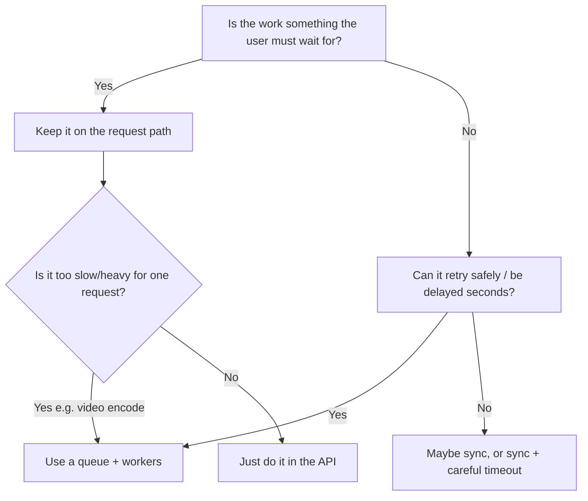
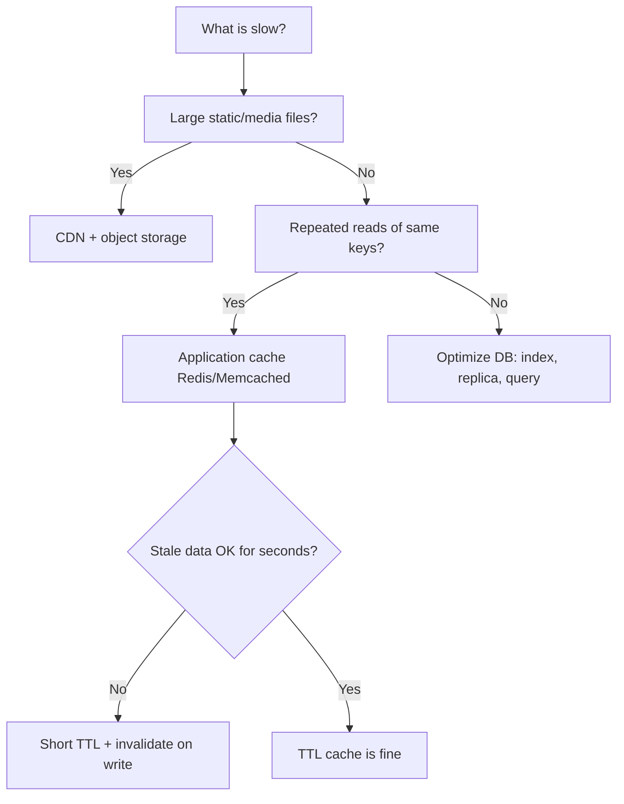
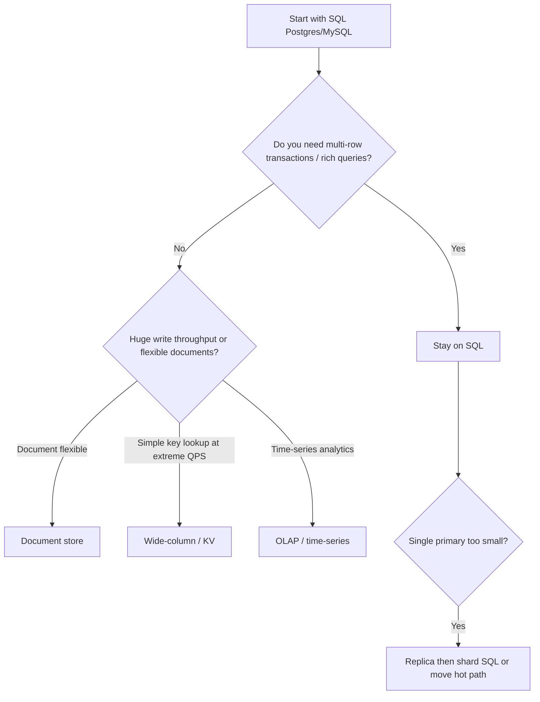
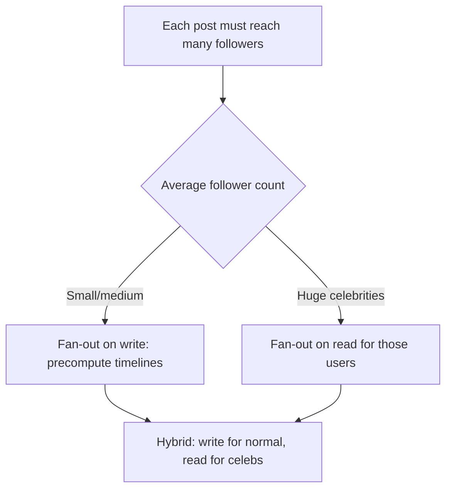

# 02. Pattern Choosers

> **Goal:** When stuck between options, follow a short decision tree — then say the trade-off out loud.

These are **defaults for beginners**, not laws. If two answers both fit, pick the simpler one and explain when you’d switch.

---

## How to use this page

1. Hit a fork in your design (“Do I need a queue?”).  
2. Walk the matching tree below.  
3. State: **choice + one reason + one risk**.

Example:  
“I’d add a queue for thumbnail generation because upload ACK shouldn’t wait on CPU work. Risk: users briefly see a placeholder until the worker finishes.”

---

## Chooser 1 — Do I need a **queue**?



| Signal you need a queue | Example |
|-------------------------|---------|
| Work takes seconds–minutes | Transcoding, PDF, ML batch |
| Spiky writes, smooth consumers | Analytics ingest |
| Multiple independent side effects | Email + push + webhook |
| Want retries without blocking user | Payment notification |

| Signal you do **not** need a queue yet | Example |
|----------------------------------------|---------|
| Simple CRUD under moderate QPS | Blog CMS |
| User needs the result in the same response | “Save and show the new total” |
| You’re avoiding learning transactions | Don’t hide consistency bugs behind Kafka |

**Beginner default:** No queue until you can name the async job.

---

## Chooser 2 — **Cache** vs **DB** vs **CDN**?

Ask: *What are we speeding up, and is it OK if it’s slightly stale?*



| Layer | Stores | Good for | Bad for |
|-------|--------|----------|---------|
| **CDN** | Edge copies of files | Images, video segments, JS/CSS | Per-user private JSON (unless careful) |
| **App cache** | Hot keys in memory | Sessions, product pages, redirect maps | Source of truth forever |
| **DB** | Durable truth | Money, bookings, identity | Serving every viral read alone |

**Phrase:** “Cache is a **speed layer**, not the system of record.”

---

## Chooser 3 — **SQL** vs **NoSQL**?

Start with SQL. Switch when you have a concrete reason.



| Choose SQL when | Choose NoSQL-style when |
|-----------------|-------------------------|
| Strong relationships, joins | Mostly key lookups |
| Transactions matter | You accept eventual consistency |
| Ad-hoc admin queries | Schema evolves constantly (documents) |
| Team knows SQL | You already know the access patterns |

**Interview tip:** “I’d start with Postgres. If redirect QPS explodes, the *mapping* can move to a KV/cache tier; payments stay on SQL.”

---

## Chooser 4 — **Sync** vs **async**?

| If the user… | Prefer |
|--------------|--------|
| Must see success/failure now | Sync (or sync for core + async for extras) |
| Can wait for email / notification | Async |
| Uploads a large file | Sync ACK of upload + async processing |
| Books a seat | Sync hold; async email ticket |

**Split brain pattern (very common):**

```text
Sync:  validate → write critical truth → return 200
Async: notify, analytics, search index, thumbnails
```

---

## Chooser 5 — Fan-out on **write** vs on **read**?

Used for feeds, notifications, timelines.



| Fan-out on write | Fan-out on read |
|------------------|-----------------|
| Fast reads (timeline ready) | Cheap writes |
| Expensive for celebrities | Slower/more work at read time |
| Great for average users | Great for mega-popular accounts |

**Phrase:** “Hybrid — because celebrity fan-out would melt the write path.”

See [News Feed](../case-studies/06-news-feed.md) after you try this chooser yourself.

---

## Chooser 6 — Push (WebSocket) vs pull (HTTP poll)?

| Need | Prefer |
|------|--------|
| Chat, presence, live collab | WebSocket / SSE (push) |
| Occasional updates, simple clients | Short polling or version checks |
| One-way server events, simpler than WS | Server-Sent Events |

**Beginner default:** HTTP for request/response; add WebSockets only when latency/push is a real requirement.

---

## Quick reference card (print this mentally)

| Question | Beginner default |
|----------|------------------|
| Queue? | Only if you named an async job |
| Cache? | Yes if read-heavy + stale OK briefly |
| CDN? | Yes if media/static |
| DB? | Postgres first |
| Sync vs async? | Sync critical truth; async side effects |
| Fan-out? | Write for normal users; hybrid for celebs |
| Realtime? | WebSocket only if product needs push |

---

## Practice: pick without a case study

For each prompt, write **choice + reason** (2 minutes each):

1. “Users upload 4K video; others stream it.” — queue? CDN?  
2. “Like button on posts, 100:1 read:write.” — cache? exact counts?  
3. “Seat booking for a hot concert.” — SQL transaction? Redis hold?  
4. “Celebrity with 50M followers posts.” — fan-out strategy?

<details>
<summary>Sample answers (not the only right ones)</summary>

1. **Queue** for transcoding; **CDN + object storage** for playback segments. Upload ACK sync; encode async.  
2. **Cache** post pages / counts; counts can be **approximate** or updated async — don’t take a write lock on every like if scale is huge.  
3. **Short-lived hold** in Redis or locked row; **confirm** in SQL with idempotent payment — correctness on inventory matters.  
4. **Hybrid fan-out** — don’t write to 50M timelines synchronously; celebs pulled at read time or processed with special workers.

</details>

---

## Check your understanding

1. When is a queue the wrong tool?  
2. Why is “cache as source of truth” dangerous?  
3. Why start with SQL in interviews even if you know Cassandra?

<details>
<summary>Answers</summary>

1. When the user needs the result in the same request and the work is light; or when you’re using a queue to avoid designing transactions.  
2. Cache can be flushed, evicted, or stale; money/inventory must live in a durable store with clear rules.  
3. SQL fits most CRUD + transaction stories; Cassandra is a scaling choice you justify with access patterns and team cost — not a default flex.

</details>

---

**Next:** [First 10 minutes](03-first-10-minutes.md) — narrated walkthroughs for five classic prompts.
